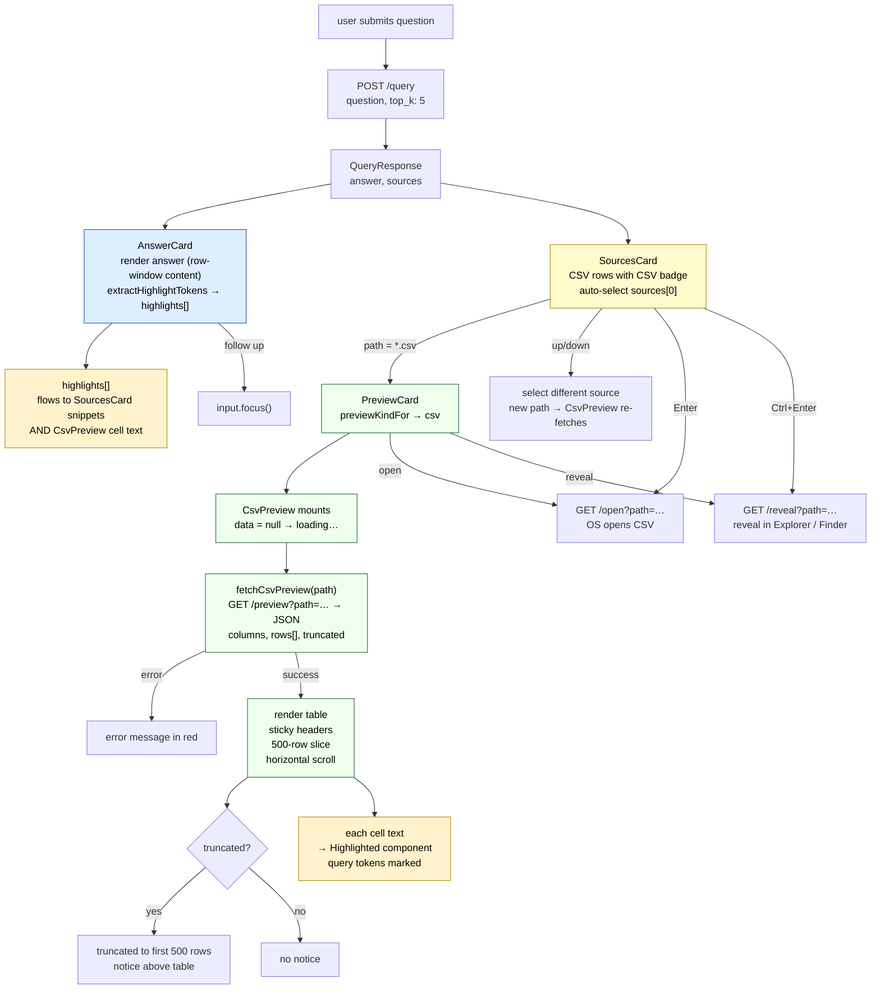

# CSV — query-time UI

What the user sees and can do after Magpie returns a `.csv` file as a result.
CSV has the most distinct preview of any file type — it renders a live table
rather than text or an image, and the snippet in the sources list may be a
matched *row* rather than a file-level summary.

For how a CSV gets into the index (including row-level Qdrant points and the
answer-time row-window logic) see [Tiers/CSV_routing.md](../Tiers/CSV_routing.md).

---

## What the UI shows

```
┌────────────────────────────────────────────────────────────────┐
│  ANSWER                          │  preview pane               │
│  Dr. Brown teaches Physics and   │  (truncated to first 500 rows)│
│  is located in room SC-214.      │                             │
│                                  │  dept    │ name    │ room   │
│  + follow up                     │──────────┼─────────┼────────│
├──────────────────────────────────│  Physics │ Dr.Smith│ SC-210 │
│  SOURCES          2 cited / 5    │  Physics │ Dr.Jones│ SC-212 │
│  ▶ CSV  directory.csv   0.91 ●  │  Physics │ Dr.Brown│ SC-214 │
│    Faculty directory, Physics…   │  Physics │ Dr.Green│ SC-216 │
│    /documents/faculty            │  ...     │ ...     │ ...    │
└────────────────────────────────────────────────────────────────┘
```

---

## AnswerCard

Same structure as all file types. The answer text is the LLM's response,
which for CSV hits is built from the **row-window block** (matched rows ± 2
neighbours) plus the LLM summary supplement — not a raw file dump.
See the answer-time section in [Tiers/CSV_routing.md](../Tiers/CSV_routing.md)
for the exact content that reaches the LLM.

Highlight tokens extracted from the answer (currency, dates, proper nouns,
IDs, etc.) flow into both the SourcesCard snippets and the CsvPreview cell
highlighting.

---

## SourcesCard — CSV row

[frontend/src/components/SourcesCard.tsx](../frontend/src/components/SourcesCard.tsx)

| Element | Content |
|---|---|
| Icon badge | `CSV` |
| Filename | `directory.csv` |
| Score chip | colour-coded: `≥ 0.7` green / `≥ 0.4` amber / `< 0.4` grey |
| Cited dot | present if this CSV's rows contributed to the answer |
| Snippet | `source.summary` from the query response |
| Directory | directory portion of path |

**What the snippet contains for CSV:** for T1 CSVs (< 20 MB) the snippet
comes from the LLM-generated `FileSummary` stored at ingest time — a 3–7
sentence description of what the CSV contains. It is not the row text. For T0
and T2 CSVs it is the text of the preview/extract written at ingest.

**Keyboard navigation:** identical to all types — `↑↓` navigate sources,
`Enter` opens in OS default app, `Ctrl+Enter` / `⌘+Enter` reveals in
Explorer / Finder.

---

## PreviewCard — CsvPreview

[frontend/src/components/previews/CsvPreview.tsx](../frontend/src/components/previews/CsvPreview.tsx)

CSV is the only type that makes a **JSON** request to the preview endpoint
rather than fetching raw bytes or text.

### What is fetched

```ts
fetchCsvPreview(path)
  → GET /preview?path=<encoded>
  → Content-Type: application/json
  → { columns: string[], rows: string[][], truncated: boolean }
```

The sidecar reads the CSV, returns the first 500 rows as a 2D array.
`truncated: true` when the file has more than 500 rows.

### What renders

A horizontal-scrolling table:

| Element | Detail |
|---|---|
| Truncation notice | `"(truncated to first 500 rows)"` shown above the table if `data.truncated` |
| Table border | `1px solid var(--border-soft)`, `border-radius: 8px` |
| Column headers | sticky top, dark background, secondary text colour, no wrap |
| Cells | `max-width: 360px`, overflow hidden with `text-overflow: ellipsis`, `title` attribute holds the full value on hover |
| Cell text | runs through `Highlighted` — query tokens are marked with `<mark class="magpie-highlight">` |
| Row separator | `rgba(255,255,255,0.04)` border-bottom |

**Cell highlight detail:** `Highlighted` does a case-insensitive, word-boundary-aware
longest-match-first split of the cell text against the token list. Tokens that
contain punctuation or whitespace skip the word-boundary requirement.
([Highlighted.tsx:36](../frontend/src/components/Highlighted.tsx#L36))

### Loading and error states

| State | What shows |
|---|---|
| loading (`data === null`) | `"loading…"` in dim text |
| error | error message in red |
| loaded | scrollable table |

The component resets to loading whenever `path` changes — `useEffect` on
`path` sets `data = null` and fires a new fetch.

### No pagination

CSV has no page buttons — the entire 500-row slice is rendered at once in a
scrollable container. The scroll is the user's navigation mechanism.

---

## Header actions (PreviewCard)

| Button | Action |
|---|---|
| `↗ open` | `GET /open?path=…` → OS default app (Excel, Numbers, etc.) |
| `↺ reveal in finder` | `GET /reveal?path=…` → Explorer / Finder |

Header shows: `CSV` badge, filename, `~/full/path` directory.

---

## Data flow



---

## What the preview does NOT show

- **The matched rows.** The CsvPreview always shows the first 500 rows of
  the file, not the rows that actually matched. The row-window content (which
  rows matched and their ± 2 neighbours) is only in the AnswerCard text.
- **Row indices.** Row numbers are not shown in the preview table.
- **The LLM summary.** The T1 summary markdown is used at answer time
  (as a supplement in the prompt) but is not surfaced in the UI.

These are current limitations, not intentional design decisions.

---

## Code references

| Symbol | File | Line |
|---|---|---|
| `CsvPreview` component | [previews/CsvPreview.tsx](../frontend/src/components/previews/CsvPreview.tsx) | L6 |
| `fetchCsvPreview` | [api.ts](../frontend/src/api.ts) | L54 |
| `CsvPreview` type | [types.ts](../frontend/src/types.ts) | — |
| `previewKindFor` → `"csv"` | [api.ts](../frontend/src/api.ts) | L165 |
| `fileLabel` → `"CSV"` | [PreviewCard.tsx](../frontend/src/components/PreviewCard.tsx) | L73 |
| `fileIcon` → `"CSV"` | [SourcesCard.tsx](../frontend/src/components/SourcesCard.tsx) | L116 |
| `Highlighted` (cell text) | [Highlighted.tsx](../frontend/src/components/Highlighted.tsx) | L8 |
| `extractHighlightTokens` | [Highlighted.tsx](../frontend/src/components/Highlighted.tsx) | L66 |
| auto-select top source | [MagpieWindow.tsx](../frontend/src/components/MagpieWindow.tsx) | L181 |

**Backend (ingest + answer-time row-window):** [Tiers/CSV_routing.md](../Tiers/CSV_routing.md)
