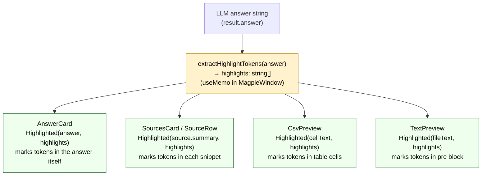

# Highlighted

Two exports in one file: the `Highlighted` render component and the
`extractHighlightTokens` function that feeds it. Together they handle
marking query-relevant text across the answer, source snippets, CSV cells,
and text file previews.

File: [frontend/src/components/Highlighted.tsx](../frontend/src/components/Highlighted.tsx)

---

## `Highlighted` component (L8)

```ts
export function Highlighted({ text, tokens }: { text: string; tokens: string[] })
```

Splits `text` into a flat array of `{ text, highlight }` parts, then renders:
- highlighted parts as `<mark class="magpie-highlight">`
- non-highlighted parts as `<span>`

Uses `useMemo` on `[text, tokens]` so `splitWithTokens` only re-runs when
either input changes.

### Where it is used

| Usage site | Text being highlighted |
|---|---|
| `AnswerCard` | LLM answer string |
| `SourceRow` (SourcesCard) | `source.summary` snippet |
| `CsvPreview` | individual cell text |
| `TextPreview` | entire file text in `<pre>` |

---

## `splitWithTokens` (L36)

The core matching function. Given a text string and a list of tokens:

1. **Deduplicates and sorts** tokens longest-first so `"reading glasses"` is
   matched before `"reading"` or `"glasses"` individually.

2. **Escapes** each token for safe use in a regex with `escapeRegex`.

3. **Applies word-boundary rules:**
   - Token matches `/^\w[\w-]*$/` (pure alphanumeric + hyphen) → wrapped in
     `\b…\b` word boundaries
   - Token contains punctuation or whitespace → matched as-is (no boundaries)
   - This means `"Dr. Brown"` matches mid-sentence, but `"room"` only matches
     as a whole word.

4. **Builds one case-insensitive regex** from all tokens joined with `|`.

5. **Scans** the text left-to-right, emitting parts until the string is
   exhausted.

```ts
const re = new RegExp(alts.join("|"), "gi");
```

---

## `extractHighlightTokens` (L66)

```ts
export function extractHighlightTokens(answer: string): string[]
```

Called once per query result in `MagpieWindow` via `useMemo`. Extracts tokens
from the LLM's answer text that are worth highlighting everywhere.

### Patterns extracted

| Category | Pattern example | Regex |
|---|---|---|
| Currency | `$1,234.56`, `€500` | `[\$€£]\s?\d{1,6}(?:[.,]\d{2})?` |
| Course codes | `CSC 121`, `PHY 111-01L` | `[A-Z]{2,4}[- ]\d{3}(?:-\d{2}L?)?` |
| ISO dates | `2024-05-14` | `\d{4}-\d{2}-\d{2}` |
| US dates | `05/14/2024` | `\d{1,2}\/\d{1,2}\/\d{2,4}` |
| Month-name dates | `May 14 2024`, `14 May 2024` | two separate patterns |
| Times | `8:30 AM`, `1:15 PM` | `\d{1,2}:\d{2}\s*(?:AM|PM|am|pm)` |
| All-caps tokens | `ISBN`, `CONTRACT-7B` | `[A-Z][A-Z0-9\-]{2,}` |
| Quoted phrases | `"annual report"` | `"[^"]{2,50}"` |
| Proper nouns | `Westside Capital`, `Dr. Smith` | multi-word Capitalised sequences |

**Proper noun filter:** common sentence-starters (`The`, `This`, `These`,
`That`, `Those`, `He`, `She`, `It`, `They`, `We`, `You`, `I`) are excluded
to avoid highlighting unrelated words that happen to start a sentence.

### Return value

A deduplicated `string[]`. Empty if the answer contains no matching patterns.
If the answer is still loading or errored, `MagpieWindow` produces `[]` via
the `useMemo` guard:

```ts
const highlights = useMemo(
  () => (result ? extractHighlightTokens(result.answer) : []),
  [result]
);
```

---

## How tokens flow through the UI



---

## Code references

| Symbol | File | Line |
|---|---|---|
| `Highlighted` component | [Highlighted.tsx](../frontend/src/components/Highlighted.tsx) | L8 |
| `splitWithTokens` | [Highlighted.tsx](../frontend/src/components/Highlighted.tsx) | L36 |
| word-boundary logic | [Highlighted.tsx](../frontend/src/components/Highlighted.tsx) | L42 |
| `escapeRegex` | [Highlighted.tsx](../frontend/src/components/Highlighted.tsx) | L57 |
| `extractHighlightTokens` | [Highlighted.tsx](../frontend/src/components/Highlighted.tsx) | L66 |
| currency pattern | [Highlighted.tsx](../frontend/src/components/Highlighted.tsx) | L70 |
| proper noun filter | [Highlighted.tsx](../frontend/src/components/Highlighted.tsx) | L93 |
| `highlights` useMemo | [MagpieWindow.tsx](../frontend/src/components/MagpieWindow.tsx) | L132 |
