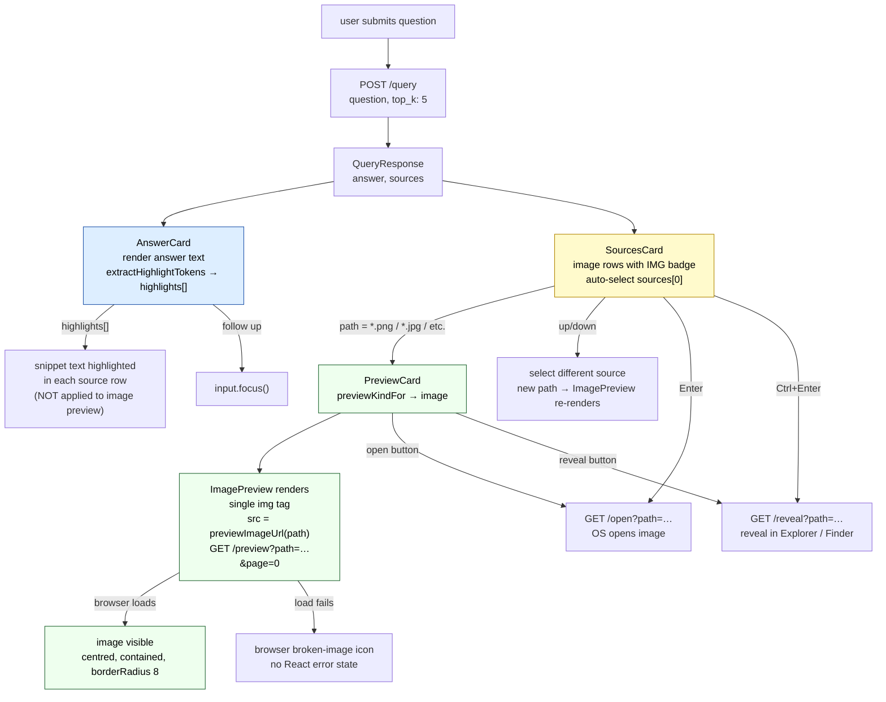

# Image — query-time UI

What the user sees and can do after Magpie returns an image file (`.png`, `.jpg`,
`.jpeg`, `.webp`, `.gif`) as a result. Images have the simplest preview of any
file type — a single `` tag with no fetch loop, no pagination, and no text
highlights (there is no text layer in an image).

For how an image gets into the index see the backend Tiers docs.

---

## What the UI shows

```
┌────────────────────────────────────────────────────────────────┐
│  ANSWER                          │  preview pane               │
│  The org chart shows the CTO     │                             │
│  reporting directly to the CEO.  │  ┌──────────────────────┐  │
│                                  │  │                      │  │
│  + follow up                     │  │   <image content>    │  │
├──────────────────────────────────│  │                      │  │
│  SOURCES          1 cited / 3    │  └──────────────────────┘  │
│  ▶ IMG  org-chart.png   0.88 ●  │                             │
│    Org chart showing reporting…  │                             │
│    /documents/company            │                             │
└────────────────────────────────────────────────────────────────┘
```

---

## AnswerCard

Same structure as all file types. The answer text is the LLM's response built
from the image content at query time. Highlight tokens flow from the answer to
SourcesCard snippets; they are **not** applied to the image preview (no text
layer to highlight).

---

## SourcesCard — image row

[frontend/src/components/SourcesCard.tsx](../frontend/src/components/SourcesCard.tsx)

| Element | Content |
|---|---|
| Icon badge | `IMG` (all image extensions share this badge) |
| Filename | e.g. `org-chart.png` |
| Score chip | colour-coded: `≥ 0.7` green / `≥ 0.4` amber / `< 0.4` grey |
| Cited dot | present if this image contributed to the answer |
| Snippet | `source.summary` from the query response |
| Directory | directory portion of path |

**Keyboard navigation:** `↑↓` navigate sources, `Enter` opens in OS default
app, `Ctrl+Enter` / `⌘+Enter` reveals in Explorer / Finder.

---

## PreviewCard — ImagePreview

[frontend/src/components/previews/ImagePreview.tsx](../frontend/src/components/previews/ImagePreview.tsx)

Image is the simplest preview kind. The component is a single JSX expression —
no state, no useEffect, no fetch.

### What renders

```ts
<div style={{ display: "flex", justifyContent: "center" }}>
  &page=0
    alt={path}
    style={{
      maxWidth: "100%",
      maxHeight: "100%",
      objectFit: "contain",
      borderRadius: 8,
    }}
  />
</div>
```

The `` fetches directly — the browser makes the request and renders the
bytes. The sidecar serves the original image file. The `page=0` query param
(from the default argument in `previewImageUrl`) is ignored by the sidecar for
image files.

### No loading or error state

Unlike PDF and text previews, `ImagePreview` has no React loading/error state.
The browser handles the image lifecycle natively. If the file cannot be served,
the browser renders a broken-image icon.

### No pagination

Images are single-page by definition. There are no prev/next buttons.

### No highlights

`ImagePreview` accepts only `path` — no `highlights` prop. Highlight tokens
from the answer text apply only to the SourcesCard snippet.

### No re-fetch on path change

Because there is no state or effect, switching to a different image source
simply re-renders with the new `src` URL. The browser handles the transition.

---

## Header actions (PreviewCard)

| Button | Action |
|---|---|
| `↗ open` | `GET /open?path=…` → OS default app (Preview, Photos, etc.) |
| `↺ reveal in finder` | `GET /reveal?path=…` → Explorer / Finder |

Header shows: extension badge (`PNG` / `JPG` / `WEBP` / `GIF`), filename,
`~/full/path` directory.

**Note:** the header badge (`fileLabel`) uses the exact extension — `PNG`,
`JPG`, `WEBP`, `GIF`. The SourcesCard badge (`fileIcon`) always shows `IMG`
regardless of extension.

---

## Data flow



---

## Code references

| Symbol | File | Line |
|---|---|---|
| `ImagePreview` component | [previews/ImagePreview.tsx](../frontend/src/components/previews/ImagePreview.tsx) | L3 |
| `previewImageUrl` | [api.ts](../frontend/src/api.ts) | L50 |
| `previewKindFor` → `"image"` | [api.ts](../frontend/src/api.ts) | L163 |
| `fileLabel` → `"PNG"` / `"JPG"` etc. | [PreviewCard.tsx](../frontend/src/components/PreviewCard.tsx) | L68 |
| `fileIcon` → `"IMG"` | [SourcesCard.tsx](../frontend/src/components/SourcesCard.tsx) | L113 |
| `openInOs` | [api.ts](../frontend/src/api.ts) | L66 |
| `revealInFinder` | [api.ts](../frontend/src/api.ts) | L71 |
| auto-select top source | [MagpieWindow.tsx](../frontend/src/components/MagpieWindow.tsx) | L146 |
| keyboard nav (sources) | [SourcesCard.tsx](../frontend/src/components/SourcesCard.tsx) | L22 |
