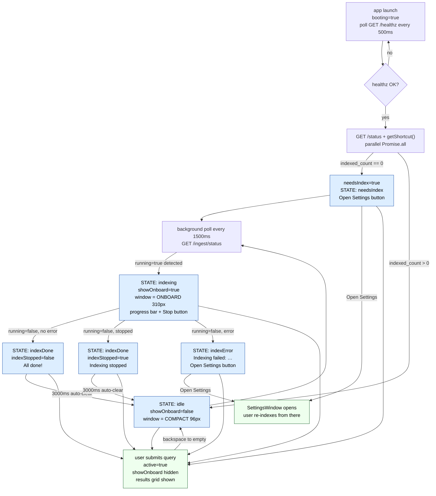

# Management card (Surface 1 — inline, MagpieWindow)

The management card is the `onboard-card` rendered inside `MagpieWindow`
directly below the search input. It is **conditionally visible** — it only
appears when `showOnboard` is true. When idle (no indexing, no error, no
onboarding needed) the window collapses to just the search bar at 96px.

```ts
const showOnboard = !active && (indexing || indexError !== null || needsIndex || indexDone);
```

The moment a query is submitted (`active = true`) the card is also hidden and
the three-column results grid takes its place.

Component: [frontend/src/components/MagpieWindow.tsx](../frontend/src/components/MagpieWindow.tsx)
CSS: [frontend/src/components/MagpieWindow.css](../frontend/src/components/MagpieWindow.css)

---

## Window height

Width is always `800px` (logical). Height is one of three values:

| Constant | Value | When |
|---|---|---|
| `COMPACT_HEIGHT` | `96px` | idle — search bar only, no onboard card |
| `ONBOARD_HEIGHT` | `310px` | `showOnboard` is true (indexing / error / needsIndex / indexDone) |
| `EXPANDED_HEIGHT` | `680px` | active query (result, loading, or query error) |

The resize fires in a `useEffect` watching
`[result, loading, error, needsIndex, indexDone, indexing, indexError]`.
[MagpieWindow.tsx:167](../frontend/src/components/MagpieWindow.tsx#L167)

`hideWindow` shrinks to `COMPACT_HEIGHT` before hiding so the next summon
opens already-compact.
[MagpieWindow.tsx:319](../frontend/src/components/MagpieWindow.tsx#L319)

---

## States

The card renders one of four branches. Priority is top-to-bottom in the JSX
ternary chain — a state higher in the list masks those below.

### 1 · `indexing === true`

Shown while the background poll loop sees `running=true` from
`GET /ingest/status`.

| Element | Content |
|---|---|
| Message | `"Scanning files…"` until `ingestProgress.total` is known, then `"Indexing N / M files…"` |
| Progress bar | `width = done/total * 100%`, `transition: width 800ms linear` |
| Detail line 1 | Current filename, truncated to last 42 chars if > 44 chars: `…<tail>` |
| Detail line 2 | Elapsed time formatted as `Ns` or `Nm Ns` |
| Button | **Stop indexing** → `handleStop` → `POST /ingest/stop` |

Progress bar and detail lines appear only when `ingestProgress` is non-null.

---

### 2 · `indexError !== null`

Shown when the poll loop receives `running=false` with a non-empty `error` field.

| Element | Content |
|---|---|
| Message | `"Indexing failed: <error string>"` |
| Button | **Open Settings** → `handleOpenSettings` → `invoke("open_settings", { port })` |

The "Try again" flow moved to SettingsWindow — the user re-indexes from there.

---

### 3 · `indexDone === true`

Shown for exactly **3 000 ms** after the poll loop detects a
running→done transition. No button — just a message.

| `indexStopped` | Message |
|---|---|
| `true` | `"Indexing stopped — files so far are searchable."` |
| `false` | `"All done! Go ahead and ask something."` |

After the timeout `setIndexDone(false)` fires and `showOnboard` becomes false,
collapsing the window to `COMPACT_HEIGHT`.

---

### 4 · `needsIndex === true`

Set on startup when `GET /status` returns `indexed_count === 0`. Cleared when
any ingest completes successfully, or when a query returns results.

| Element | Content |
|---|---|
| Message | `"No folders indexed yet."` |
| Button | **Open Settings** → `handleOpenSettings` |

Folder selection and indexing are initiated entirely from SettingsWindow.

---

## Background poll loop

The management card no longer drives indexing itself. Instead a unified
always-on background poll loop (`useEffect` with empty deps, running every
1 500 ms) watches `GET /ingest/status` and updates state:
[MagpieWindow.tsx:76](../frontend/src/components/MagpieWindow.tsx#L76)

```
poll tick every 1500ms
  s.running == true
    → prevRunningRef = true
    → setIndexing(true)
    → setIngestProgress(...)

  s.running == false AND prevRunningRef == true   (transition detected)
    → prevRunningRef = false
    → setIndexing(false)
    → setIngestProgress(null)
    → if s.error: setIndexError(s.error)
    → else: setNeedsIndex(false), setIndexStopped(s.stopped),
            setIndexDone(true), setTimeout(setIndexDone(false), 3000)
```

`prevRunningRef` is a `useRef` (not state) so it doesn't trigger a re-render
and is safe to read/write inside the async poll loop without stale-closure issues.

This design means the management card picks up indexing started from
**SettingsWindow** — both windows poll the same `/ingest/status` endpoint.

---

## State machine



---

## Key callbacks

| Callback | Trigger | What it does |
|---|---|---|
| `handleStop` | "Stop indexing" | `POST /ingest/stop` — poll loop detects the transition |
| `handleOpenSettings` | "Open Settings" (error/needsIndex) | `invoke("open_settings", { port })` → Tauri opens SettingsWindow |

All folder management (add, remove, re-index) is in
[SETTINGS_WINDOW.md](./SETTINGS_WINDOW.md).

---

## Backspace-to-dismiss

When `query` becomes empty (user backspaces all the way), a `useEffect`
resets `result`, `submitted`, `selectedPath`, and `error` to null. This
collapses the results grid and restores the idle state.
[MagpieWindow.tsx:157](../frontend/src/components/MagpieWindow.tsx#L157)

---

## Code references

| Symbol | File | Line |
|---|---|---|
| `showOnboard` | [MagpieWindow.tsx](../frontend/src/components/MagpieWindow.tsx) | L224 |
| management card JSX | [MagpieWindow.tsx](../frontend/src/components/MagpieWindow.tsx) | L240 |
| background poll loop | [MagpieWindow.tsx](../frontend/src/components/MagpieWindow.tsx) | L76 |
| resize effect | [MagpieWindow.tsx](../frontend/src/components/MagpieWindow.tsx) | L167 |
| backspace-to-dismiss | [MagpieWindow.tsx](../frontend/src/components/MagpieWindow.tsx) | L157 |
| `handleStop` | [MagpieWindow.tsx](../frontend/src/components/MagpieWindow.tsx) | L118 |
| `handleOpenSettings` | [MagpieWindow.tsx](../frontend/src/components/MagpieWindow.tsx) | L122 |
| `hideWindow` | [MagpieWindow.tsx](../frontend/src/components/MagpieWindow.tsx) | L319 |
| height constants | [MagpieWindow.tsx](../frontend/src/components/MagpieWindow.tsx) | L19–22 |
| `.onboard-card` styles | [MagpieWindow.css](../frontend/src/components/MagpieWindow.css) | L40 |
