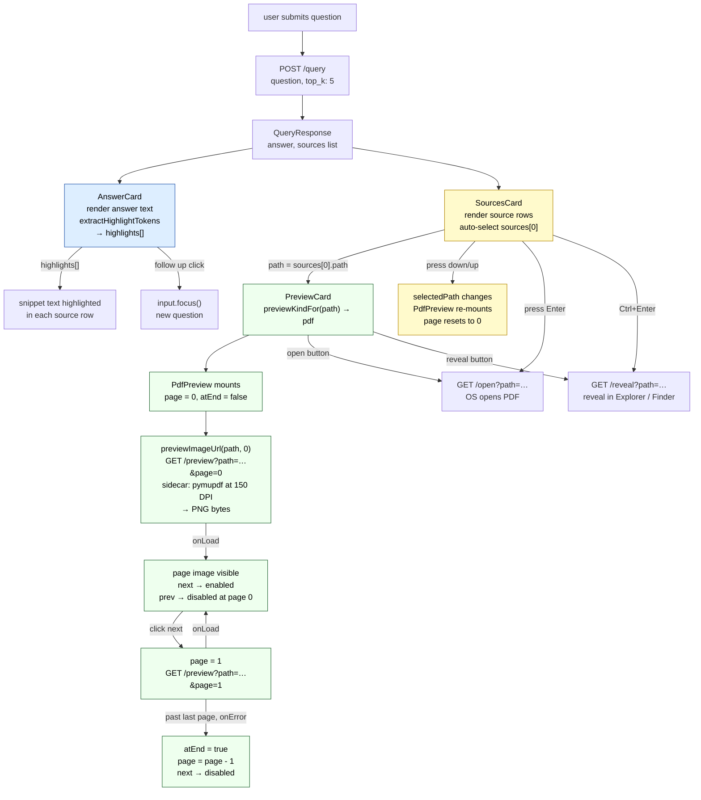

# PDF — query-time UI

What the user sees and can do after Magpie returns a `.pdf` file as a result.
This document covers the display side only. For how a PDF gets into the index
see [Tiers/PDF_routing.md](../Tiers/PDF_routing.md).

---

## What the UI shows

After a query completes with a PDF in the results, three panels populate:

```
┌─────────────────────────────────────────────────────────────┐
│  ANSWER                        │  preview pane              │
│  LLM answer text with          │  ┌──────────────────────┐  │
│  highlighted tokens            │  │  page image          │  │
│                                │  │  (150 DPI render)    │  │
│  + follow up                   │  └──────────────────────┘  │
├────────────────────────────────│  ← prev   page N   next → │
│  SOURCES          3 cited / 5  │                            │
│  ▶ PDF  report.pdf    0.84 ●  │                            │
│    Annual financial summary…   │                            │
│    /documents/finance          │                            │
│  ─────────────────────────── │                            │
│    PDF  notes.pdf     0.61 ●  │                            │
└─────────────────────────────────────────────────────────────┘
```

---

## AnswerCard

[frontend/src/components/AnswerCard.tsx](../frontend/src/components/AnswerCard.tsx)

Same for all file types. Three possible states:

| State | What shows |
|---|---|
| loading | Three animated dots (`answer-card__dot`) |
| error | `⚠ <error message>` in red |
| answer | LLM answer text with `Highlighted` tokens wrapped in `<mark class="magpie-highlight">` |

**Highlight extraction** from the answer text
([Highlighted.tsx:66](../frontend/src/components/Highlighted.tsx#L66)):

Patterns extracted for highlighting: currency (`$€£ 1,234.56`), dates
(`2024-05-14`, `May 14 2024`, `14 May 2024`), times (`8:30 AM`), course codes
(`CSC 121`), all-caps identifiers (`ISBN`, `CONTRACT-7B`), quoted phrases, and
capitalised proper nouns (`Westside Capital`). These same tokens are passed
down to SourcesCard snippets and the PDF page text (though the page text is
an image, so highlights don't apply there — see PreviewCard below).

**"+ follow up"** button re-focuses the search input so the user can type
a follow-up question without clicking.

---

## SourcesCard — PDF row

[frontend/src/components/SourcesCard.tsx](../frontend/src/components/SourcesCard.tsx)

Each source row for a PDF shows:

| Element | Content |
|---|---|
| Icon badge | `PDF` |
| Filename | basename of path, e.g. `report.pdf` |
| Score chip | numeric score, colour-coded: `≥ 0.7` green / `≥ 0.4` amber / `< 0.4` grey |
| Cited dot | filled dot if this source's content was used in the answer |
| Snippet | `source.summary` from the query response, with highlight tokens marked |
| Directory | directory portion of path |

**The snippet** is the text field stored in Qdrant alongside the PDF's embedding.
For T3-routed PDFs this comes from the LLM-generated summary markdown written
at ingest time. It is NOT the raw PDF text — it is a distilled description.

**Auto-selection:** the top-scoring source is selected automatically when
results arrive (`setSelectedPath(res.sources[0]?.path ?? null)`). The PDF
preview pane loads immediately without a click.

**Keyboard navigation:**

| Key | Action |
|---|---|
| `↓` | select next source |
| `↑` | select previous source |
| `Enter` | open PDF in OS default application (e.g. Preview, Acrobat) |
| `Ctrl+Enter` / `⌘+Enter` | reveal PDF in file explorer (Finder / Explorer) |

---

## PreviewCard — PdfPreview

[frontend/src/components/previews/PdfPreview.tsx](../frontend/src/components/previews/PdfPreview.tsx)

PDF is the only file type with **pagination**. State is local to the component
instance and resets to page 0 whenever `path` changes (i.e. whenever the user
selects a different source).

### How a page loads

```ts
src = previewImageUrl(path, page)
    = `${baseUrl()}/preview?path=${encodeURIComponent(path)}&page=${page}`
```

The sidecar serves each page as a PNG rendered at 150 DPI via pymupdf.
The `` tag receives the URL directly — no fetch, no base64, just a
native browser image request.

### Page navigation

| Element | Behaviour |
|---|---|
| `← prev` button | `page = Math.max(0, page - 1)`, clears `atEnd` |
| `next →` button | `page = page + 1` |
| `prev` disabled | when `page === 0` |
| `next` disabled | when `atEnd === true` |

**`atEnd` detection:** the `` fires `onError` when the sidecar returns a
non-image response (e.g. 404 for a page index beyond the last page). When this
fires: `setAtEnd(true)`, `setPage(Math.max(0, page - 1))` — clamps back to the
last valid page and disables the Next button.

**`onLoad`** clears `atEnd` — needed so that navigating backward from the end
re-enables Next if the user later tries to go forward again (the load on the
valid page fires before they might press Next again).

### No text highlights in the preview

The PDF preview renders a raster image of the page — there is no text layer
in the preview pane. Highlights (passed as `highlights` prop to `PreviewCard`)
are not applied to `PdfPreview`. They are applied to the SourcesCard snippet
text only.

### Header actions (PreviewCard)

Shown above the page image regardless of which page is displayed:

| Button | Action |
|---|---|
| `↗ open` | `GET /open?path=…` → sidecar opens the file in the OS default app |
| `↺ reveal in finder` | `GET /reveal?path=…` → sidecar reveals the file in Explorer / Finder |

The header also shows: `PDF` badge, filename, `~/full/path` directory.

---

## Data flow



---

## Code references

| Symbol | File | Line |
|---|---|---|
| `PdfPreview` component | [previews/PdfPreview.tsx](../frontend/src/components/previews/PdfPreview.tsx) | L4 |
| `previewImageUrl` | [api.ts](../frontend/src/api.ts) | L50 |
| `previewKindFor` | [api.ts](../frontend/src/api.ts) | L161 |
| `fileLabel` → `"PDF"` | [PreviewCard.tsx](../frontend/src/components/PreviewCard.tsx) | L72 |
| `fileIcon` → `"PDF"` | [SourcesCard.tsx](../frontend/src/components/SourcesCard.tsx) | L115 |
| `openInOs` | [api.ts](../frontend/src/api.ts) | L66 |
| `revealInFinder` | [api.ts](../frontend/src/api.ts) | L71 |
| `extractHighlightTokens` | [Highlighted.tsx](../frontend/src/components/Highlighted.tsx) | L66 |
| auto-select top source | [MagpieWindow.tsx](../frontend/src/components/MagpieWindow.tsx) | L181 |
| keyboard nav (sources) | [SourcesCard.tsx](../frontend/src/components/SourcesCard.tsx) | L22 |

**Backend (ingest side):** [Tiers/PDF_routing.md](../Tiers/PDF_routing.md)
