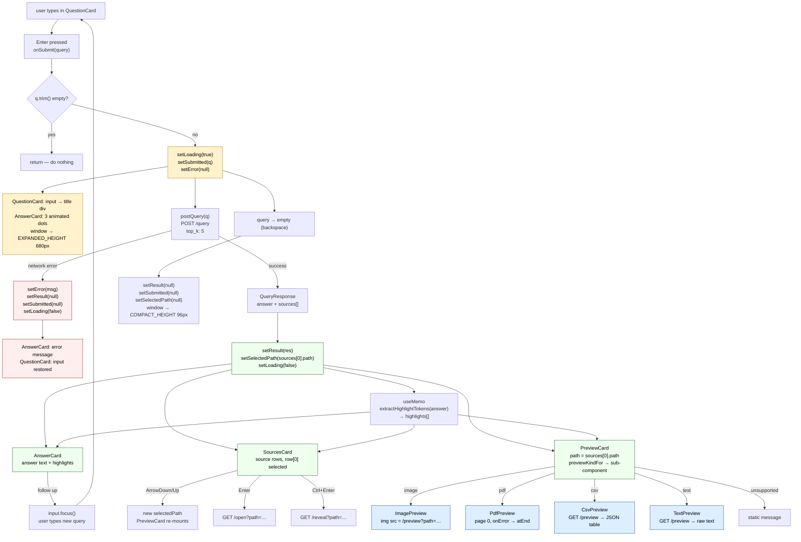

# Query flow — end to end

The sequence from the user pressing Enter to a fully rendered result. This is
the cross-cutting view; per-file-type details (preview fetching, pagination,
etc.) are in the individual type docs.

---

## Sequence

```
1. User types in QuestionCard input
2. Presses Enter (no Shift) → QuestionCard.onSubmit()
3. MagpieWindow.onSubmit(query) fires
4. POST /query → server starts RAG pipeline
5. Response arrives → React re-renders
6. Window expands, answer renders, preview loads
```

---

## Step-by-step

### 1 · Input state

While the user types, `query` state updates on every keystroke (controlled
input). Nothing queries the server yet.

`QuestionCard` shows the input; `MagpieWindow` owns the `query` state.

### 2 · Submit

`Enter` without `Shift` in the input calls `onSubmit()` in `QuestionCard`,
which is wired to `onSubmit(query)` in `MagpieWindow`.

```ts
// MagpieWindow
const onSubmit = useCallback(async (q: string) => {
  if (!q.trim()) return;
  setLoading(true);
  setError(null);
  setSubmitted(q);           // freezes the input into active mode
  try {
    const res = await postQuery(q);
    setResult(res);
    setNeedsIndex(false);
    setSelectedPath(res.sources[0]?.path ?? null);  // auto-select top source
  } catch (e) {
    setError((e as Error).message);
    setResult(null);
    setSubmitted(null);
  } finally {
    setLoading(false);
  }
}, []);
```

([MagpieWindow.tsx:137](../frontend/src/components/MagpieWindow.tsx#L137))

### 3 · In-flight state

While `loading === true`:
- `QuestionCard` switches to active mode — input is replaced by a title div
  showing the submitted question
- `AnswerCard` renders three animated dots
- `SourcesCard` shows the previous result (or nothing on first query)
- Window resizes to `EXPANDED_HEIGHT` (680px) because `loading === true`
  triggers the resize effect

### 4 · Response arrives

`postQuery` returns a `QueryResponse`:

```ts
{
  question: string;
  answer: string;
  sources: Source[];       // top_k results from Qdrant, already scored
  search_query: {
    query: string;
    keywords: string[];
  }
}
```

`setResult(res)` and `setSelectedPath(res.sources[0]?.path ?? null)` fire
together — React batches them into a single re-render.

### 5 · Re-render

Three panels populate simultaneously:

**AnswerCard**
- Receives `answer` + `highlights` (computed via `useMemo` from `answer`)
- Renders answer text with highlight tokens marked

**SourcesCard**
- Receives `sources[]`
- Renders one row per source with badge, score chip, snippet
- `selectedPath` is already set to `sources[0].path` — first row is selected

**PreviewCard**
- Receives `path = sources[0].path`
- Calls `previewKindFor(path)` → mounts the appropriate preview component
- Preview component fetches or constructs its content (see per-type docs)

### 6 · Highlight propagation

`extractHighlightTokens(result.answer)` runs once via `useMemo` after `result`
is set. The resulting `highlights[]` array is passed to:
- `AnswerCard` — marks tokens in the answer text
- `SourcesCard` → each `SourceRow` — marks tokens in snippets
- `CsvPreview` — marks tokens in table cells
- `TextPreview` — marks tokens in `<pre>` content

`ImagePreview` and `PdfPreview` receive no highlights (raster content).

### 7 · Backspace-to-dismiss

If the user backspaces the `query` state to empty, a `useEffect` resets
`result`, `submitted`, `selectedPath`, and `error` to null:

```ts
useEffect(() => {
  if (query === "") {
    setResult(null);
    setSubmitted(null);
    setSelectedPath(null);
    setError(null);
  }
}, [query]);
```

([MagpieWindow.tsx:157](../frontend/src/components/MagpieWindow.tsx#L157))

This collapses the window back to `COMPACT_HEIGHT` (96px).

---

## Full flowchart



---

## Code references

| Symbol | File | Line |
|---|---|---|
| `onSubmit` callback | [MagpieWindow.tsx](../frontend/src/components/MagpieWindow.tsx) | L137 |
| `setSelectedPath(sources[0])` | [MagpieWindow.tsx](../frontend/src/components/MagpieWindow.tsx) | L146 |
| `highlights` useMemo | [MagpieWindow.tsx](../frontend/src/components/MagpieWindow.tsx) | L132 |
| backspace-to-dismiss | [MagpieWindow.tsx](../frontend/src/components/MagpieWindow.tsx) | L157 |
| resize effect | [MagpieWindow.tsx](../frontend/src/components/MagpieWindow.tsx) | L167 |
| `postQuery` | [api.ts](../frontend/src/api.ts) | L18 |
| `extractHighlightTokens` | [Highlighted.tsx](../frontend/src/components/Highlighted.tsx) | L66 |
| `previewKindFor` | [api.ts](../frontend/src/api.ts) | L161 |
| `QuestionCard` submit | [QuestionCard.tsx](../frontend/src/components/QuestionCard.tsx) | L74 |
