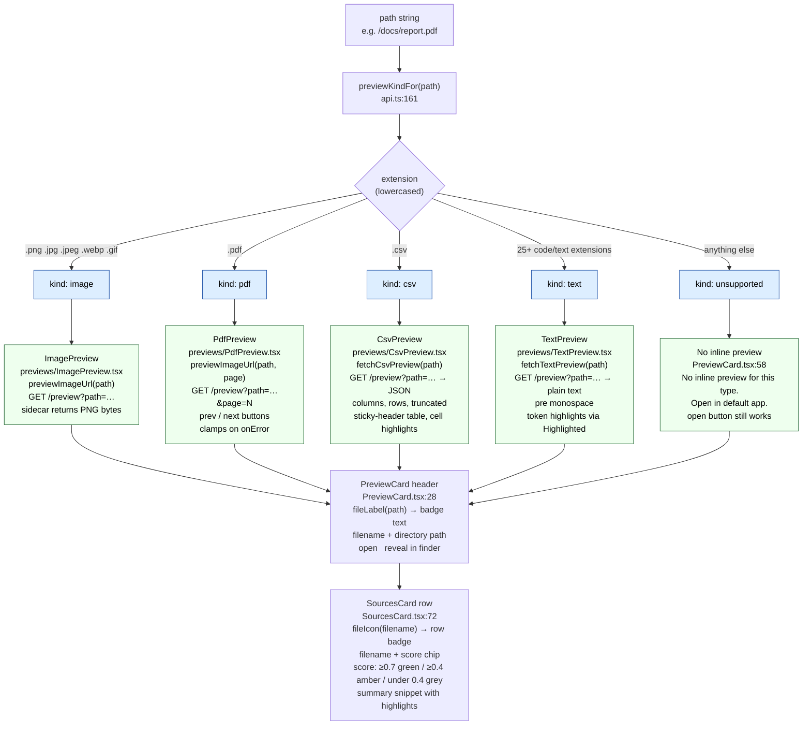

# Frontend routing

Every file path that comes back in a query result passes through three
independent routing functions before anything renders. Together they determine
what badge label appears in the preview header, what icon badge appears in the
sources list, and which preview component is mounted.

All three functions live in [frontend/src/api.ts](../frontend/src/api.ts) and
[frontend/src/components/PreviewCard.tsx](../frontend/src/components/PreviewCard.tsx) /
[frontend/src/components/SourcesCard.tsx](../frontend/src/components/SourcesCard.tsx).
None of them make network calls — they inspect the file extension only.

---

## 1. `previewKindFor` — which preview component loads

[frontend/src/api.ts:161](../frontend/src/api.ts#L161)

Returns one of five string literals. The decision is purely extension-based,
case-normalised to lowercase.

| Kind | Extensions |
|---|---|
| `"image"` | `.png` `.jpg` `.jpeg` `.webp` `.gif` |
| `"pdf"` | `.pdf` |
| `"csv"` | `.csv` |
| `"text"` | `.md` `.markdown` `.txt` `.py` `.js` `.ts` `.tsx` `.jsx` `.go` `.rs` `.java` `.c` `.cpp` `.h` `.hpp` `.cs` `.rb` `.swift` `.kt` `.sh` `.sql` `.json` `.yaml` `.yml` `.toml` |
| `"unsupported"` | everything else (`.docx` `.xlsx` `.pptx` `.xlsm` `.log` `.ipynb` …) |

`"unsupported"` is the catch-all — no explicit list. Any extension not in the
four named groups lands here.

---

## 2. `fileLabel` — badge text in the PreviewCard header

[frontend/src/components/PreviewCard.tsx:68](../frontend/src/components/PreviewCard.tsx#L68)

Shown in the top-left of the preview pane next to the filename. Has an explicit
map for common types; everything else uppercases the extension.

| Extension(s) | Label |
|---|---|
| `.png` | `PNG` |
| `.jpg` `.jpeg` | `JPG` |
| `.webp` | `WEBP` |
| `.gif` | `GIF` |
| `.pdf` | `PDF` |
| `.csv` | `CSV` |
| `.md` `.markdown` | `MD` |
| `.docx` | `DOCX` |
| `.xlsx` | `XLSX` |
| `.txt` | `TXT` |
| `.json` | `JSON` |
| anything else | extension uppercased, e.g. `.rs → RS`, `.toml → TOML` |
| no extension | `FILE` |

---

## 3. `fileIcon` — badge text in each SourcesCard row

[frontend/src/components/SourcesCard.tsx:113](../frontend/src/components/SourcesCard.tsx#L113)

Shown inline in the sources list before the filename. Fewer categories than
`fileLabel` — groups image formats, merges document types.

| Extension(s) | Icon |
|---|---|
| `.png` `.jpg` `.jpeg` `.webp` `.gif` | `IMG` |
| `.pdf` | `PDF` |
| `.csv` | `CSV` |
| `.md` `.markdown` | `MD` |
| `.docx` | `DOC` |
| `.xlsx` | `XLS` |
| everything else | `TXT` |

---

## Flowchart

---

## How the three routing results relate

When a user clicks a source row, three things happen simultaneously using the
same `path` string:

1. `previewKindFor(path)` → mounts the right preview component
2. `fileLabel(path)` → sets the badge in the preview header
3. `fileIcon(filename)` → was already rendered in the source row when results arrived

They are independent — `fileLabel` and `fileIcon` can produce different strings
for the same extension (e.g. `.docx` → `"DOCX"` label but `"DOC"` icon) because
they were written to different character-count budgets.

---

## Code references

| Function | File | Line |
|---|---|---|
| `previewKindFor` | [frontend/src/api.ts](../frontend/src/api.ts) | [L161](../frontend/src/api.ts#L161) |
| `fileLabel` | [frontend/src/components/PreviewCard.tsx](../frontend/src/components/PreviewCard.tsx) | [L68](../frontend/src/components/PreviewCard.tsx#L68) |
| `fileIcon` | [frontend/src/components/SourcesCard.tsx](../frontend/src/components/SourcesCard.tsx) | [L113](../frontend/src/components/SourcesCard.tsx#L113) |
| `ImagePreview` | [frontend/src/components/previews/ImagePreview.tsx](../frontend/src/components/previews/ImagePreview.tsx) | — |
| `PdfPreview` | [frontend/src/components/previews/PdfPreview.tsx](../frontend/src/components/previews/PdfPreview.tsx) | — |
| `CsvPreview` | [frontend/src/components/previews/CsvPreview.tsx](../frontend/src/components/previews/CsvPreview.tsx) | — |
| `TextPreview` | [frontend/src/components/previews/TextPreview.tsx](../frontend/src/components/previews/TextPreview.tsx) | — |
| `PreviewCard` | [frontend/src/components/PreviewCard.tsx](../frontend/src/components/PreviewCard.tsx) | — |
| `SourcesCard` | [frontend/src/components/SourcesCard.tsx](../frontend/src/components/SourcesCard.tsx) | — |
