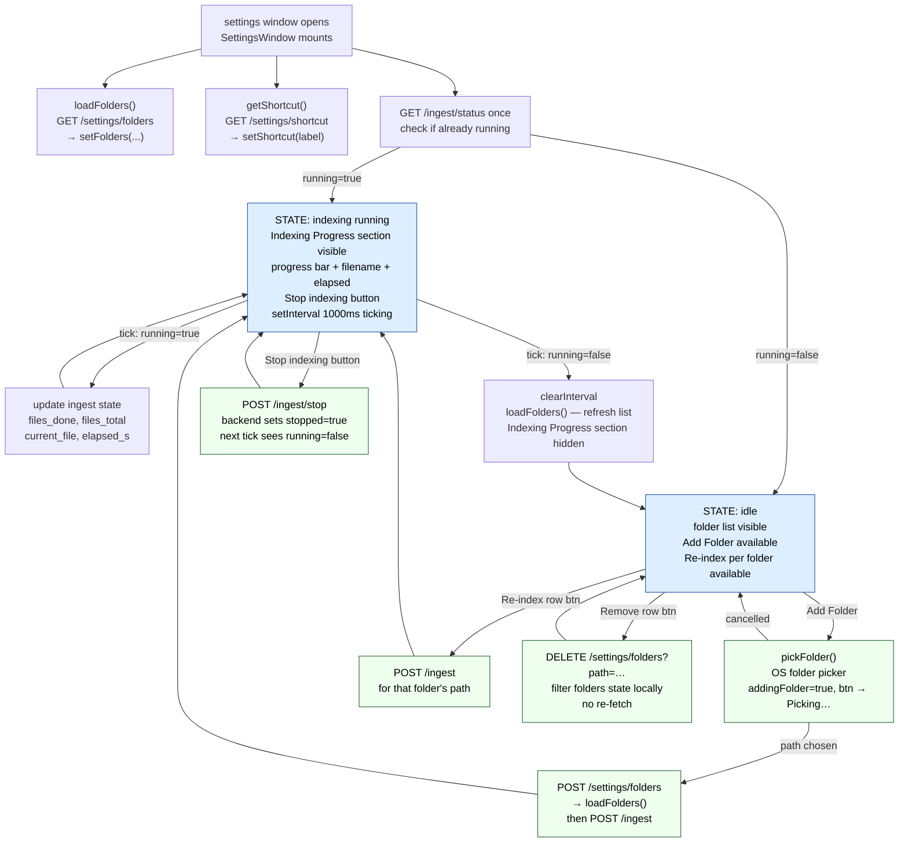

# Settings window (Surface 2 — separate Tauri window)

The settings window is a **separate Tauri webview window**, not a panel inside
the main Magpie bar. It opens when the user clicks the settings gear in the
QuestionCard (`open_settings` Tauri command). It has its own component,
stylesheet, and lifecycle — it does not share state with `MagpieWindow`.

Component: [frontend/src/components/SettingsWindow.tsx](../frontend/src/components/SettingsWindow.tsx)
CSS: [frontend/src/components/SettingsWindow.css](../frontend/src/components/SettingsWindow.css)
Rust command: `open_settings` in [frontend/src-tauri/src/lib.rs](../frontend/src-tauri/src/lib.rs)

---

## Sections

The window is a single scrollable page with four sections rendered top-to-bottom.

### 1 · Indexed Locations

Lists every folder/path registered in the backend's settings store.
Populated on mount via `GET /settings/folders`.

Each row contains:
- **Path** — full filesystem path in monospace, ellipsis-truncated if long
- **Re-index** button — `POST /ingest` for that path, then starts polling
  (disabled while any ingest is running)
- **Remove** button — `DELETE /settings/folders?path=…`, immediately removes
  the entry from local state (no re-fetch needed)
  (disabled if that specific path is currently being indexed)

The section header also contains:
- **+ Add Folder** button — opens the OS folder picker, calls
  `POST /settings/folders` to register it, then immediately starts ingesting it.
  Disabled while any ingest is running or while the picker is open (`addingFolder`
  state). Changes label to `"Picking…"` while the OS picker is open.

If no folders are registered: `"No folders indexed yet."` placeholder.

---

### 2 · Indexing Progress *(conditionally rendered)*

Only visible when `ingest?.running === true`. Appears as a rounded card with
a light border, separate from the section list.

| Element | Content |
|---|---|
| Title | `"Indexing"` |
| Message | `"N / M files"` when total is known; `"Scanning…"` before the walker has counted |
| Progress bar | `width = files_done / files_total * 100%`, `transition: width 800ms linear` |
| Detail line 1 | Current filename, truncated to last 50 chars if > 52 chars: `…<tail>` |
| Detail line 2 | `"N elapsed"` where N is formatted as `Xs` or `Xm Xs` |
| Stop button | **Stop indexing** → `POST /ingest/stop` |

The progress bar only renders if `files_total > 0`. Detail lines render only
when their respective fields are non-null.

---

### 3 · Keyboard Shortcut

Read-only display of the currently registered shortcut. Loaded on mount via
`GET /settings/shortcut`, defaulting to `"Alt+Space"` on any fetch failure.

| Element | What |
|---|---|
| Label | `"Summon Magpie"` |
| `<kbd>` | current shortcut string, e.g. `Alt+Space`, `Ctrl+Space` |
| Hint | `"To change the shortcut, quit and relaunch Magpie — it will offer alternatives if the current shortcut is taken."` |

Changing the shortcut from within the settings window is **not supported**. It
requires a full relaunch so the global shortcut plugin can register the new key
before the event loop starts.

---

### 4 · About

Static text only. No interactivity.

```
Magpie — local AI search for your files.
Built with ColPali, Qdrant, and a lot of stubbornness.
```

---

## Polling loop

The settings window has its own ingest status polling loop, independent of
the one in `MagpieWindow`. It runs on a 1 000 ms `setInterval`.

- On mount: calls `GET /ingest/status` once. If `running=true`, starts the
  interval immediately.
- On each tick: updates `ingest` state. If `running` flips to false,
  clears the interval and re-fetches the folder list (`loadFolders()`).
- On unmount: clears the interval if still active.

The duplicate polling (both windows polling `/ingest/status` simultaneously)
is safe — the endpoint is read-only and the backend state is authoritative.

---

## API calls

| Action | Method | Endpoint | Body / Query |
|---|---|---|---|
| Load folder list | GET | `/settings/folders` | — |
| Add folder | POST | `/settings/folders` | `{ "path": "…" }` |
| Remove folder | DELETE | `/settings/folders` | `?path=<encoded>` |
| Read shortcut | GET | `/settings/shortcut` | — |
| Start ingest | POST | `/ingest` | `{ "path": "…" }` |
| Poll ingest | GET | `/ingest/status` | — |
| Stop ingest | POST | `/ingest/stop` | — |

---

## Flowchart



---

## Button states summary

| Button | Disabled when |
|---|---|
| + Add Folder | `addingFolder === true` OR `ingest?.running === true` |
| Re-index (row) | `ingest?.running === true` (any ingest, not just for this folder) |
| Remove (row) | `isIndexingThis === true` (only for the folder currently being indexed) |
| Stop indexing | never disabled |

---

## Code references

| Symbol | File | Line |
|---|---|---|
| `SettingsWindow` component | [SettingsWindow.tsx](../frontend/src/components/SettingsWindow.tsx) | L20 |
| `loadFolders` | [SettingsWindow.tsx](../frontend/src/components/SettingsWindow.tsx) | L28 |
| `handleAddFolder` | [SettingsWindow.tsx](../frontend/src/components/SettingsWindow.tsx) | L94 |
| `handleRemoveFolder` | [SettingsWindow.tsx](../frontend/src/components/SettingsWindow.tsx) | L111 |
| `handleIndexFolder` | [SettingsWindow.tsx](../frontend/src/components/SettingsWindow.tsx) | L121 |
| `handleStop` | [SettingsWindow.tsx](../frontend/src/components/SettingsWindow.tsx) | L131 |
| polling loop | [SettingsWindow.tsx](../frontend/src/components/SettingsWindow.tsx) | L43 |
| `startPolling` | [SettingsWindow.tsx](../frontend/src/components/SettingsWindow.tsx) | L77 |
| `getFolders` | [api.ts](../frontend/src/api.ts) | L128 |
| `addFolder` | [api.ts](../frontend/src/api.ts) | L134 |
| `removeFolder` | [api.ts](../frontend/src/api.ts) | L144 |
| `getShortcut` | [api.ts](../frontend/src/api.ts) | L151 |
| CSS | [SettingsWindow.css](../frontend/src/components/SettingsWindow.css) | — |
