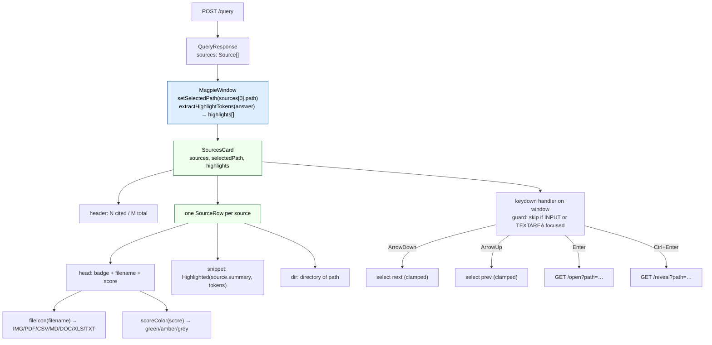

# SourcesCard

The list of result files returned by the query. Each row is a source — a file
that was retrieved from Qdrant, with its similarity score and a snippet of its
content. Clicking or keyboard-navigating to a row updates the preview pane.

Component: [frontend/src/components/SourcesCard.tsx](../frontend/src/components/SourcesCard.tsx)

---

## What it shows

```
┌──────────────────────────────────────────────────────────┐
│ SOURCES                                    2 cited / 5   │
│──────────────────────────────────────────────────────────│
│ ▶ PDF  annual-report.pdf          0.84  ●               │
│   Annual financial summary for FY2024. Revenue grew…     │
│   /documents/finance                                     │
│──────────────────────────────────────────────────────────│
│   PDF  notes.pdf                  0.61  ●               │
│   Meeting notes from the Q3 planning session. Key…       │
│   /documents/meetings                                     │
│──────────────────────────────────────────────────────────│
│   IMG  org-chart.png              0.43                   │
│   Organisation chart updated March 2024.                 │
│   /documents/company                                     │
└──────────────────────────────────────────────────────────┘
```

The selected row gets the `is-selected` CSS class (shown as `▶` above).
Cited rows get the `is-cited` CSS class (dot indicator via CSS).

---

## Header

```ts
<div className="sources-card__header">
  <span className="sources-card__label">SOURCES</span>
  <span className="sources-card__count">
    {sources.filter((s) => s.cited).length} cited / {sources.length}
  </span>
</div>
```

"cited" means the source's content was used in building the LLM answer — the
backend sets `cited: true` on those sources in the `/query` response.

---

## Source row (`SourceRow`)

Each row is a `<li>` with three sub-sections:

### Head
```
[fileIcon badge]  [filename]  [score chip]
```

| Element | Detail |
|---|---|
| `source-row__icon` | Badge text from `fileIcon(filename)` — see table below |
| `source-row__name` | Basename of path; `title` attribute holds the full path on hover |
| `source-row__score` | `score.toFixed(2)`, colour from `scoreColor(score)` |

### Snippet
```
<Highlighted text={source.summary} tokens={highlights} />
```
The `summary` field from the `/query` response. For most file types this is the
LLM-generated description stored at ingest time. Query tokens are highlighted.

### Directory
```
<div className="source-row__dir">{dir}</div>
```
The directory portion of the path (everything before the last `/`).

---

## Badge text (`fileIcon`)

Defined at [SourcesCard.tsx:113](../frontend/src/components/SourcesCard.tsx#L113).

| Extension(s) | Badge |
|---|---|
| `.png` `.jpg` `.jpeg` `.webp` `.gif` | `IMG` |
| `.pdf` | `PDF` |
| `.csv` | `CSV` |
| `.md` `.markdown` | `MD` |
| `.docx` | `DOC` |
| `.xlsx` | `XLS` |
| everything else | `TXT` |

Note: this badge differs from `fileLabel` in `PreviewCard`, which uses the
exact extension (e.g. `PY`, `TS`, `JSON`). SourcesCard groups all non-specific
text files under `TXT`.

---

## Score colour (`scoreColor`)

Defined at [SourcesCard.tsx:124](../frontend/src/components/SourcesCard.tsx#L124).

| Score | Colour |
|---|---|
| `≥ 0.70` | `var(--score-green)` |
| `≥ 0.40` | `var(--score-amber)` |
| `< 0.40` | `var(--score-grey)` |

---

## Row classes

| Class | When applied |
|---|---|
| `is-selected` | `source.path === selectedPath` |
| `is-cited` | `source.cited === true` |

Both classes are on the `<li>` element. CSS controls the visual rendering —
`is-selected` typically adds a left border or background tint, `is-cited`
shows the citation dot.

---

## Keyboard navigation

A `keydown` listener is registered on `window` (not the list element) so it
intercepts keys regardless of what element has focus.

**Guard:** keys are ignored when focus is on an `INPUT` or `TEXTAREA`, so
typing in the search bar doesn't move the source selection.

| Key | Action |
|---|---|
| `↓` | Select next source (clamped to last) |
| `↑` | Select previous source (clamped to first) |
| `Enter` | Open selected file in OS default app (`GET /open?path=…`) |
| `Ctrl+Enter` / `⌘+Enter` | Reveal selected file in Explorer / Finder (`GET /reveal?path=…`) |

`selectedIdx` is kept in sync via `useMemo` so the handler always operates on
the current position without a stale-closure problem.

---

## Auto-selection

The top-scoring source is selected automatically when results arrive. This
happens in `MagpieWindow`:

```ts
setSelectedPath(res.sources[0]?.path ?? null);
```

([MagpieWindow.tsx:146](../frontend/src/components/MagpieWindow.tsx#L146))

The preview pane loads immediately for the first source without any user
interaction.

---

## Data flow



---

## Code references

| Symbol | File | Line |
|---|---|---|
| `SourcesCard` component | [SourcesCard.tsx](../frontend/src/components/SourcesCard.tsx) | L15 |
| keyboard handler | [SourcesCard.tsx](../frontend/src/components/SourcesCard.tsx) | L21 |
| `SourceRow` component | [SourcesCard.tsx](../frontend/src/components/SourcesCard.tsx) | L72 |
| `splitPath` | [SourcesCard.tsx](../frontend/src/components/SourcesCard.tsx) | L106 |
| `fileIcon` | [SourcesCard.tsx](../frontend/src/components/SourcesCard.tsx) | L113 |
| `scoreColor` | [SourcesCard.tsx](../frontend/src/components/SourcesCard.tsx) | L124 |
| auto-select | [MagpieWindow.tsx](../frontend/src/components/MagpieWindow.tsx) | L146 |
| `highlights` useMemo | [MagpieWindow.tsx](../frontend/src/components/MagpieWindow.tsx) | L132 |
| `Highlighted` | [Highlighted.tsx](../frontend/src/components/Highlighted.tsx) | L8 |
