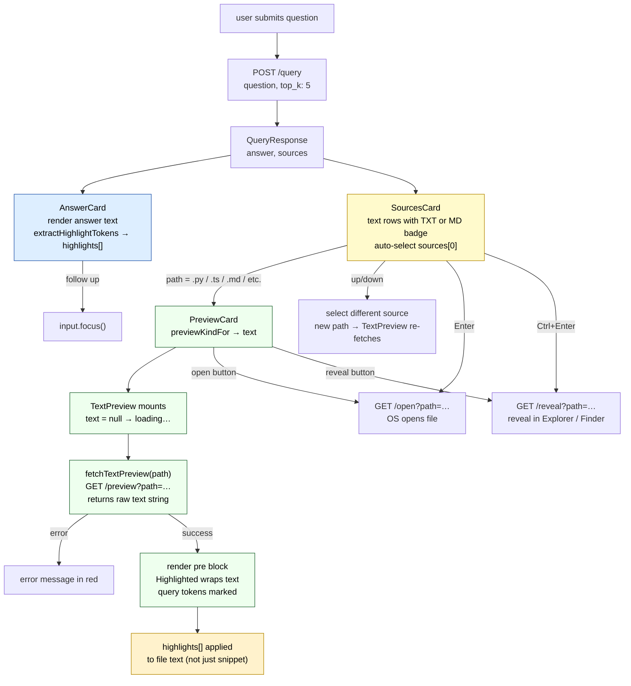

# Text — query-time UI

What the user sees and can do after Magpie returns a text-based file as a result.
"Text" covers a broad set of extensions that all render as a scrollable `<pre>`
block with highlight tokens applied.

For how text files get into the index see the backend Tiers docs.

---

## Covered extensions

`previewKindFor` routes these extensions to `"text"`:

```
.md  .markdown  .txt  .py  .js  .ts  .tsx  .jsx
.go  .rs  .java  .c  .cpp  .h  .hpp  .cs  .rb
.swift  .kt  .sh  .sql  .json  .yaml  .yml  .toml
```

([api.ts:166](../frontend/src/api.ts#L166))

Everything else that is not an image, PDF, or CSV falls through to
`"unsupported"` — see [UNSUPPORTED.md](./UNSUPPORTED.md).

---

## What the UI shows

```
┌────────────────────────────────────────────────────────────────┐
│  ANSWER                          │  preview pane               │
│  The retry logic is in           │  def fetch_with_retry(      │
│  fetch_with_retry(), which        │    url, retries=3           │
│  uses exponential backoff.        │  ):                         │
│                                  │    for i in range(retries): │
│  + follow up                     │      try:                   │
├──────────────────────────────────│        resp = requests…     │
│  SOURCES          1 cited / 3    │      except Exception:      │
│  ▶ TXT  utils.py      0.79 ●   │        ...                  │
│    Utility module with HTTP…     │                             │
│    /src/network                  │                             │
└────────────────────────────────────────────────────────────────┘
```

---

## AnswerCard

Same structure as all file types. Highlight tokens extracted from the answer
text flow down to both the SourcesCard snippet and the `TextPreview` content.

---

## SourcesCard — text row

[frontend/src/components/SourcesCard.tsx](../frontend/src/components/SourcesCard.tsx)

| Element | Content |
|---|---|
| Icon badge | `TXT` for most text files; `MD` for `.md` / `.markdown` |
| Filename | e.g. `utils.py` |
| Score chip | colour-coded: `≥ 0.7` green / `≥ 0.4` amber / `< 0.4` grey |
| Cited dot | present if this file's content contributed to the answer |
| Snippet | `source.summary` from the query response, with highlight tokens marked |
| Directory | directory portion of path |

**Icon badge detail:** `fileIcon` has explicit cases only for `.md`/`.markdown`
→ `"MD"` and falls back to `"TXT"` for all other text extensions, including
`.py`, `.ts`, `.json`, `.sql`, etc.

**Header badge:** `fileLabel` in PreviewCard shows the actual extension in caps
(`PY`, `TS`, `JSON`, `SQL`, `MD`, `TXT`, etc.).

**Keyboard navigation:** `↑↓` navigate sources, `Enter` opens in OS default
app, `Ctrl+Enter` / `⌘+Enter` reveals in Explorer / Finder.

---

## PreviewCard — TextPreview

[frontend/src/components/previews/TextPreview.tsx](../frontend/src/components/previews/TextPreview.tsx)

### What is fetched

```ts
fetchTextPreview(path)
  → GET /preview?path=<encoded>
  → Content-Type: text/plain
  → raw file text (string)
```

The sidecar returns the raw file contents as plain text. There is no
line-count limit documented in the frontend — the backend decides how much
to return.

### What renders

A `<pre>` block containing the file text run through `Highlighted`:

```ts
<pre style={{
  fontFamily: "var(--font-mono)",
  fontSize: 12,
  lineHeight: 1.55,
  color: "var(--text-primary)",
  whiteSpace: "pre-wrap",
  wordBreak: "break-word",
  margin: 0,
}}>
  <Highlighted text={text} tokens={highlights} />
</pre>
```

`Highlighted` marks any query-derived tokens with `<mark class="magpie-highlight">`.
The result is syntax-agnostic — no language-aware colouring, just the raw text
with keyword highlights on top.

### Loading and error states

| State | What shows |
|---|---|
| loading (`text === null`) | `"loading…"` in `var(--text-dim)` |
| error | error message in `#ff8e8e` (red) |
| loaded | scrollable `<pre>` |

The component resets to loading whenever `path` changes — `useEffect` on
`path` sets both `text` and `error` to null and fires a new fetch.

### No pagination

Text has no page buttons. The backend returns a single chunk; the user scrolls
through it.

---

## Header actions (PreviewCard)

| Button | Action |
|---|---|
| `↗ open` | `GET /open?path=…` → OS default app (editor, etc.) |
| `↺ reveal in finder` | `GET /reveal?path=…` → Explorer / Finder |

Header shows: extension badge (e.g. `PY`, `MD`, `JSON`), filename,
`~/full/path` directory.

---

## Data flow



---

## Code references

| Symbol | File | Line |
|---|---|---|
| `TextPreview` component | [previews/TextPreview.tsx](../frontend/src/components/previews/TextPreview.tsx) | L5 |
| `fetchTextPreview` | [api.ts](../frontend/src/api.ts) | L60 |
| `previewKindFor` → `"text"` | [api.ts](../frontend/src/api.ts) | L166 |
| `fileLabel` → extension badge | [PreviewCard.tsx](../frontend/src/components/PreviewCard.tsx) | L68 |
| `fileIcon` → `"TXT"` / `"MD"` | [SourcesCard.tsx](../frontend/src/components/SourcesCard.tsx) | L113 |
| `Highlighted` (cell text) | [Highlighted.tsx](../frontend/src/components/Highlighted.tsx) | L8 |
| `extractHighlightTokens` | [Highlighted.tsx](../frontend/src/components/Highlighted.tsx) | L66 |
| auto-select top source | [MagpieWindow.tsx](../frontend/src/components/MagpieWindow.tsx) | L146 |
| keyboard nav (sources) | [SourcesCard.tsx](../frontend/src/components/SourcesCard.tsx) | L22 |

**Backend:** text ingest path in the backend Tiers docs.
