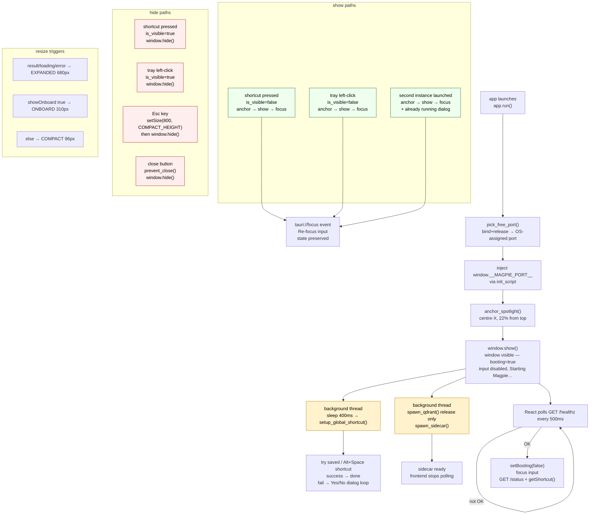

# Window lifecycle

Everything about how the Magpie window appears, positions itself, resizes,
and disappears. Split between Rust (`lib.rs`) and React (`MagpieWindow.tsx`).
Neither side knows the full story alone.

Rust: [frontend/src-tauri/src/lib.rs](../frontend/src-tauri/src/lib.rs)
React: [frontend/src/components/MagpieWindow.tsx](../frontend/src/components/MagpieWindow.tsx)

---

## Anchor positioning

`anchor_spotlight` in [lib.rs:14](../frontend/src-tauri/src/lib.rs#L14)

Called every time the window is shown — on shortcut press, tray left-click,
and single-instance focus. Never called on hide.

```
x = (screen.width  - window.outer_width)  / 2        ← horizontal centre
y =  screen.height * 0.22                             ← 22% from top
both values clamped to ≥ 0
```

Monitor resolution: tries `current_monitor()` first (the monitor the window
is already on), falls back to `primary_monitor()`. If both fail, returns
without moving the window.

Uses `PhysicalPosition` — pixel-perfect regardless of DPI scaling. Tauri's
`set_position` keeps top-left fixed; subsequent `set_size` calls grow the
window downward, so the anchor point never shifts mid-session.

---

## Window sizes

All sizes are **logical pixels** (`LogicalSize`). The window is not resizable
by the user (`resizable: false` in `WebviewWindowBuilder`).

| Constant | Value | When |
|---|---|---|
| `COMPACT_HEIGHT` | `96` | defined but never used as a resize target anymore |
| `MANAGE_HEIGHT` | `160` | idle or hidden — management card only |
| `ONBOARD_HEIGHT` | `310` | indexing / error / needsIndex / indexDone states |
| `EXPANDED_HEIGHT` | `680` | any active query (result, loading, or query error) |
| width | `800` | always — `COMPACT_WIDTH` constant |

The resize fires in a React `useEffect`:
[MagpieWindow.tsx:167](../frontend/src/components/MagpieWindow.tsx#L167)

```ts
result !== null || loading || error !== null  → EXPANDED_HEIGHT
indexing || indexError || needsIndex || indexDone → ONBOARD_HEIGHT
else                                           → COMPACT_HEIGHT
```

Tauri's `set_size` anchors the top-left corner, so growth is always downward.
No re-anchor is needed during a session.

---

## Show / hide paths

There are three independent paths that show the window and one path that hides it.
All show-paths call `anchor_spotlight` before showing.

### Global shortcut (toggle)

Registered in a background thread 400 ms after the event loop starts
([lib.rs:224](../frontend/src-tauri/src/lib.rs#L224)).

On `ShortcutState::Pressed`:
- visible → `window.hide()`
- hidden → `anchor_spotlight` → `window.show()` → `window.set_focus()`

### Tray icon left-click (toggle)

`on_tray_icon_event` handler, `MouseButton::Left` + `MouseButtonState::Up`:
[lib.rs:243](../frontend/src-tauri/src/lib.rs#L243)

Same toggle logic: visible → hide, hidden → anchor → show → focus.

### Single-instance redirect

When a second process tries to launch, `tauri_plugin_single_instance` fires
the callback in the **first** process ([lib.rs:148](../frontend/src-tauri/src/lib.rs#L148)):

- `anchor_spotlight` → `window.show()` → `window.set_focus()`
- Shows a blocking dialog: `"Magpie is already running. … summon with {shortcut}."`
  where `{shortcut}` is read live from `shortcut.json` (or `"Alt+Space"` if
  the file doesn't exist).

### Esc key (hide only)

A `keydown` listener in React ([MagpieWindow.tsx:189](../frontend/src/components/MagpieWindow.tsx#L189)):

```ts
if (e.key === "Escape") hideWindow()
```

`hideWindow` ([MagpieWindow.tsx:319](../frontend/src/components/MagpieWindow.tsx#L319)):
1. `setSize(COMPACT_WIDTH, COMPACT_HEIGHT)` — shrinks first so the next summon
   opens already-compact, avoiding a frame where the full expanded layout flashes
2. `window.hide()`

### Close button (prevented)

`on_window_event` catches `CloseRequested` and calls `api.prevent_close()`,
then hides the window instead ([lib.rs:337](../frontend/src-tauri/src/lib.rs#L337)).
The app never truly closes via the window close button — only via tray → Quit.

---

## Booting sequence

```
app.run()
  └─ setup()
       ├─ pick_free_port() — bind + release a socket, get OS-assigned port
       ├─ inject window.__MAGPIE_PORT__ via init script
       ├─ anchor_spotlight → window.show()         ← window visible immediately
       ├─ thread::spawn → setup_global_shortcut()  ← background, 400ms delay
       └─ thread::spawn → spawn_qdrant()           ← background (release only)
                        → spawn_sidecar()          ← background
```

The window is visible before the sidecar starts. The React side polls
`GET /healthz` every 500 ms with `booting=true`:
[MagpieWindow.tsx:48](../frontend/src/components/MagpieWindow.tsx#L48)

While `booting`:
- Input is disabled
- Placeholder reads `"Starting Magpie…"`

When `healthz` responds OK:
- `setBooting(false)` → `requestAnimationFrame(() => inputRef.current?.focus())`
- `GET /status` → if `indexed_count === 0` → `setNeedsIndex(true)`

---

## Focus behaviour

Two focus effects in React:

**1. Boot focus** ([MagpieWindow.tsx:201](../frontend/src/components/MagpieWindow.tsx#L201))
Fires once when `booting` flips to `false`. Focuses the input.

**2. Re-summon focus** ([MagpieWindow.tsx:206](../frontend/src/components/MagpieWindow.tsx#L206))
Listens for `tauri://focus` events (fired when the Tauri window gains OS focus).
Re-focuses the input each time. Does not reset state — an in-progress query
survives the window being hidden and re-summoned.

---

## Global shortcut registration

Runs in a background thread, sleeps 400 ms first so the window is visible
before any dialog appears.
[lib.rs:87](../frontend/src-tauri/src/lib.rs#L87)

```
load shortcut.json
  found → try to register that shortcut
    success → done (save if it was the default)
    fail    → proceed to picker loop (same as "not found")
  not found → try Alt+Space
    success → save "Alt+Space", done
    fail    → picker loop
```

**Picker loop** — sequential blocking Yes/No dialogs, one per alternative:

| Step | Dialog |
|---|---|
| For each of Alt+Q / Ctrl+Space / Ctrl+Alt+Space | `"<failed> is already in use. Use <alt> instead?"` Yes/No |
| If Yes and registration succeeds | save choice, done |
| If Yes but registration also fails | `"<alt> couldn't be registered either. Trying another…"` |
| If user says No | try next alternative |
| All exhausted or declined | `"No global shortcut could be registered. Use the tray icon."` |

Persistence: the chosen shortcut label is written to `shortcut.json` in the
app data directory as `{"shortcut":"<label>"}`.

---

## App data directory

Used for `shortcut.json` and Qdrant storage.
[lib.rs:367](../frontend/src-tauri/src/lib.rs#L367)

Mirrors `platformdirs.user_data_dir("Magpie", "magpie", roaming=False)` so
Rust and Python agree without passing env vars.

| OS | Path |
|---|---|
| Windows | `%LOCALAPPDATA%\magpie\Magpie\` |
| macOS | `~/Library/Application Support/Magpie/` |
| Linux | `$XDG_DATA_HOME/Magpie/` or `~/.local/share/Magpie/` |

---

## Child process cleanup

On `tauri::RunEvent::Exit` (force-quit, system shutdown):
[lib.rs:349](../frontend/src-tauri/src/lib.rs#L349)

```
SidecarState → child.kill() + child.wait()
QdrantState  → child.kill() + child.wait()
```

Both children are held in `Mutex<Option<Child>>` managed state. If the app
crashes without hitting `RunEvent::Exit`, the children may become orphans —
there is no watchdog or PID file.

---

## Flowchart



---

## Code references

| Symbol | File | Line |
|---|---|---|
| `anchor_spotlight` | [lib.rs](../frontend/src-tauri/src/lib.rs) | L14 |
| `try_register_shortcut` | [lib.rs](../frontend/src-tauri/src/lib.rs) | L65 |
| `setup_global_shortcut` | [lib.rs](../frontend/src-tauri/src/lib.rs) | L87 |
| `preset_shortcuts` | [lib.rs](../frontend/src-tauri/src/lib.rs) | L55 |
| `load_saved_shortcut` / `save_shortcut` | [lib.rs](../frontend/src-tauri/src/lib.rs) | L41 / L47 |
| `app_data_dir` | [lib.rs](../frontend/src-tauri/src/lib.rs) | L367 |
| single-instance callback | [lib.rs](../frontend/src-tauri/src/lib.rs) | L148 |
| tray click handler | [lib.rs](../frontend/src-tauri/src/lib.rs) | L243 |
| close-prevent handler | [lib.rs](../frontend/src-tauri/src/lib.rs) | L337 |
| child process cleanup | [lib.rs](../frontend/src-tauri/src/lib.rs) | L349 |
| booting poll | [MagpieWindow.tsx](../frontend/src/components/MagpieWindow.tsx) | L46 |
| resize effect | [MagpieWindow.tsx](../frontend/src/components/MagpieWindow.tsx) | L167 |
| Esc handler | [MagpieWindow.tsx](../frontend/src/components/MagpieWindow.tsx) | L189 |
| boot focus effect | [MagpieWindow.tsx](../frontend/src/components/MagpieWindow.tsx) | L201 |
| re-summon focus effect | [MagpieWindow.tsx](../frontend/src/components/MagpieWindow.tsx) | L206 |
| `hideWindow` | [MagpieWindow.tsx](../frontend/src/components/MagpieWindow.tsx) | L319 |
