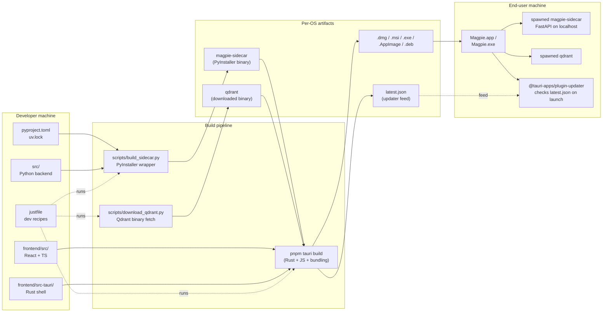

# 00 — Packaging Overview

## What this folder is

This folder is the **reading-order documentation set for the packaging
work landed on the `packaging` branch as of 2026-05-08**. Each file
covers one concern, end-to-end, and contains at least one diagram so
you can see the data flow without reading the source.

| # | Document | What it answers |
|---|---|---|
| 00 | this file | "Where do I start?" |
| 01 | [Bundle Diet](01-bundle-diet.md) | "Why does the install fit on a laptop?" |
| 02 | [Sidecar Build](02-sidecar-build.md) | "How does Python become an executable?" |
| 03 | [Desktop Shell](03-desktop-shell.md) | "What is the desktop app, and how does it start the backend?" |
| 04 | [Auto-Updater](04-auto-updater.md) | "How does an installed app upgrade itself?" |
| 05 | [Release Pipeline](05-release-pipeline.md) | "How does a tag-push become signed installers?" |
| 06 | [Local Development](06-local-development.md) | "How do I run all of this on my own machine?" |
| 07 | [Day Log 2026-05-08](07-day-log-2026-05-08.md) | "What was actually shipped on the day this got documented?" |

The locked plan that drives all of the above lives next to this
folder: [`Plans/Packaging/Implementation Plan.md`](../Implementation%20Plan.md).
The historical brainstorm that became that plan: [`Plans/Packaging/Brainstorm.md`](../Brainstorm.md).

---

## The product, in one paragraph

We ship a desktop app called **Magpie**. It looks like Spotlight, but
instead of file-name matching it does *semantic* search: ingests your
local documents (PDFs, notes, invoices, slides), summarizes them,
embeds the summaries in a vector database, and answers natural-language
questions by retrieving the relevant summaries and reading the
corresponding files. Everything indexing-related runs locally on the
user's machine; only the LLM call (optional) hits the network. This
folder documents how we turn the source tree into installable artifacts
for macOS, Windows, and Linux.

---

## Component map (the whole system, one picture)

**Read this picture left to right:** developer-side source feeds the
build pipeline, the build pipeline emits per-OS artifacts, the
artifacts install onto a user's machine, and the running app spawns
the Python + Qdrant binaries it ships with while the updater module
periodically checks the manifest for new releases.

---

## Three "tiers" of distribution

The implementation plan ([`Plans/Packaging/Implementation Plan.md`](../Implementation%20Plan.md)
§5) calls out three distribution tiers we work toward in order. The
documentation set below mirrors them.

| Tier | What the user does | Audience | Status today |
|---|---|---|---|
| **1** | `uv sync && uv run notspotlight` | other developers | ✅ Working — see [01-bundle-diet.md](01-bundle-diet.md) for size |
| **2** | Run a single binary (`magpie-sidecar`) | testers, "give me the tool" friends | ✅ Builds, ⚠️ smoke-tested in CI but no perf record yet |
| **3** | Double-click an installer (`.dmg`, `.msi`, etc.) | end customers | 🟡 Builds unsigned; signing + update feed pending — see [05-release-pipeline.md](05-release-pipeline.md) |

Plus auto-updates layered on top of Tier 3: see
[04-auto-updater.md](04-auto-updater.md).

---

## How to use these docs

1. **You're new and want the elevator pitch?** — finish this file, you're done.
2. **You're touching dependency code or worried about install size?** — [01-bundle-diet.md](01-bundle-diet.md).
3. **You want to ship a new build today?** — [05-release-pipeline.md](05-release-pipeline.md), then [06-local-development.md](06-local-development.md) for the dry-run.
4. **CI is red on a build?** — [05-release-pipeline.md](05-release-pipeline.md) lists the smoke test that catches most regressions.
5. **The updater isn't picking up a new version?** — [04-auto-updater.md](04-auto-updater.md), specifically the "things that go wrong" table.
6. **You want to know what got done on a specific day?** — [07-day-log-2026-05-08.md](07-day-log-2026-05-08.md).
