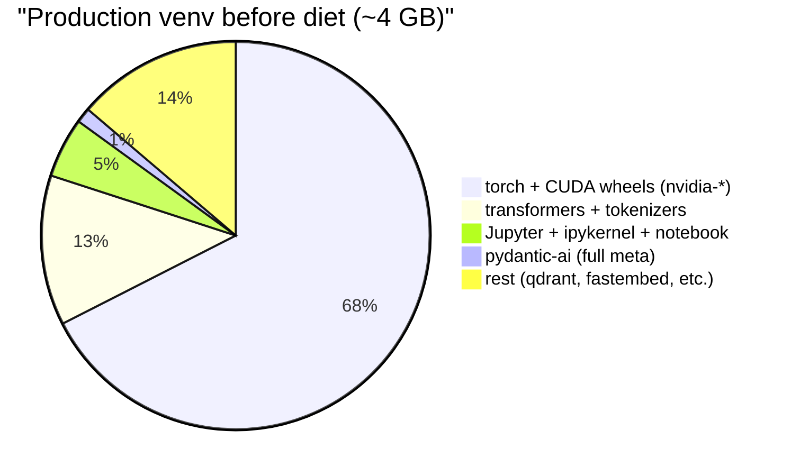
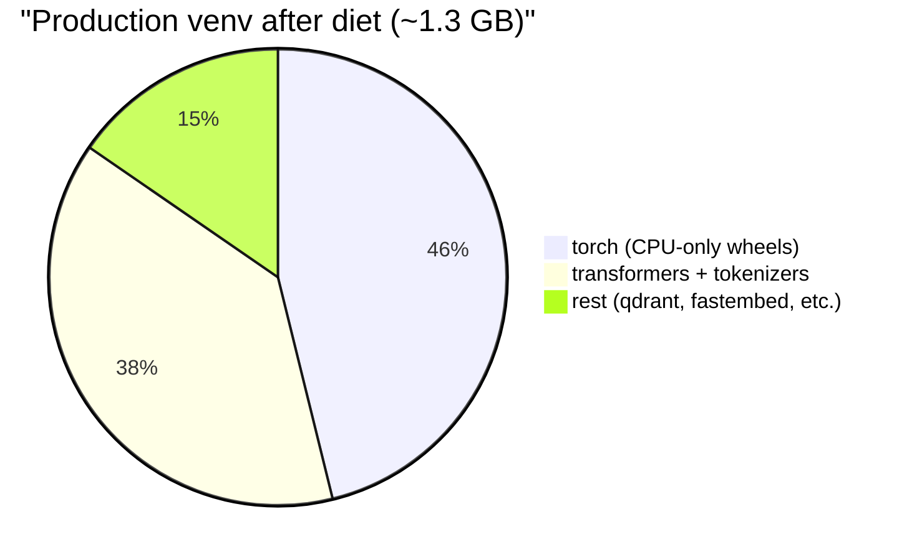
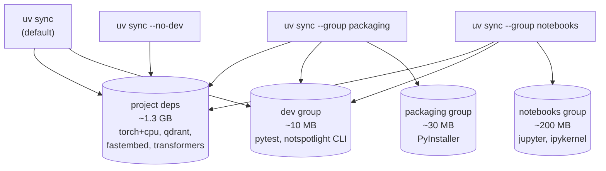
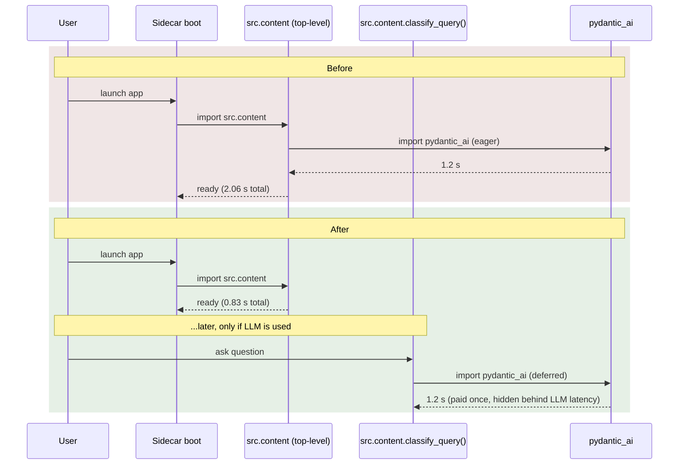

# 01 — Bundle Diet

## What this is about

The unmodified Magpie venv was **~4 GB**. Most of that was deep-learning
runtime libraries we don't use (CUDA wheels for users on CPU-only Macs
and Linux boxes), plus a few transitively pulled validation libraries
that imported eagerly at module load and slowed cold start to >2 seconds.

The Bundle Diet was a five-PR sweep that brought the production install
down to **~1.3 GB on Mac/CPU-Linux** and cut a critical-path import
from **2.06 s → 0.83 s** — without changing a single feature.

This work is the foundation for everything else. A 4 GB installer
isn't shippable; a 1.3 GB one is borderline; further trimming via
PyInstaller excludes (Tier 3) cuts the sidecar binary another
~450–750 MB on top of that — see [02-sidecar-build.md](02-sidecar-build.md).

---

## Component map

| Component | Purpose | File |
|---|---|---|
| Python project manifest | Declares the install surface and dependency groups | [`pyproject.toml`](../../../pyproject.toml) |
| Locked dependency graph | Frozen, deterministic resolution; what CI actually installs | [`uv.lock`](../../../uv.lock) |
| Lazy-import patch | Defers `pydantic_ai` until first use | [`src/content.py`](../../../src/content.py) |
| Exclude-list audit | Diagnostic for unused transformer architectures | [`scripts/list_unused_transformers_models.py`](../../../scripts/list_unused_transformers_models.py) |
| Diet plan | Per-PR rationale, size deltas, deferred work | [`Plans/Bundle Trim/Implementation Plan.md`](../../Bundle%20Trim/Implementation%20Plan.md) |

---

## Where the size came from (before)

CUDA libraries dominated, and Jupyter — only needed by one of us when
opening notebooks — was forced on every install.

## Where the size goes now (after)

CUDA libraries removed (saved ~2.7 GB), Jupyter moved to an opt-in
group (saved ~200 MB on default installs), `pydantic-ai` swapped to
the slim variant. Note: this is the `uv` install size, not the bundled
binary — see [02-sidecar-build.md](02-sidecar-build.md) for what
PyInstaller does on top.

---

## Dependency-group split

The single biggest UX change: `pyproject.toml` now declares **three
opt-in groups** instead of one giant install.

| Persona | Command | Why |
|---|---|---|
| Contributor (default) | `uv sync` | smallest install that lets you run tests and the CLI |
| Build engineer | `uv sync --group packaging` | adds PyInstaller for the sidecar build |
| Notebook user | `uv sync --group notebooks` | adds Jupyter for `notebooks/*.ipynb` |
| CI build job | `uv sync --no-dev` | production install — smallest possible |
| Linux + NVIDIA user | `UV_TORCH_BACKEND=cu121 uv sync` | opts back into CUDA wheels |

Run `just deps` to see the same cheat-sheet at the terminal.

---

## The torch-CPU re-route (the biggest win)

`pyproject.toml` includes a `[tool.uv.sources]` block that points
`torch` at PyTorch's CPU-only wheel index. The lockfile change:

- **−13** `nvidia-*` package entries (was: nvidia-cublas, nvidia-cuda-cupti, nvidia-cuda-nvrtc, nvidia-cuda-runtime, nvidia-cudnn, nvidia-cufft, nvidia-curand, nvidia-cusolver, nvidia-cusparse, nvidia-nccl, nvidia-nvjitlink, nvidia-nvtx, triton)
- torch source URL: `pypi.org/simple` → `download.pytorch.org/whl/cpu`
- net lockfile churn: −1690 lines

Mac users still get MPS — the `+cpu` tag means *no bundled CUDA libs*,
not *no GPU support*. NVIDIA-on-Linux users override at sync time
(`UV_TORCH_BACKEND=cu121`) without touching the project files.

---

## Lazy-import patch (`src/content.py`)

`pydantic_ai` was imported at module load. Because `src/content.py`
is on the cold-start path (loaded as soon as the FastAPI server boots),
this added **~1.2 s of import time** to every fresh sidecar launch —
even when no LLM call ever happens.

Fix: move the import inside the function that actually uses it.

The deferred import lands inside the function — pydantic_ai's cost
hides behind the LLM call's own latency, so the user never sees it.

---

## Exclude-list audit (preview of Tier 3)

Hugging Face's `transformers` package ships ~150 model architectures
(BERT, GPT-2, Llama, T5, etc.). Magpie uses ~12 of them. PyInstaller's
static analysis can't tell which: `transformers` does dynamic
string-name loading via `AutoModel.from_pretrained()`, so every
architecture ends up in the bundle.

[`scripts/list_unused_transformers_models.py`](../../../scripts/list_unused_transformers_models.py)
imports `transformers`, walks `transformers/models/`, subtracts an
ALLOWLIST of architectures we *do* need (paligemma, qwen2_vl,
qwen2_5_vl, gemma, gemma2, gemma3, siglip, bert, mpnet, distilbert, …)
and prints the rest as `--exclude-module transformers.models.X` lines.

The output is **not yet wired into [`build_sidecar.py`](../../../scripts/build_sidecar.py)**
— it's deferred until we run a full multi-tier smoke test (T0 text,
T1 code, T2 PDF, T3 vision PDF, T4 ColPali). Each tier exercises
different model loads. Estimated saving when applied: **~450–750 MB**
of bundle size.

See [02-sidecar-build.md §"Three tiers of excludes"](02-sidecar-build.md#three-tiers-of-excludes)
for what's already wired (Tiers 1 + 2) vs. what's deferred (Tier 3).

---

## Things that go wrong

| Symptom | Cause | Fix |
|---|---|---|
| Linux user with NVIDIA card sees torch import error | They ran `uv sync` and got the CPU wheel | Re-sync with `UV_TORCH_BACKEND=cu121 uv sync` |
| Notebook fails to start with "no kernel" | They didn't install the notebooks group | `uv sync --group notebooks` |
| CI install size suddenly 4 GB again | Someone removed the `[tool.uv.sources]` block in pyproject.toml | Revert; verify lockfile has zero `nvidia-*` lines |
| Cold start regressed past ~1 s | A new top-level import was added on the boot path | Grep recent commits in `src/content.py` and adjacent files for new imports; defer them |

---

## What's next

- Apply Tier 3 excludes to `build_sidecar.py` and re-run the multi-tier smoke test.
- Audit `sentence-transformers` for similar dynamic-load architectures (likely a smaller win).
- Consider a `--group cloud` for users who only ever use the cloud LLM (no local llama-server, no GGUF cache).
