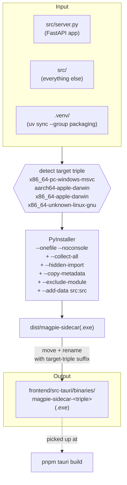
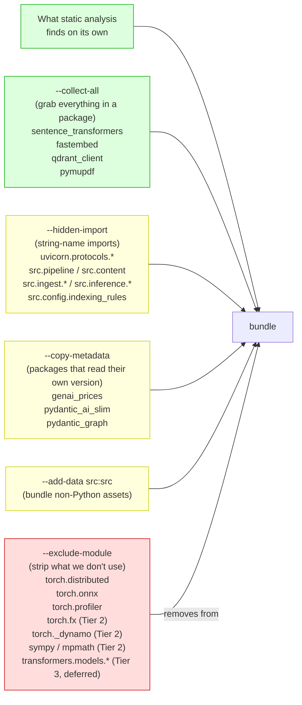
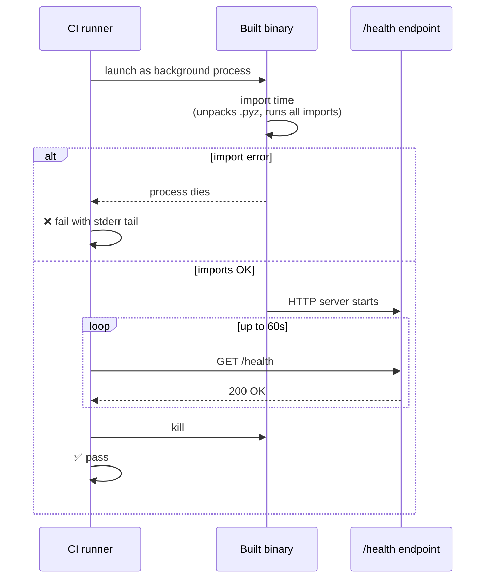

# 02 — Sidecar Build

## What this is about

The Magpie desktop app is two processes that talk to each other over
HTTP on localhost:

1. **The shell** — Tauri (Rust + WebView). The window the user sees.
2. **The sidecar** — a FastAPI Python server. Does all the actual work
   (indexing, embedding, vector search, file reading, LLM calls).

The shell is built by `tauri build` (Rust toolchain). The sidecar
needs a different build path — Python doesn't compile to a binary on
its own. We use **PyInstaller** to wrap the Python interpreter, the
project source, and every transitive dependency into a single
executable that the shell can spawn.

This document is about that wrapping step.

---

## Component map

| Component | Purpose | File |
|---|---|---|
| Build script | PyInstaller wrapper, target-triple detection, includes/excludes | [`scripts/build_sidecar.py`](../../../scripts/build_sidecar.py) |
| Sidecar entry point | The FastAPI app PyInstaller bundles | [`src/server.py`](../../../src/server.py) |
| Excludes audit (deferred input) | Generates Tier-3 transformer excludes | [`scripts/list_unused_transformers_models.py`](../../../scripts/list_unused_transformers_models.py) |
| Output directory | Where Tauri picks the binary up at bundle time | `frontend/src-tauri/binaries/` |
| Tauri integration | Declares the binary as `externalBin` | [`frontend/src-tauri/tauri.conf.json`](../../../frontend/src-tauri/tauri.conf.json) |

---

## End-to-end flow



The output filename always has the **target triple suffix**. Tauri
strips the triple at bundle time per its `externalBin` convention, so
inside the installed `.app` / `.exe` the binary is just
`magpie-sidecar`. This is how a single source tree ships
platform-specific binaries — each CI matrix job emits a differently-suffixed
file, and Tauri picks the one for its OS.

---

## Why PyInstaller needs so many flags

PyInstaller statically analyzes the import graph starting from the
entry script. Anything *not reachable by static analysis* — dynamic
imports via `importlib`, modules referenced by string name in a
config, plugins loaded from a directory — gets silently omitted. The
binary builds fine, then **explodes at first launch with `ImportError`**.

`build_sidecar.py` compensates with five flag families.



| Flag family | Why it's needed | Risk if you skip it |
|---|---|---|
| `--collect-all` | Heavy ML packages have data files (model configs, tokenizer JSON) that aren't Python | Runtime: "No such file or directory: tokenizer.json" |
| `--hidden-import` | Lots of our `src.*` modules are lazy-imported inside endpoints (perf optimization), invisible to static analysis | Runtime: `ModuleNotFoundError: src.ingest.tier1` |
| `--copy-metadata` | Some packages call `importlib.metadata.version("self")` at import time; PyInstaller strips `.dist-info` by default | Runtime: `PackageNotFoundError: pydantic_ai_slim` |
| `--add-data` | Ships non-Python assets next to the binary | Runtime: relative-path lookups inside the bundled app fail |
| `--exclude-module` | Strips packages we don't use to shrink the binary | Runtime: import error in code paths we forgot we still hit |

---

## Three tiers of excludes

Excludes are the trade-off knob: the bigger the exclude list, the
smaller the binary, but also the higher the chance one of them breaks
a code path. We tier them by confidence.

| Tier | What | Saving | Risk | Status |
|---|---|---|---|---|
| **1** (high confidence) | `torch.distributed`, `torch.onnx`, `torch.profiler`, `torch.tensorboard`, `torch.optim`, `torch.autograd.profiler`, `IPython`, `babel` | ~80–100 MB | Low — well-isolated, never imported except by training/debugging code | ✅ Wired |
| **2** (medium confidence) | `torch.fx`, `torch._dynamo`, `sympy`, `mpmath` | ~80–100 MB | Medium — torch occasionally lazy-imports these from unexpected places | ✅ Wired (caught by CI smoke test) |
| **3** (deferred) | ~150 unused `transformers.models.*` architectures | ~450–750 MB | High — only verifiable with a full multi-tier corpus walk | 🟡 Audit script ready ([list_unused_transformers_models.py](../../../scripts/list_unused_transformers_models.py)) |

Tier 3 isn't statically checked in to `build_sidecar.py` because the
list rots fast — every transformers release adds new architectures.
The plan ([`Plans/Packaging/Implementation Plan.md`](../Implementation%20Plan.md) §5)
is to regenerate it on the release branch each cut.

---

## How the CI smoke test catches Tier-2 regressions

The headache with excludes: a wrong exclude doesn't break the *build*,
it breaks the *first launch*. To catch this without shipping broken
binaries, the CI workflow ([`.github/workflows/build.yml`](../../../.github/workflows/build.yml))
includes a step that:



This step runs on **every** CI trigger (PR, push, tag, dispatch) on
**every** OS in the matrix. A Tier-2 exclude that breaks `linux-gnu`
but not `darwin` shows up as one red matrix job, not a broken release.

---

## What ships next to the sidecar

The sidecar binary isn't alone in `frontend/src-tauri/binaries/`. The
Qdrant vector database also lives there as an `externalBin`. Tauri's
`tauri.conf.json` declares both:

```json
"externalBin": ["binaries/magpie-sidecar", "binaries/qdrant"]
```

[`scripts/download_qdrant.py`](../../../scripts/download_qdrant.py) is
the analogue of `build_sidecar.py` for Qdrant — but instead of
compiling, it just downloads the prebuilt binary from Qdrant's GitHub
releases, with the same target-triple suffix convention. See
[06-local-development.md](06-local-development.md#downloading-qdrant)
for the local invocation.

---

## Things that go wrong

| Symptom | Diagnosis | Fix |
|---|---|---|
| `ModuleNotFoundError: src.X` at first launch | `src.X` is lazy-imported and missing from `--hidden-import` | Add it to the list in [build_sidecar.py:73-101](../../../scripts/build_sidecar.py#L73-L101) |
| `PackageNotFoundError` at import time | Package reads its own `.dist-info`; not in `--copy-metadata` | Add it to [build_sidecar.py:110-112](../../../scripts/build_sidecar.py#L110-L112) |
| Binary works locally but fails in Tauri bundle | Wrong target-triple suffix; Tauri's `externalBin` strips by exact name | Verify the filename matches `target_triple()` in [build_sidecar.py:29-40](../../../scripts/build_sidecar.py#L29-L40) |
| `/health` smoke test fails on one OS only | Tier-2 exclude broke that platform's torch import path | Comment out the offending Tier-2 exclude line in [build_sidecar.py:137-140](../../../scripts/build_sidecar.py#L137-L140) and reopen as a workaround |
| Build is huge (~2 GB) | Forgot `--collect-all` for a small package — its config files were missed but its full deps got pulled | Audit per-package: which actually need `--collect-all` vs. `--collect-data` |

---

## Where this file plugs in next

- **Where the binary goes after build:** [03-desktop-shell.md](03-desktop-shell.md) — how the Tauri shell spawns it.
- **How the binary gets built in CI vs. locally:** [05-release-pipeline.md](05-release-pipeline.md) and [06-local-development.md](06-local-development.md).
- **Why the binary needs to be smaller:** [01-bundle-diet.md](01-bundle-diet.md).
