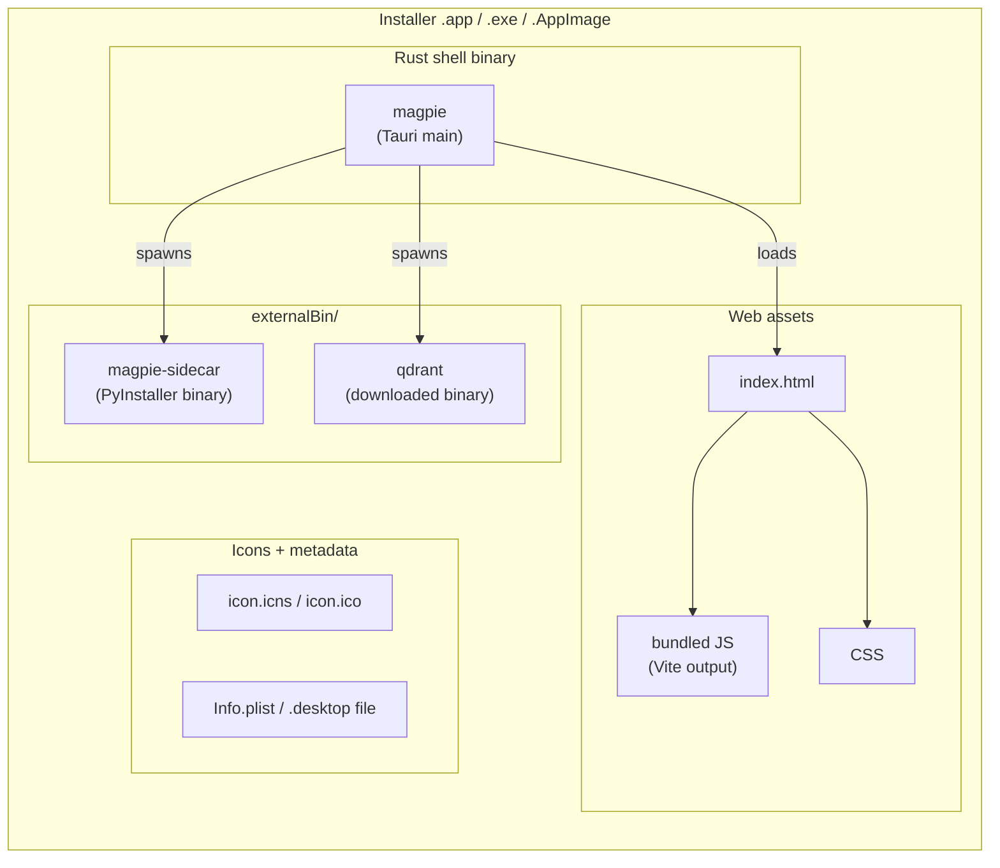
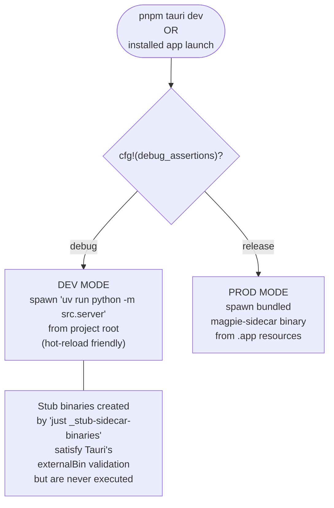
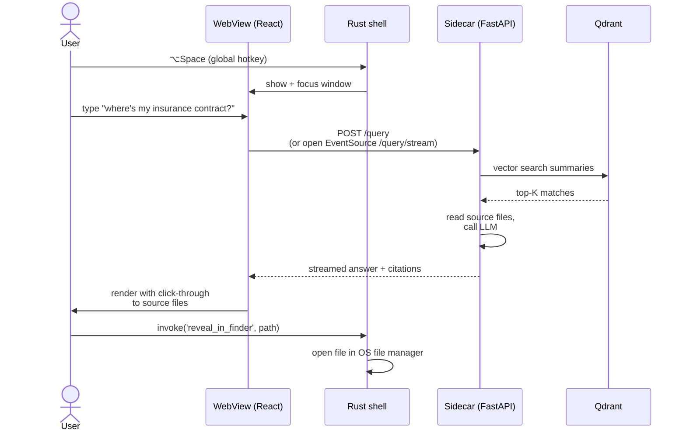

# 03 — Desktop Shell

## What this is about

Magpie is shipped as a desktop application via **Tauri 2**. The "shell"
is the Tauri-built binary that the user actually launches: a tiny Rust
process that owns a system WebView, hosts the React frontend, and
spawns/babysits the Python sidecar (and Qdrant) as child processes.

This file walks through how the shell is laid out, how the three
processes (Rust shell, React frontend, Python sidecar) talk to each
other, and which files contain which responsibility.

The build pipeline that produces this binary is in
[02-sidecar-build.md](02-sidecar-build.md) (sidecar) and
[05-release-pipeline.md](05-release-pipeline.md) (Tauri build).

---

## Component map

| Component | Purpose | File |
|---|---|---|
| Tauri app config | Window geometry, bundle settings, `externalBin` declarations, plugin config | [`frontend/src-tauri/tauri.conf.json`](../../../frontend/src-tauri/tauri.conf.json) |
| Rust crate root | Plugin registration, sidecar spawn logic, IPC commands | [`frontend/src-tauri/src/lib.rs`](../../../frontend/src-tauri/src/lib.rs) |
| Rust deps | `tauri-plugin-updater`, `tauri-plugin-process`, etc. | [`frontend/src-tauri/Cargo.toml`](../../../frontend/src-tauri/Cargo.toml) |
| Frontend entry | React boot, calls auto-updater | [`frontend/src/main.tsx`](../../../frontend/src/main.tsx) |
| Frontend deps | `@tauri-apps/plugin-updater`, `@tauri-apps/plugin-process` | [`frontend/package.json`](../../../frontend/package.json) |
| HTTP client | Calls the sidecar's REST endpoints | [`frontend/src/api.ts`](../../../frontend/src/api.ts) |
| Sidecar binaries dir | Where the PyInstaller binary + Qdrant binary land | `frontend/src-tauri/binaries/` |

---

## The three processes (runtime architecture)

```mermaid
flowchart TB
    subgraph proc1[Process 1 — Tauri shell]
        rust["Rust binary<br/>(WebView host,<br/>sidecar spawner,<br/>tray menu,<br/>global hotkey)"]
        web["WebView<br/>(React frontend)"]
        rust --- web
    end

    subgraph proc2[Process 2 — Python sidecar]
        sidecar["magpie-sidecar<br/>(PyInstaller binary)"]
        fastapi["FastAPI / uvicorn<br/>localhost:8765"]
        sidecar --- fastapi
    end

    subgraph proc3[Process 3 — Qdrant]
        qdrant["qdrant binary"]
        http["Qdrant HTTP API<br/>localhost:6433"]
        qdrant --- http
    end

    user(("User<br/>presses<br/>⌥Space"))

    user -->|OS shortcut event| rust
    rust -->|spawn at launch| sidecar
    rust -->|spawn at launch| qdrant
    web <-->|invoke()<br/>Tauri IPC| rust
    web <-->|fetch / SSE<br/>over localhost| fastapi
    fastapi <-->|HTTP / gRPC| qdrant

    rust -.kills on exit.-> sidecar
    rust -.kills on exit.-> qdrant
```

**Three processes, two boundaries:**
1. WebView ↔ Rust shell — Tauri's built-in IPC (`invoke("cmd_name", args)`).
2. WebView ↔ Python sidecar — plain `fetch()` to `localhost:8765`.

The Rust shell is responsible for **lifecycle**: when the app launches
it spawns sidecar + qdrant; when it exits it kills both. Both of those
processes' binaries are bundled into the Tauri installer via
`externalBin` so they ship inside the `.app` / `.exe`.

---

## What each layer does

### Rust shell (`frontend/src-tauri/src/lib.rs`)

- Plugin registration: updater, process, single-instance, global-shortcut, etc.
- Sidecar spawn: in **dev mode** runs `uv run python -m src.server` from the project root; in **release mode** spawns the bundled `magpie-sidecar` binary from inside the `.app` resources.
- Tray icon + menu (Settings, Quit, etc.).
- Global ⌥Space shortcut to show/hide the main window.
- Window lifecycle (anchoring, focus management, blur-to-hide).

### React frontend (`frontend/src/`)

- Renders the search bar UI.
- On boot ([`main.tsx`](../../../frontend/src/main.tsx)) calls `checkForUpdates({ silent: true })` from [`auto-updater.ts`](../../../frontend/src/auto-updater.ts).
- Issues queries via [`api.ts`](../../../frontend/src/api.ts) directly to the sidecar's REST endpoints.
- For streaming answers, opens an `EventSource` to `/query/stream`.

### Python sidecar (`src/server.py` and friends)

- FastAPI app with endpoints for `/query`, `/query/stream`, `/settings`, `/backup`, `/health`, etc.
- Owns the manifest, the embedding models, the LLM client, the Qdrant client.
- Talks to Qdrant for vector search.
- Spawns its *own* child processes when needed (e.g. `llama-server` for local LLM inference).

---

## What gets bundled into the `.app` / `.exe`



What's **not** bundled:

- The **HF model cache** (~3 GB of embedding model weights). Downloaded on first launch into the user's app data directory.
- The **llama-server binary** + GGUF model. Downloaded on first local-LLM use.
- The **user's documents**. Indexed in place; we never copy them.

This keeps the installer to roughly the size of the bundled binaries
plus the WebView (~150 MB on macOS, ~250 MB on Windows where Tauri
ships an Edge WebView2 stub).

---

## Two startup modes (dev vs. production)



The two-mode design lets developers iterate on Python code without
re-running PyInstaller every time. The stub-binary trick is what makes
this work: Tauri validates that the `externalBin` paths exist at build
time, so `just dev` creates empty placeholder files at those paths.
At runtime in debug mode, `lib.rs` ignores them and shells out to
`uv run python` directly. See [`justfile:_stub-sidecar-binaries`](../../../justfile)
for the implementation and the long comment above it for the
rationale.

---

## Why the window config is unusual

[`tauri.conf.json:14-32`](../../../frontend/src-tauri/tauri.conf.json#L14-L32)
declares the main window as:

```json
{
  "width": 800,
  "height": 96,
  "decorations": false,
  "transparent": true,
  "alwaysOnTop": true,
  "skipTaskbar": true,
  "titleBarStyle": "Overlay"
}
```

This isn't a normal app window — it's a **Spotlight-style overlay**:

- Tiny height (96 px) so it sits like a search bar.
- Transparent + decoration-free so the React side draws its own chrome (rounded corners, blur, shadow).
- `alwaysOnTop` so it floats above other windows.
- `skipTaskbar` so it doesn't appear in the dock/taskbar — only in the tray.
- Summoned via global ⌥Space, dismissed via blur or Escape.

Result: the visible "app" is the search bar; everything else (settings,
results detail) opens in secondary windows or expands the bar in place.

---

## How a query flows end-to-end



Two distinct IPC paths: HTTP+SSE for query results (high-bandwidth,
streaming), Tauri `invoke` for OS-level actions like opening Finder
(needs Rust/native code, low-frequency).

---

## Things that go wrong

| Symptom | Diagnosis | Fix |
|---|---|---|
| App launches but search returns nothing | Sidecar didn't start; check Tauri logs for spawn error | Verify the sidecar binary exists at `frontend/src-tauri/binaries/magpie-sidecar-<triple>` and is executable |
| Window appears for a frame then disappears | `blur-to-hide` triggered before window settled focus | Window-lifecycle bug — see commits around `anchor_spotlight gated to once-per-session` |
| `pnpm tauri dev` fails with "binary not found" | Stub binaries weren't created | Run `just _stub-sidecar-binaries` (or just `just dev`, which calls it) |
| Sidecar runs but UI says "connection refused" | Port collision (8765 in use by another app) or sidecar bound to wrong host | Check sidecar logs; verify uvicorn is on `127.0.0.1:8765`; another tool using the same port? |

---

## Adjacent docs

- **How the sidecar binary itself is built:** [02-sidecar-build.md](02-sidecar-build.md).
- **What auto-update does to a running shell:** [04-auto-updater.md](04-auto-updater.md).
- **How the whole bundle is signed and packaged into installers:** [05-release-pipeline.md](05-release-pipeline.md).
- **Running this locally for development:** [06-local-development.md](06-local-development.md).
