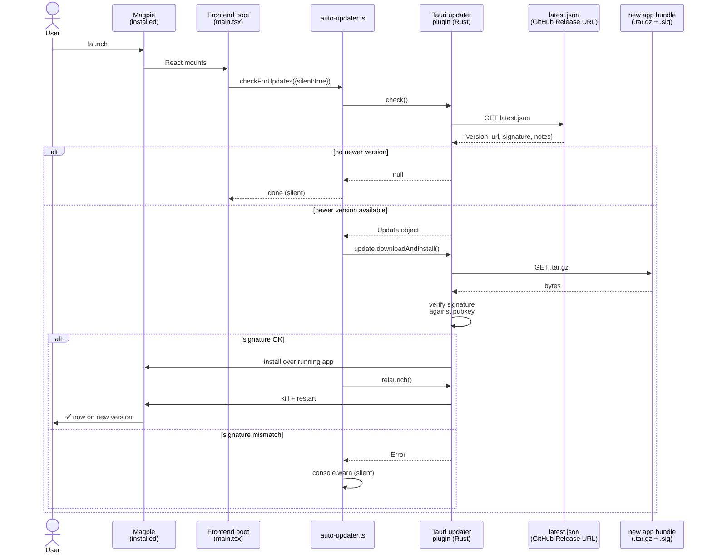
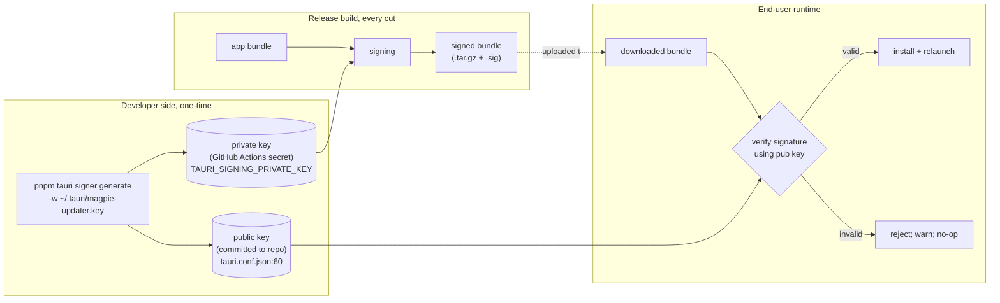

# 04 — Auto-Updater

## What this is about

When we ship a new version of Magpie, installed copies need to upgrade
themselves without the user reinstalling. Tauri 2 ships a first-class
updater plugin; we wired it end-to-end on 2026-05-08. This file walks
through every component involved and what happens at update time.

The update *artifact* (the new app bundle the user downloads) is
produced by the release pipeline — see [05-release-pipeline.md](05-release-pipeline.md).
This file is about how the *running* app discovers and applies it.

---

## Component map

| Component | Purpose | File |
|---|---|---|
| Frontend updater module | Single async function: check, download, install, relaunch | [`frontend/src/auto-updater.ts`](../../../frontend/src/auto-updater.ts) |
| Frontend boot integration | Calls the updater module on app launch | [`frontend/src/main.tsx`](../../../frontend/src/main.tsx) |
| Tauri updater plugin (JS) | The `@tauri-apps/plugin-updater` package | [`frontend/package.json`](../../../frontend/package.json) |
| Tauri updater plugin (Rust) | Crate registration in the Rust shell | [`frontend/src-tauri/src/lib.rs`](../../../frontend/src-tauri/src/lib.rs), [`Cargo.toml`](../../../frontend/src-tauri/Cargo.toml) |
| Updater config | Endpoint URL, public signing key, dialog disabled | [`frontend/src-tauri/tauri.conf.json`](../../../frontend/src-tauri/tauri.conf.json) (`plugins.updater` block) |
| Update manifest (the feed) | `latest.json` — what version is current, where to download, signature | Hosted at the GitHub release URL configured in `tauri.conf.json` |
| Build flag | `bundle.createUpdaterArtifacts: true` produces the `.tar.gz` + `.sig` files | [`frontend/src-tauri/tauri.conf.json:51`](../../../frontend/src-tauri/tauri.conf.json#L51) |

---

## Update lifecycle, end-to-end



The whole thing happens **silently in the background on every launch**.
Failures (network down, 404, signature mismatch) become a `console.warn`
and the user keeps using the current version. Updates never block,
never prompt, never interrupt.

---

## The "no dialog" UX choice

Tauri's updater plugin can run in two modes:

| Mode | Behavior |
|---|---|
| `dialog: true` (default) | Plugin shows a native modal asking the user to accept |
| `dialog: false` (our choice) | Plugin returns the `Update` object to JS; UI is whatever we render |

We picked `dialog: false` because:

1. The user opened the app to *do* something. A modal asking
   "Update available — install now?" is exactly the friction we want
   to avoid.
2. Update payloads are small (~100 MB tar.gz), so background download
   doesn't burn meaningful resources.
3. Auto-install + relaunch on next launch (rather than mid-session)
   means users see the new version when they're already in
   "starting fresh" mode — no work is interrupted.

The cost: we have no UI affordance for "Check now" yet. The module
exposes `checkForUpdates({ silent: false })` to make that easy when
we add a settings toggle or tray menu item.

---

## Signature verification (the critical security boundary)

A malicious `latest.json` would be a remote-code-execution channel.
Tauri's updater requires every update bundle to be signed by a key
the running app trusts.



| Concern | Where it lives |
|---|---|
| Private key | `~/.tauri/magpie-updater.key` on dev machine; mirrored to GitHub Actions secret `TAURI_SIGNING_PRIVATE_KEY` |
| Public key | Hard-coded in [`tauri.conf.json:60`](../../../frontend/src-tauri/tauri.conf.json#L60) — **currently a placeholder**, must be replaced before first real release |
| Signing happens in CI | `tauri-action@v0` reads `TAURI_SIGNING_PRIVATE_KEY` env var and signs each platform's bundle automatically |

⚠️ **Open task before first release:** `tauri.conf.json:60` currently
contains the literal string `REPLACE_WITH_PUBLIC_KEY_FROM_TAURI_SIGNER_GENERATE`.
Generating the keypair and committing the public half is a one-line
ceremony that gates real shipping.

---

## What `latest.json` looks like

This is the manifest the updater fetches. `tauri-action@v0` produces
it automatically on tag pushes when `includeUpdaterJson: true` is set
in the workflow ([`.github/workflows/build.yml:186`](../../../.github/workflows/build.yml#L186)).

```json
{
  "version": "0.2.0",
  "notes": "Release notes here",
  "pub_date": "2026-05-15T12:00:00Z",
  "platforms": {
    "darwin-aarch64": {
      "signature": "dW50cnVzdGVkIGNvbW1lbnQ6IHNpZ25hdHVy...",
      "url": "https://github.com/.../Magpie_0.2.0_aarch64.app.tar.gz"
    },
    "darwin-x86_64":   { "signature": "...", "url": "..." },
    "linux-x86_64":    { "signature": "...", "url": "..." },
    "windows-x86_64":  { "signature": "...", "url": "..." }
  }
}
```

The plugin picks the entry matching the user's platform/architecture,
downloads the `url`, and verifies it against `signature` using the
embedded public key.

---

## Endpoint configuration

[`tauri.conf.json`](../../../frontend/src-tauri/tauri.conf.json#L57-L59):

```json
"endpoints": [
  "https://github.com/mriddyagrawal/Magpie/releases/latest/download/latest.json"
]
```

The updater fetches from this URL on every launch. We point at GitHub's
`/releases/latest/` redirect because:

1. It always serves the most recent **non-draft** release. Drafts are
   invisible until promoted, which gives us a "stage in CI then promote
   when ready" workflow without changing the URL.
2. No separate hosting infrastructure (S3, CloudFront) needed — GitHub
   Releases is the CDN.
3. We can ship pre-releases by leaving them as draft and pointing
   testers at a different endpoint.

If we ever need staged rollouts (5% of users on day 1, 50% on day 3,
100% on day 5), this URL is where we'd switch to a real CDN with
percentage routing — see [`Plans/Packaging/Implementation Plan.md`](../Implementation%20Plan.md)
for the longer-term plan.

---

## Things that go wrong

| Symptom | Diagnosis | Fix |
|---|---|---|
| Installed apps don't see a newly-published release | Release was left in **draft** state | Promote the draft on GitHub Releases page |
| Installed apps see the release but `signature mismatch` in logs | Public key in `tauri.conf.json` doesn't match the private key used in CI | Regenerate keypair, update both halves, re-cut release |
| `latest.json: 404` in console | Tag push didn't include `includeUpdaterJson: true` (regression in workflow) | Re-add the flag to the `tauri-action` step |
| Update applies but sidecar fails to start after relaunch | The new sidecar binary's runtime requirements differ from the previous version (e.g. new HF model not yet downloaded) | Sidecar must self-bootstrap missing assets on first run; if not, ship a migration step in `src/server.py` lifespan |
| User on x86 Mac never gets updates after we drop Intel support | `latest.json` no longer has a `darwin-x86_64` entry | Decision: announce EOL; users on dropped platforms stay on last-supported version |
| `console.warn` says "permission denied" during install | macOS Gatekeeper / quarantine attribute on the downloaded bundle | Notarization issue — see signing config in [05-release-pipeline.md](05-release-pipeline.md) |

---

## Why we used `tauri-action@v0` instead of a custom workflow

The previous CI (pre-2026-05-08) used a custom multi-step pipeline:
import Apple cert → run `tauri build` → sign Windows installer with
`signtool` → upload artifacts → manually generate `latest.json`. It
worked but had three problems:

1. Manual `latest.json` generation drifted from Tauri's expected
   schema each Tauri major version.
2. Apple notarization was implemented twice (once for the .dmg, once
   for the .pkg).
3. macOS code-signing was tied to a specific cert format (`.p12` vs.
   `.cert`) that broke whenever Apple rotated something.

`tauri-apps/tauri-action@v0` does all four steps natively: build,
macOS sign + notarize, generate `latest.json`, draft GitHub Release.
Windows authenticode signing is the one thing it doesn't do — see
[05-release-pipeline.md](05-release-pipeline.md) for the EV-cert
plan.

---

## Adjacent docs

- **Where the signed update bundle comes from:** [05-release-pipeline.md](05-release-pipeline.md).
- **What the running shell that calls the updater looks like:** [03-desktop-shell.md](03-desktop-shell.md).
- **Manual update testing locally:** [06-local-development.md](06-local-development.md#testing-the-updater).
