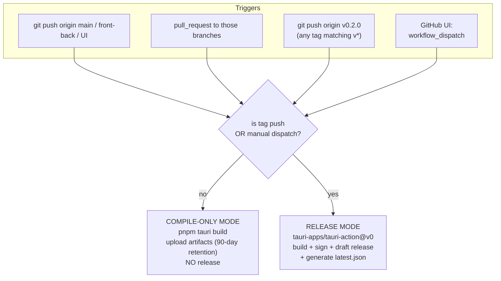
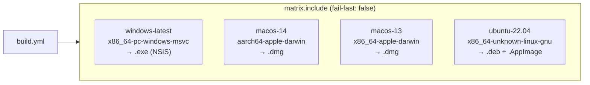
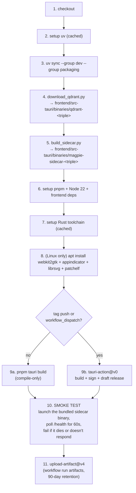

# 05 — Release Pipeline

## What this is about

Going from "I just merged something" to "users have signed installers
in their hands" is a 12-step dance involving four toolchains (uv,
PyInstaller, pnpm, cargo), three operating systems, and at least two
sets of code-signing certificates. The CI workflow at
[`.github/workflows/build.yml`](../../../.github/workflows/build.yml)
is what runs that dance every time.

This file walks the workflow top to bottom, explaining what triggers
what and where the decision points are.

---

## Component map

| Component | Purpose | File |
|---|---|---|
| CI workflow | The orchestration | [`.github/workflows/build.yml`](../../../.github/workflows/build.yml) |
| Sidecar build script | Step 3 of every job | [`scripts/build_sidecar.py`](../../../scripts/build_sidecar.py) |
| Qdrant downloader | Step 2 of every job | [`scripts/download_qdrant.py`](../../../scripts/download_qdrant.py) |
| Tauri release action | Steps 7–10 (build, sign, draft release, manifest) | [`tauri-apps/tauri-action@v0`](https://github.com/tauri-apps/tauri-action) (external) |
| Updater feed config | Output destination of step 10 | [`frontend/src-tauri/tauri.conf.json`](../../../frontend/src-tauri/tauri.conf.json) |

---

## Triggers and modes

**Two modes, one workflow:**

| Mode | Triggered by | What it produces | Why |
|---|---|---|---|
| Compile-only | branch push, PR | unsigned artifacts uploaded to the workflow run | Catch compile/import regressions on every push without burning release-flow infrastructure |
| Release | `v*` tag, manual dispatch | signed installers + draft GitHub Release + `latest.json` | The actual ship path |

Manual dispatch (the GitHub UI "Run workflow" button) is included in
release mode so we can rehearse a real signed build without tagging.
Useful when debugging signing certs.

---

## Job matrix (always all four)

`fail-fast: false` means a Windows-only failure doesn't kill the macOS
or Linux jobs. Important because when a Tier-2 PyInstaller exclude
breaks one platform's import graph (see
[02-sidecar-build.md §three-tiers-of-excludes](02-sidecar-build.md#three-tiers-of-excludes)),
the other three platforms still produce usable artifacts, and the
debug surface is one red job instead of four.

---

## What each job does, step by step

Steps 4 and 5 are the points where the *platform-specific output
binaries* land in `frontend/src-tauri/binaries/`. Tauri's build picks
them up automatically because they're declared as `externalBin` in
`tauri.conf.json`.

Step 10 is the **safety net** — it catches the most common class of
release regression (PyInstaller excludes that break import at first
launch). See [02-sidecar-build.md §how-the-CI-smoke-test-catches-tier-2-regressions](02-sidecar-build.md#how-the-ci-smoke-test-catches-tier-2-regressions).

---

## Code signing — the messy reality

```mermaid
flowchart TB
    subgraph mac[macOS path]
        macsec[("APPLE_CERTIFICATE<br/>APPLE_CERTIFICATE_PASSWORD<br/>APPLE_SIGNING_IDENTITY<br/>APPLE_ID<br/>APPLE_PASSWORD<br/>APPLE_TEAM_ID")]
        macact["tauri-action @v0"]
        macsign["✅ codesign<br/>+ notarize<br/>+ staple"]
        macdmg[".dmg uploaded<br/>SIGNED"]
        macsec --> macact --> macsign --> macdmg
    end

    subgraph win[Windows path — partial]
        winsec[("WINDOWS_CERTIFICATE<br/>WINDOWS_CERTIFICATE_PASSWORD")]
        winact["tauri-action @v0"]
        winnote["⚠️ tauri-action<br/>does NOT sign<br/>Windows binaries"]
        winexe[".exe uploaded<br/>UNSIGNED"]
        winsec -.passed but unused.-> winact --> winnote --> winexe
    end

    subgraph lnx[Linux path]
        lnxact["tauri-action @v0"]
        lnxnote["No signing<br/>(.deb / .AppImage<br/>aren't typically signed)"]
        lnxout[".deb + .AppImage uploaded"]
        lnxact --> lnxnote --> lnxout
    end

    subgraph upd[Update signing — separate from code signing]
        updsec[("TAURI_SIGNING_PRIVATE_KEY<br/>TAURI_SIGNING_PRIVATE_KEY_PASSWORD")]
        updsign["✅ tauri-action<br/>signs each platform's<br/>.tar.gz update bundle"]
        updsec --> updsign
    end
```

| Signing concern | Status | Notes |
|---|---|---|
| **macOS code signing** | ✅ Wired via `tauri-action` | All Apple env vars passed; gracefully no-ops if certs aren't set yet |
| **macOS notarization** | ✅ Wired via `tauri-action` | Same env-var path |
| **Windows authenticode signing** | 🟡 NOT wired | `tauri-action` doesn't sign Windows out of the box; needs a pre-step that imports the cert + a `bundle.windows.signCommand` block in `tauri.conf.json` |
| **Linux signing** | N/A | `.deb` / `.AppImage` aren't typically signed; some distributions sign their repos |
| **Update bundle signing (Tauri updater)** | ✅ Wired | This is *separate* from code signing; ensures `latest.json` payloads aren't tampered with |

The Windows path is the open item. The previous workflow used
"approach (b)" from the Tauri docs (post-step signs the .exe AFTER
tauri-action uploads), which means the GitHub Release attached the
*unsigned* version. Both paths to fix that are documented inline in
[`.github/workflows/build.yml:158-173`](../../../.github/workflows/build.yml#L158-L173).

---

## What lands on a successful tag push

```mermaid
flowchart LR
    tag(["git push origin v0.2.0"])

    subgraph release["Draft GitHub Release: 'Magpie v0.2.0'"]
        dmg1["Magpie_0.2.0_aarch64.dmg"]
        dmg2["Magpie_0.2.0_x64.dmg"]
        deb["magpie_0.2.0_amd64.deb"]
        appimg["magpie_0.2.0_amd64.AppImage"]
        msi["Magpie_0.2.0_x64-setup.exe"]
        latestjson["latest.json<br/>(updater feed)"]
        sig1[".sig files<br/>for each platform"]
    end

    promote["maintainer<br/>promotes draft → published"]

    rollout["installed apps see new<br/>latest.json on next launch<br/>→ background download<br/>→ install + relaunch"]

    tag --> release
    release -. on review .-> promote
    promote --> rollout
```

The `releaseDraft: true` setting in
[`build.yml:184`](../../../.github/workflows/build.yml#L184) is
deliberate — *nothing publishes automatically*. A human looks at the
draft, downloads each artifact, verifies it launches, then clicks
"Publish release". This is the kill-switch for any rollout.

---

## Cutting an actual release (the human steps)

1. Bump `version` in [`frontend/src-tauri/tauri.conf.json:4`](../../../frontend/src-tauri/tauri.conf.json#L4).
2. Bump `version` in [`pyproject.toml`](../../../pyproject.toml) and [`frontend/package.json`](../../../frontend/package.json).
3. Commit + push.
4. Tag: `git tag -a v0.2.0 -m "Release notes here"`.
5. `git push origin v0.2.0` — kicks off the workflow in release mode.
6. Wait ~20 min for all four matrix jobs to finish.
7. Open the draft release on GitHub. Skim release notes
   (auto-populated by `tauri-action`).
8. Download each platform's artifact + double-click. Verify it
   launches and `/health` responds.
9. Click "Publish release".
10. Within ~24h, installed apps will pick up the new `latest.json`
    on their next launch and self-update.

---

## Things that go wrong

| Symptom | Diagnosis | Fix |
|---|---|---|
| Tag-push run fails with "Resource not accessible by integration" | `permissions: contents: write` missing | Already fixed in [build.yml:27-28](../../../.github/workflows/build.yml#L27-L28) — most common tauri-action bug |
| Workflow succeeds but no release appears | `releaseDraft: true`; you need to promote it | Open Releases page, find draft, click Publish |
| One matrix job fails with "binary not found" in smoke test | `build_sidecar.py` exited non-zero earlier; PyInstaller emit failed | Check the Build Python sidecar step's logs; usually a missing `--hidden-import` |
| Smoke test fails on tag-push only (passes on branch push) | A Tier-2 exclude is platform-sensitive | Comment out the offending exclude in [build_sidecar.py:137-140](../../../scripts/build_sidecar.py#L137-L140) and re-tag |
| macOS DMG produces but Gatekeeper warns "developer cannot be verified" | Notarization didn't run; APPLE_PASSWORD is wrong or expired | Generate a new app-specific password at appleid.apple.com, update the secret |
| Windows installer downloads as `.exe (Unverified)` | Authenticode signing isn't wired yet | Expected; see "Windows authenticode signing" row in the table above |
| `latest.json` has wrong URL pattern | `tagName` template in workflow doesn't match what users' installed apps expect | The format is `app-v__VERSION__`; changing it breaks all installed apps' upgrade path |

---

## Adjacent docs

- **What `tauri-action` actually does internally:** [Tauri release pipeline guide](https://v2.tauri.app/distribute/pipelines/github/) (external).
- **What gets installed onto the user's machine:** [03-desktop-shell.md](03-desktop-shell.md).
- **How updates flow back into the running app:** [04-auto-updater.md](04-auto-updater.md).
- **How to dry-run all of this locally before tagging:** [06-local-development.md](06-local-development.md).
