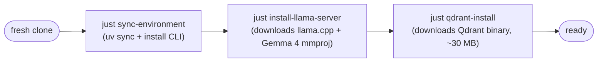
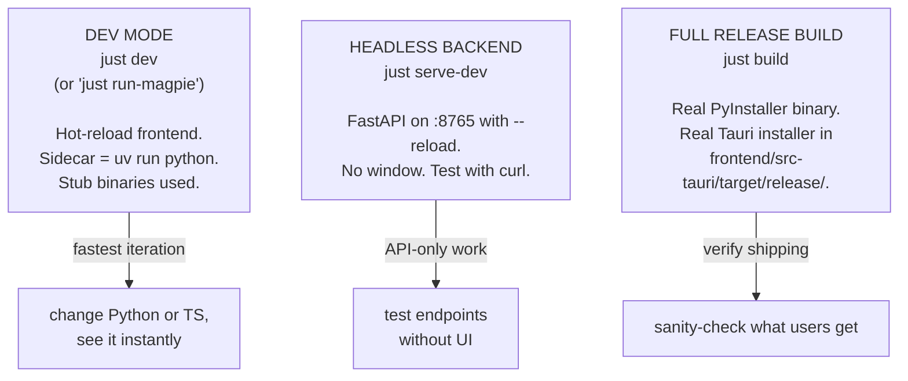
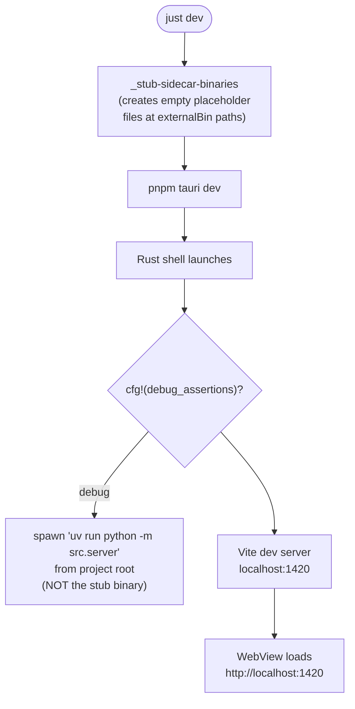
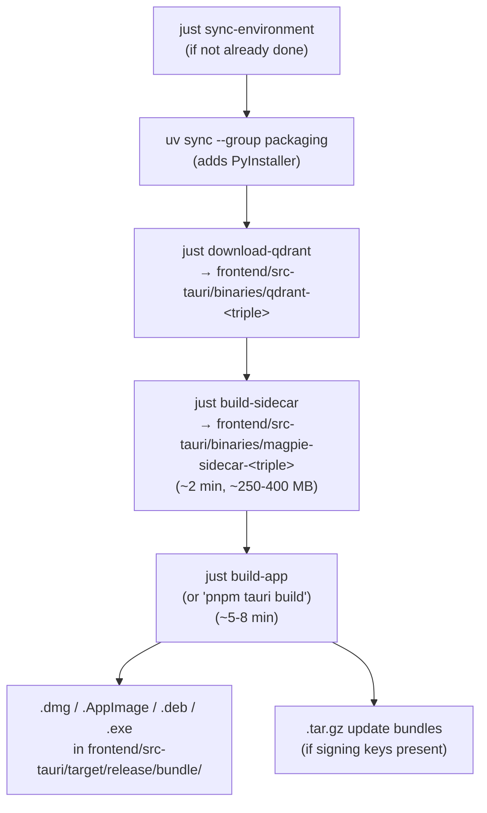
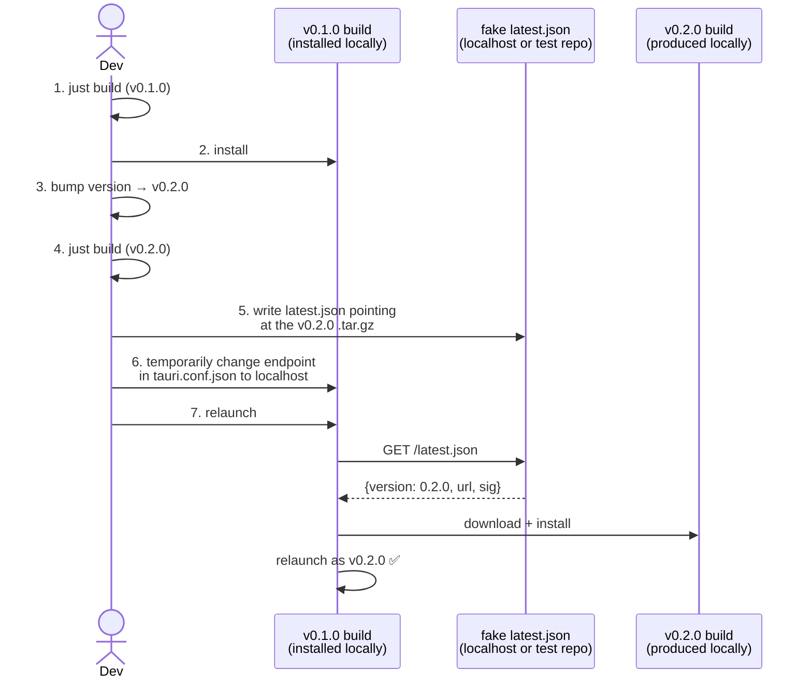
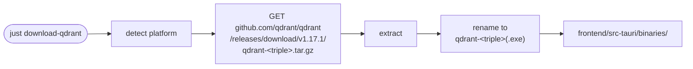

# 06 — Local Development

## What this is about

How to run the whole stack on your laptop — from "fresh clone" to
"app window opens with hot reload" — using only the recipes in
[`justfile`](../../../justfile). This file is the missing manual for
contributors who want to make a packaging change and verify it without
pushing to CI every time.

---

## Component map

| Component | Purpose | File |
|---|---|---|
| Task runner | All recipes | [`justfile`](../../../justfile) |
| Dev mode launcher | `pnpm tauri dev` with stub binaries | recipe `dev` / `run-magpie` |
| Sidecar builder | Local PyInstaller invocation | recipe `build-sidecar` |
| Qdrant downloader | Fetches the platform binary | recipe `download-qdrant` |
| Full release build | Sidecar + Qdrant + Tauri all in one | recipe `build` |

Run `just --list` to see every recipe with its first-line description.

---

## First-time setup (the three commands)

After these three:

- Python venv ready (`.venv/`).
- `magpie-repl` / `ns` / `nas` global aliases installed via `uv tool`.
- `llama-server` binary + Gemma 4 mmproj projector cached in `<APP_DATA_DIR>/bin/`.
- Qdrant binary at `<APP_DATA_DIR>/qdrant/qdrant`.

`<APP_DATA_DIR>` is `~/.local/share/Magpie` on Linux, `~/Library/Application Support/Magpie`
on macOS, `%APPDATA%/Magpie` on Windows.

`just install-llama-server` is optional — only needed if you want
local LLM inference. Cloud LLM mode (`LLM_PROVIDER=magpie-cloud` or
`LLM_PROVIDER=openrouter`) skips it entirely.

---

## Three ways to run the app locally

| What you're working on | Use this | Why |
|---|---|---|
| Frontend UI changes | `just dev` | Vite hot-reload makes UI iteration instant |
| Python endpoint or pipeline | `just serve-dev` | uvicorn `--reload` watches `src/`; no Tauri rebuild |
| Sidecar PyInstaller flags | `just build-sidecar` | Just rebuilds the binary; takes ~2 min |
| End-to-end pre-tag verification | `just build` | Full release build; takes ~10 min |

---

## Dev mode in detail

The trick: in debug builds, `lib.rs` ignores the `externalBin` declarations
and runs `uv run python -m src.server` directly. The empty stub
binaries at the `externalBin` paths exist only to satisfy Tauri's
build-time validation. See the long comment above the
`_stub-sidecar-binaries` recipe in [`justfile`](../../../justfile)
for the full reasoning.

**You can edit Python source while dev mode is running** — but the
sidecar process won't pick up the change automatically (Tauri spawns
it once at startup). For Python hot-reload, run `just serve-dev`
separately and patch `lib.rs` to skip the auto-spawn (see comment in
the `run-magpie` recipe).

---

## Building a real release locally (the dry-run)

Or just run `just build` — that's the same chain wired up as a
single recipe.

What you'll see in `frontend/src-tauri/target/release/bundle/` after:

| Platform | Output |
|---|---|
| macOS | `dmg/Magpie_0.1.0_aarch64.dmg` (or `_x64`) |
| Windows | `nsis/Magpie_0.1.0_x64-setup.exe` |
| Linux | `appimage/magpie_0.1.0_amd64.AppImage` + `deb/magpie_0.1.0_amd64.deb` |

These are unsigned unless you've populated the `APPLE_*` / `WINDOWS_*`
env vars locally. For local verification, unsigned is fine; macOS will
nag you on first launch but right-click → Open bypasses Gatekeeper.

---

## Testing the updater

The realistic local-test path:

1. Generate signing keys once: `pnpm tauri signer generate -- -w ~/.tauri/magpie-updater-test.key`.
2. Replace the `pubkey` placeholder in `tauri.conf.json` with the public half (locally; don't commit).
3. Set `TAURI_SIGNING_PRIVATE_KEY` env var to the private half.
4. `just build` to produce v0.1.0 with this keypair.
5. Install it.
6. Bump version, re-build → produces v0.2.0 .tar.gz + .sig.
7. Serve a local `latest.json` pointing at the v0.2.0 .tar.gz: `python -m http.server 8000` from a folder containing both files.
8. Temporarily change the updater endpoint in installed v0.1.0's config to `http://localhost:8000/latest.json`.
9. Relaunch v0.1.0; observe it self-update to v0.2.0.

This rehearsal catches signature key drift before users hit it.

---

## Downloading Qdrant

This is the cousin of `build-sidecar`: same target-triple naming
convention, same output directory, but no compilation — just
download + rename. `just qdrant-install` does the *separate*
local-development install into `<APP_DATA_DIR>/qdrant/`, which is
what `just qdrant-up` runs against during dev.

⚠️ Two Qdrant locations to keep straight:

| Path | Purpose |
|---|---|
| `frontend/src-tauri/binaries/qdrant-<triple>` | Bundled into the installer; runs inside the user's installed app |
| `<APP_DATA_DIR>/qdrant/qdrant` | Standalone for local dev; spawned by `just qdrant-up` against your local data |

The bundled one is what gets shipped; the local-dev one is what you
run while you're working on Magpie itself.

---

## Common dev workflows

| Task | Commands |
|---|---|
| First-time setup | `just sync-environment` then `just install-llama-server` (optional) then `just qdrant-install` |
| Iterate on UI | `just qdrant-up` (in one terminal) → `just dev` (in another) |
| Iterate on Python endpoints | `just qdrant-up` → `just serve-dev` → `curl localhost:8765/...` |
| Verify a packaging change | `just build` → install the resulting installer → check `/health` |
| Fix a CI smoke-test failure | Run the smoke test locally: `./frontend/src-tauri/binaries/magpie-sidecar-<triple> --port 18765` then `curl http://localhost:18765/health` |
| Reset everything | `just reset-index` (drops Qdrant data, keeps `indexing_rules.json`) |

---

## Things that go wrong

| Symptom | Diagnosis | Fix |
|---|---|---|
| `just dev` fails: "binary not found at binaries/magpie-sidecar-..." | Stub binaries weren't created | Run `just _stub-sidecar-binaries` (or `just dev` again — it's a dependency of `dev`) |
| Sidecar dies on launch with `ModuleNotFoundError: src.X` | New module not in `--hidden-import` of `build_sidecar.py` | Add it; rebuild |
| `pnpm tauri build` fails with "Could not find binaries/magpie-sidecar" | Forgot to run `just build-sidecar` first | Use `just build` instead of `just build-app` to ensure both prerequisites run |
| Built `.app` opens then immediately quits on macOS | Sidecar binary not codesigned matching the app bundle | Either sign locally with a self-signed cert, or right-click → Open and accept the Gatekeeper warning |
| `just qdrant-up` says "already running" but `qdrant-status` says stopped | Stale pidfile | `rm <APP_DATA_DIR>/qdrant/qdrant.pid` then re-up |
| WebView shows blank white screen in dev | Vite dev server died; `localhost:1420` is offline | Check the terminal; restart `pnpm dev` from `frontend/` |

---

## Adjacent docs

- **What gets bundled into the binary you build:** [02-sidecar-build.md](02-sidecar-build.md).
- **What gets bundled into the installer:** [03-desktop-shell.md](03-desktop-shell.md).
- **What CI does that you can't easily do locally (signing, notarization):** [05-release-pipeline.md](05-release-pipeline.md).
- **Today's actual changes that this doc reflects:** [07-day-log-2026-05-08.md](07-day-log-2026-05-08.md).
