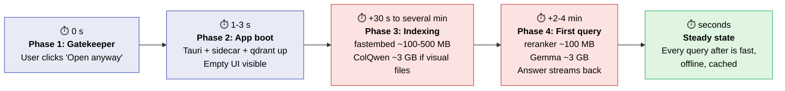
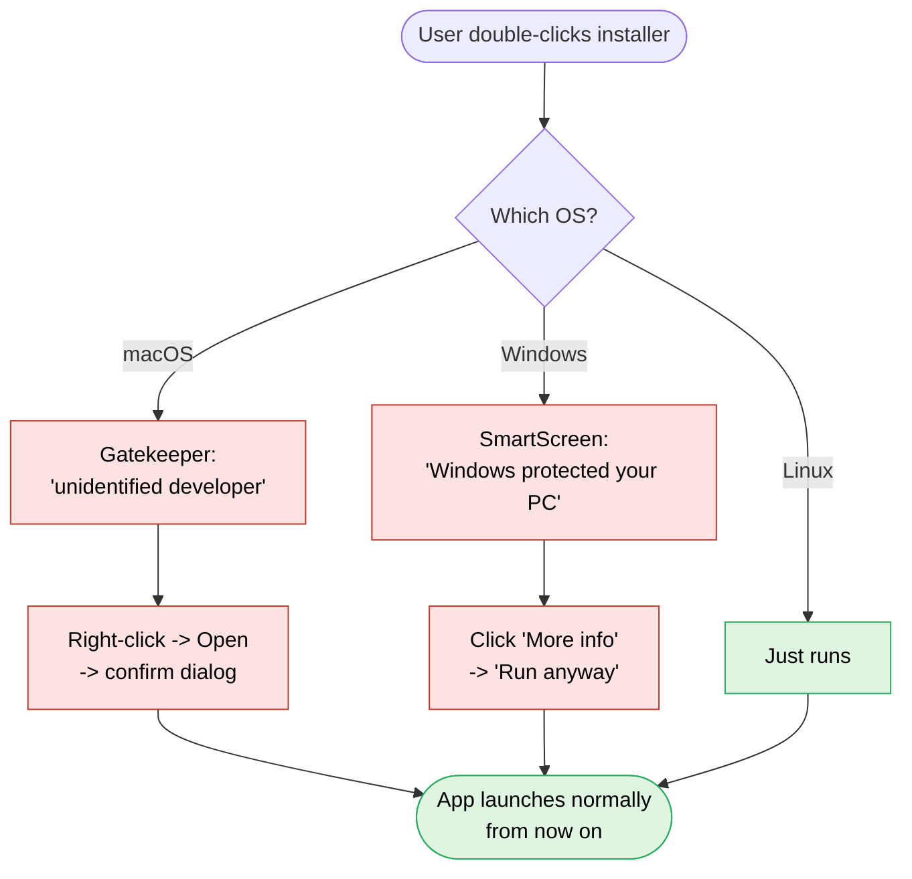
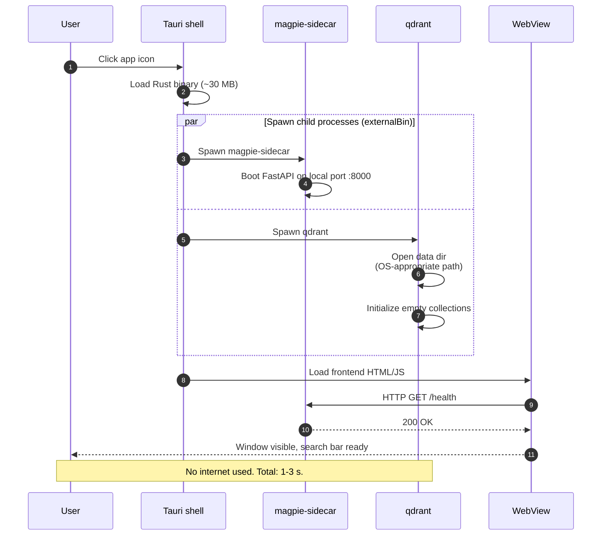
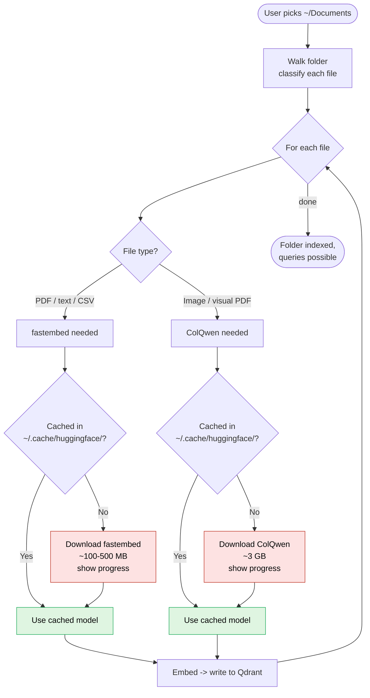
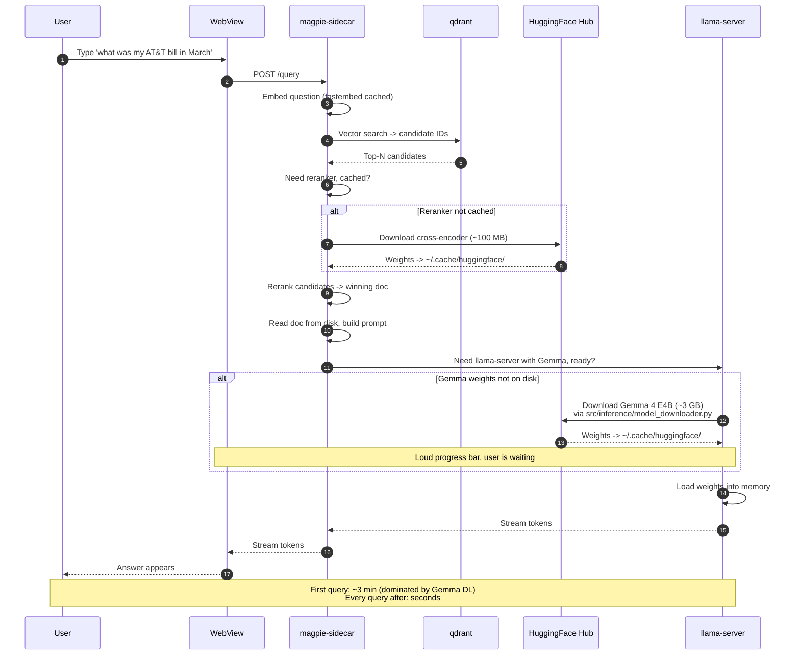

# First Run — From Double-Click to First Answer

This is the heavy path. The user has never opened Magpie before. The frozen sidecar is on disk, but no models, no index, and no Qdrant data exist yet. We walk through every visible event in order.

*Rough wall-clock on a 200 Mbps connection.*

---

## Phase 1 — OS-level friction (before the app even opens)

The user has just downloaded the installer (`.dmg`, `.exe`, `.AppImage`, or `.deb`) and double-clicks it.

- **macOS** — Because we are not paying for an Apple signing certificate yet, Gatekeeper shows: *"Magpie cannot be opened because it is from an unidentified developer."* The user must right-click the icon → **Open** → confirm in a second dialog. After that one ceremony, that machine never asks again.
- **Windows** — SmartScreen pops the blue *"Windows protected your PC"* dialog. The user clicks **More info** → **Run anyway**. Once installed via the NSIS installer, launching from the Start menu does not re-trigger the dialog.
- **Linux** — Just runs. The `.deb` and `.AppImage` paths do the right thing without prompts.

**Fixable later.** Paying for Apple Developer ID + EV cert for Windows kills both dialogs. Until then this is the "scary dialog tax" — fine for early testers, not fine for public launch.

---

## Phase 2 — App launches (1–3 seconds)

The user clicks the Magpie icon. Behind the scenes, in this order:

1. **Tauri's Rust binary starts.** This is the outer shell — roughly 30 MB of compiled code. It opens immediately.
2. **Tauri spawns two child processes** declared as `externalBin` in [frontend/src-tauri/tauri.conf.json:41](frontend/src-tauri/tauri.conf.json#L41):
   - `magpie-sidecar` — the PyInstaller-frozen Python server. Boots FastAPI on a local port (~8000-something). Ready to receive HTTP requests.
   - `qdrant` — the vector database binary. Starts on its own local port and creates a data directory under the OS-appropriate path:
     - Linux: `~/.local/share/magpie/qdrant/`
     - macOS: `~/Library/Application Support/Magpie/qdrant/`
     - Windows: `%APPDATA%\Magpie\qdrant\`
   - Initializes empty collections.
3. **The frontend (HTML/CSS/JS) loads** inside Tauri's WebView, connects to the sidecar via HTTP, and the window appears on screen.

**Total cost:** 1–3 s on a modern machine, longer on a 5-year-old laptop. **No internet required so far.** No model downloads, no anything heavy. Just process startup.

The user now sees an empty Magpie window with a search bar. Nothing has been indexed yet.

---

## Phase 3 — User picks their first folder to index

The user clicks **Add folder**, points at, say, `~/Documents`, and clicks **Start indexing**. This is where the heavy stuff happens.

1. Frontend tells the sidecar which folder to ingest, via an HTTP call.
2. The ingest pipeline starts walking the folder, classifying each file (PDF, image, CSV, etc.).
3. **First time an embedding model is needed** — `fastembed` for the summary embeddings — the sidecar realizes the model file does not exist locally and downloads it from HuggingFace. **~100–500 MB** depending on the model. The user must see a progress bar — worth verifying the UI surfaces this.
4. **First time the ColQwen vision model is needed** — i.e., the first image or visual-PDF the pipeline encounters — that model downloads. **~3 GB.** Bigger progress bar. One-time only; cached afterward.
5. **First time the cross-encoder reranker is needed** — usually triggered later, on the first query — that model downloads (**~100 MB**).

All of these go into HuggingFace's standard cache directory (`~/.cache/huggingface/`). Once downloaded, they stay there forever; subsequent launches are instant.

**Bandwidth cost so far:** up to ~3.5 GB if the corpus contains visual PDFs or images. ~100–500 MB if it's all plain text.

---

## Phase 4 — User asks their first question

The user types *"what was my AT&T bill in March"* and hits enter.

1. Sidecar embeds the question, hits Qdrant, gets candidate document IDs.
2. Reranker runs on the candidates (downloads if not yet downloaded — see Phase 3).
3. Sidecar reads the most relevant document from disk, builds a prompt, sends it to the LLM.
4. **First time the LLM runs — the biggest first-launch download.** The local LLM weights (Gemma 4 E4B by default) download from HuggingFace via [src/inference/model_downloader.py](src/inference/model_downloader.py). **~3 GB.** This is the slowest single step. Progress bar must be **loud and clear** because the user is staring at the screen waiting on their answer.
5. The `llama-server` binary itself was either bundled with the sidecar or downloads here too — depends on how [src/inference/llama_server_binary.py](src/inference/llama_server_binary.py) is implemented. (See `bundle-or-download` decision in `Plans/Packaging/Implementation Plan.md`.)
6. Once the model is loaded into memory, the LLM generates the answer and streams it back.

**Total first-query time:** dominated by the 3 GB Gemma download. Roughly **3 minutes on a 200 Mbps connection**, much longer on slower internet. After that, queries are seconds-fast because the model stays in memory.

---

## Cumulative first-run cost

| Resource | Size | When it downloads |
|---|---|---|
| Tauri shell + sidecar + Qdrant binary | ~150–250 MB | At install (bundled) |
| `fastembed` summary embedding model | ~100–500 MB | First indexing |
| ColQwen vision model | ~3 GB | First visual file indexed |
| Cross-encoder reranker | ~100 MB | First query |
| Gemma 4 E4B LLM weights | ~3 GB | First query |
| **Worst case total** | **~7 GB** | Spread across Phases 3–4 |

The user pays this once, per machine, forever.

---

## What can go wrong on first run

These are the failure modes the polish pass needs to handle gracefully — see Phase 4 of `CLAUDE.md`.

- **No internet at all.** Indexing and querying both fail at the model-download step. Magpie should surface a clear "we need internet for first-time setup" message rather than a stack trace.
- **Internet drops mid-download.** Resume should be possible (HuggingFace's hub library handles this); UI should show the partial progress and recover.
- **Disk fills up.** A 3 GB download into a near-full home volume needs to fail loudly *before* the download starts, not partway through.
- **HuggingFace rate limit / outage.** Rare, but the user is blocked. Worth surfacing the actual error.
- **First-run on a machine without AVX2 / Metal / CUDA.** `llama-server` may refuse to start. Need a CPU fallback path or a clear "your machine doesn't meet requirements" screen.
