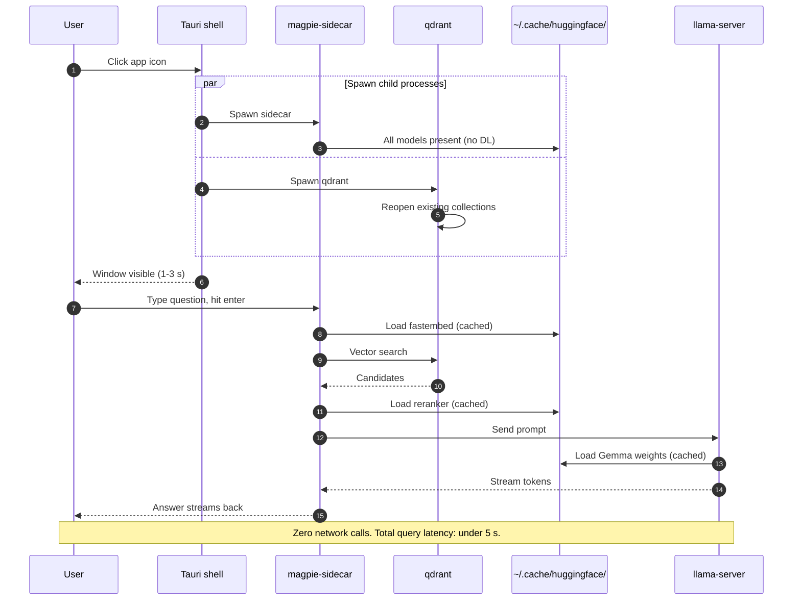
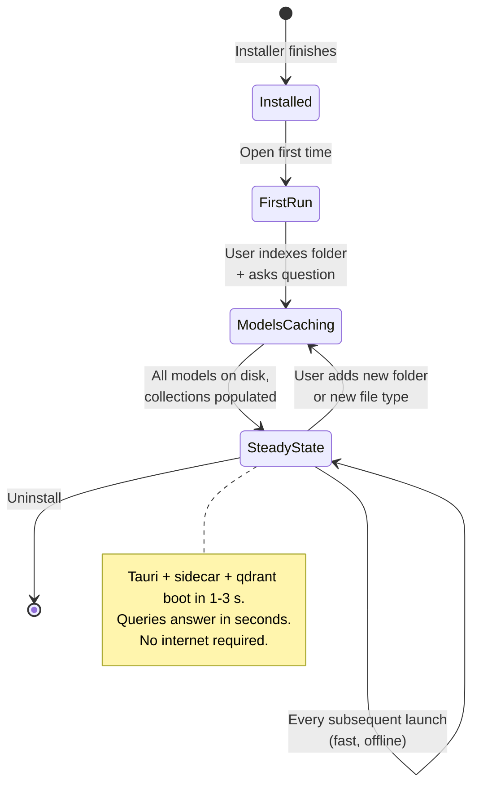

# Subsequent Runs — The Steady State

This is the "Phase 5" experience. The user has launched Magpie at least once before, indexed at least one folder, and asked at least one question. From here on, every launch should feel like opening a native desktop app — quick, quiet, and completely offline.

---

## What happens when they re-open Magpie

1. **Tauri shell starts** — same ~30 MB binary, opens immediately.
2. **Tauri spawns the same two child processes** declared in [frontend/src-tauri/tauri.conf.json:41](frontend/src-tauri/tauri.conf.json#L41):
   - `magpie-sidecar` boots FastAPI on its local port.
   - `qdrant` reopens the existing data directory at the OS-appropriate path (`~/.local/share/magpie/qdrant/` on Linux, `~/Library/Application Support/Magpie/qdrant/` on macOS, `%APPDATA%\Magpie\qdrant\` on Windows). Collections are intact. No re-indexing needed.
3. **Frontend connects** and the window appears.

**Total: 1–3 seconds**, same as cold first launch — because the work that took time the first run (model downloads) was the network, not the launch itself.

---

## What happens when they search

1. User types a question, hits enter.
2. Sidecar embeds the question using the **already-cached** `fastembed` model in `~/.cache/huggingface/`.
3. Qdrant returns candidate document IDs from the **already-populated** local collection.
4. The **already-cached** cross-encoder reranks them.
5. Sidecar reads the winning document from disk, builds a prompt, hands it to `llama-server`.
6. The **already-cached** Gemma weights load (first query of the session has a small model-load delay — usually a few seconds; subsequent queries reuse the warm process).
7. Answer streams back.

**Total: seconds**, fully offline. No HuggingFace calls. No Anthropic API calls. No internet of any kind required.

---

## What is *still* on disk from the first run

Everything that was downloaded during Phases 3–4 of [01-first-run.md](01-first-run.md) is still cached:

| Cache | Location | Approximate size |
|---|---|---|
| HuggingFace models (`fastembed`, ColQwen, reranker, Gemma) | `~/.cache/huggingface/` (all OSes — XDG-style on Linux, same on macOS by convention) | ~6.5 GB |
| Qdrant collections + payload | OS-appropriate Magpie data dir (see Phase 2 above) | Grows with the user's corpus |
| Magpie app data (settings, recent folders, logs) | OS-appropriate config dir (see [04-disk-and-cache-layout.md](04-disk-and-cache-layout.md)) | Small |

These are the things to surface in a future "Reset Magpie" or "Clear caches" UI when we get to the polish phase. Not for the MVP.

---

## What does *not* happen on subsequent runs

- ❌ No Gatekeeper / SmartScreen dialog.
- ❌ No model downloads.
- ❌ No corpus re-indexing (unless the user adds a new folder or a watched folder has new files).
- ❌ No internet activity at all in the default case.

This is the experience we want to optimize *toward*. Every minute the user spends in this state instead of the first-run state is a minute they are in love with the product.

---

## How fast "fast" actually is

Rough numbers on a modern laptop (M2 Air / mid-tier Ryzen, NVMe SSD):

| Operation | Time |
|---|---|
| App icon click → window visible | 1–2 s |
| First query of the session (cold model load) | 2–5 s |
| Subsequent queries in the same session | <1 s embed + <1 s rerank + 1–3 s LLM stream = under 5 s end-to-end |
| Indexing 1 GB of new PDFs (vision pipeline cold-cached) | several minutes — bottlenecked by ColQwen, not download |

These targets are what we hold ourselves to. If real measurements diverge, we fix the regressions before shipping.

## State diagram — what changes between runs

