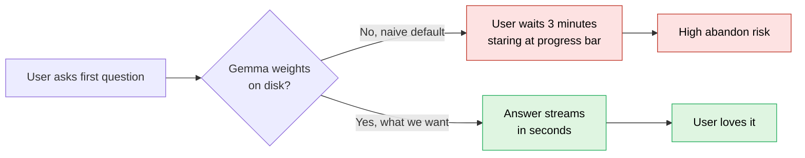
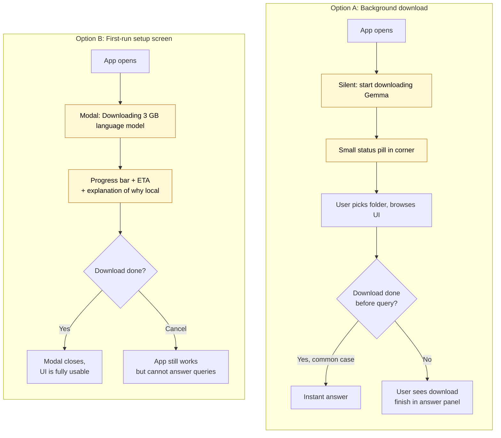
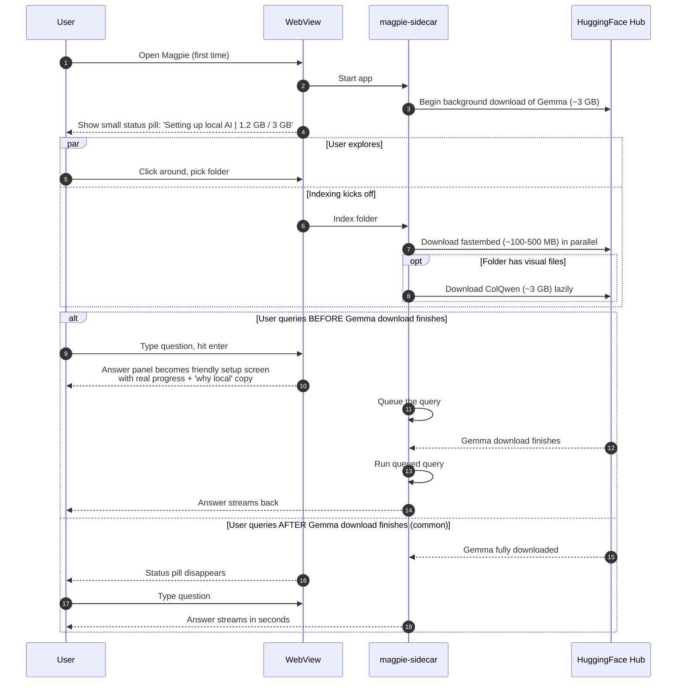
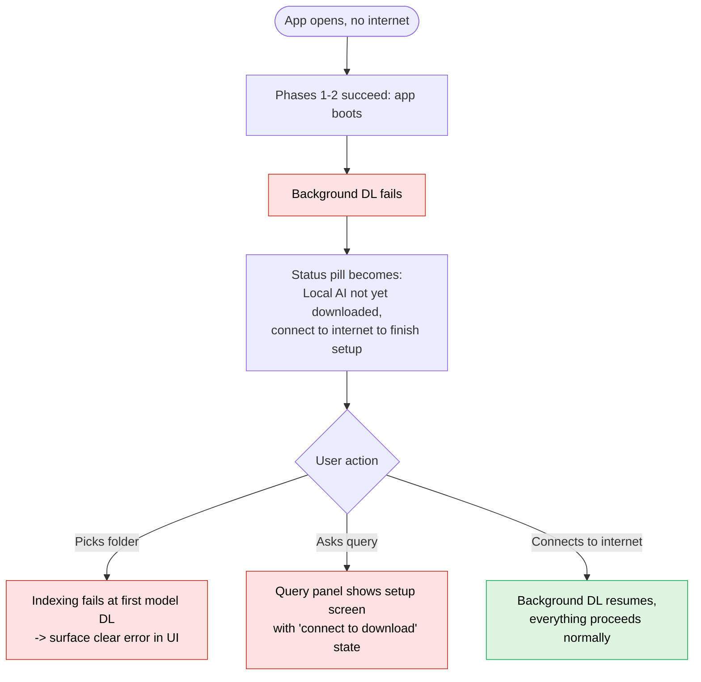

# The Honest UX Wart — and How to Fix It

The single biggest first-time issue is the **3 GB Gemma download triggered by the first query**. The user has just typed their first real question. Instead of getting an answer, they are watching a 3-minute progress bar.

That moment is the most fragile point in the entire onboarding. If we get it wrong, a non-trivial fraction of users close the window and never come back. We have to pick a mitigation before we ship to anyone outside the team.

---

## Option A — Background-download Gemma during Phase 2

**What it is.** As soon as the app launches and the sidecar is healthy, kick off a background download of the default LLM weights. The user is still on the empty home screen, has not picked a folder yet, has not asked anything. By the time they finish exploring the UI and ask their first question, the model is already on disk — or at least most of it is.

**Pros.**
- The user never sees a 3-minute wait between asking and getting an answer.
- Subjectively feels like a fast, well-engineered product.
- Failure modes (no internet, drive full) surface *before* the user is invested.

**Cons.**
- We are downloading 3 GB of weights for users who might never query — feels presumptuous, and on a metered or cellular connection it is genuinely user-hostile.
- Need to surface "Magpie is downloading 3 GB in the background" *somewhere* — silently eating bandwidth is worse than asking. So this option still needs a small banner or progress indicator, just one that does not block.

**When to choose it.** If we believe most users who get past Phase 2 will, in fact, ask a question. The conversion intuition says yes — anyone who installed Magpie did so because they want to search documents.

---

## Option B — First-run setup screen

**What it is.** After the app launches but before the user can do anything, show an explicit screen: *"Magpie is downloading its language model (~3 GB). This is a one-time setup. You'll be ready to search in about 3 minutes on a typical connection."* Progress bar, ETA, and a small explainer about why we run the model locally (privacy, cost, no API keys).

**Pros.**
- Honest. Sets the expectation correctly. Explains the *why*, which is one of Magpie's best stories ("your data never leaves your machine").
- The waiting feels intentional, not broken. The user understands what is happening.
- Lets us also kick off the embedding model and ColQwen download in parallel here, so Phase 3 has nothing to wait for either.

**Cons.**
- The literal first thing a new user sees is a download screen, not the product.
- Feels less "magic" — no instant gratification.
- A user who just wants to poke around without committing to a 3 GB download has no escape hatch unless we add one.

**When to choose it.** If we want to be transparent about what running a local AI product actually costs, and make the "your data stays here" pitch upfront.

### Side-by-side

---

## What we are recommending

**Option A with a visible-but-non-blocking banner**, escalating to **Option B if the user tries to query before the download finishes**.

Concretely:

1. Phase 2 ends. App is open. Background download of Gemma starts immediately, silent except for a small status pill in the corner: *"Setting up local AI · 1.2 GB / 3 GB"*.
2. The user can browse the empty UI, click around, pick a folder to index. Indexing kicks off other model downloads (Phase 3) in parallel — they share bandwidth but are independent.
3. If the user types a question **before** Gemma is fully on disk, the answer panel transitions into a friendly setup screen with the actual download progress and an explanation. Their question is queued and runs the moment the model is ready.
4. If the user **never** queries, the background download is wasted bandwidth — but they got the product they installed.

This gives us the speed of Option A in the common case, the honesty of Option B in the edge case, and never traps the user in a long opaque wait.

---

## The "no internet on first run" failure mode

Whichever option we pick, we need a clear path for the user who installs Magpie offline:

- App opens normally (Phases 1–2 require no network).
- Background download fails silently → status pill turns into *"Local AI not yet downloaded — connect to internet to finish setup"*.
- If the user queries, the setup screen appears with a *"connect to the internet to download"* state instead of a progress bar.

We do **not** silently fail the query with a stack trace. That is the worst possible outcome and the one we have to actively design around.

---

## Decision needed before MVP ships

- [ ] Confirm Option A + escalation is the chosen pattern.
- [ ] Decide whether ColQwen (3 GB vision model) should also be background-downloaded or kept lazy-on-first-visual-file. Default proposal: **lazy**, because users with no images in their corpus should not pay for it.
- [ ] Confirm `fastembed` (small) is acceptable to download eagerly with Gemma on first launch — yes, it is small enough that there is no reason not to.
- [ ] Wire the actual progress events from [src/inference/model_downloader.py](src/inference/model_downloader.py) up to the frontend so progress is real, not a fake spinner.
