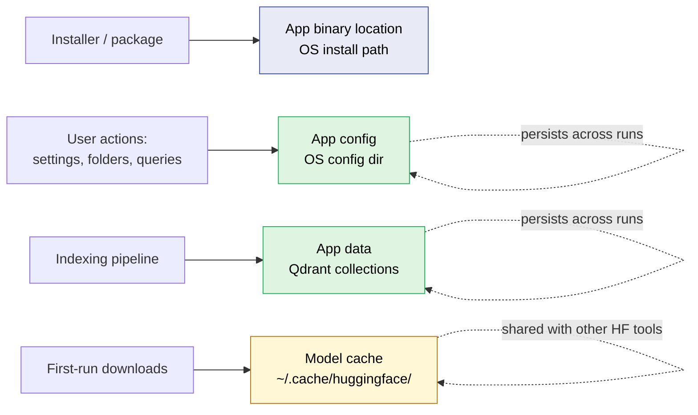
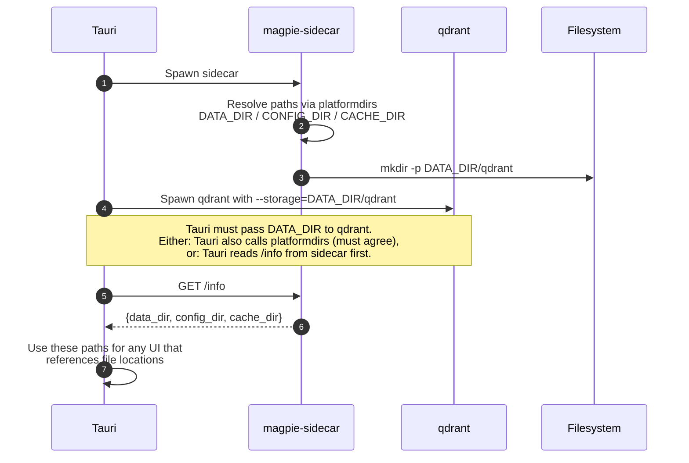

# Disk and Cache Layout — Where Magpie Puts Things

Per `CLAUDE.md`, **never hardcode file locations** — use the standard convention for each OS. This is the "billion-dollar detail" call-out: it is exactly the kind of thing AIs ship wrong and humans curse out for years afterward.

This file is the canonical reference for where Magpie writes data, so the sidecar code, the Tauri side, and any future cleanup / "Reset Magpie" flow all agree.

---

## The four kinds of paths Magpie touches

| Kind | What lives there | Lifetime |
|---|---|---|
| **App binary** | The installed Magpie app itself (Tauri shell + bundled sidecar + qdrant binary) | Until uninstall |
| **App data** | Qdrant collections, indexed corpus metadata, ingestion state | Per-machine, persistent across runs |
| **App config** | User settings, recent folders, log files | Per-user, persistent |
| **Model cache** | HuggingFace model weights (`fastembed`, ColQwen, reranker, Gemma) | Per-user, shared with any other HF tool |

The first one is decided by the installer. The other three follow OS conventions.



---

## Per-OS paths

```mermaid
flowchart TB
    subgraph Linux["Linux (XDG)"]
        L1["/opt/magpie/<br/>or ~/.local/bin/"]
        L2["~/.local/share/magpie/qdrant/"]
        L3["~/.config/magpie/<br/>(settings.json, logs/)"]
        L4["~/.cache/huggingface/"]
    end

    subgraph macOS["macOS"]
        M1["/Applications/Magpie.app/"]
        M2["~/Library/Application Support/Magpie/qdrant/"]
        M3["~/Library/Application Support/Magpie/<br/>(settings.json) + ~/Library/Logs/Magpie/"]
        M4["~/.cache/huggingface/<br/>(or ~/Library/Caches/huggingface/)"]
    end

    subgraph Windows["Windows"]
        W1["C:\\Program Files\\Magpie\\<br/>or %LOCALAPPDATA%\\Programs\\Magpie\\"]
        W2["%LOCALAPPDATA%\\Magpie\\qdrant\\"]
        W3["%APPDATA%\\Magpie\\<br/>(settings.json, logs\\)"]
        W4["%USERPROFILE%\\.cache\\huggingface\\"]
    end

    Role1[Binary] --> L1
    Role1 --> M1
    Role1 --> W1
    Role2[App data] --> L2
    Role2 --> M2
    Role2 --> W2
    Role3[App config] --> L3
    Role3 --> M3
    Role3 --> W3
    Role4[Model cache] --> L4
    Role4 --> M4
    Role4 --> W4
```



### Linux (XDG Base Directory spec)

```
App binary       /opt/magpie/                 (system install)
                 ~/.local/bin/magpie          (user install / AppImage)

App data         ~/.local/share/magpie/
                 └── qdrant/                  Qdrant collections + payload

App config       ~/.config/magpie/
                 ├── settings.json            User preferences
                 └── logs/                    Sidecar logs

Model cache      ~/.cache/huggingface/        Standard HF cache (shared)
```

XDG also lets the user override these via `$XDG_DATA_HOME`, `$XDG_CONFIG_HOME`, `$XDG_CACHE_HOME`. Honor those if set.

### macOS

```
App binary       /Applications/Magpie.app/

App data         ~/Library/Application Support/Magpie/
                 └── qdrant/

App config       ~/Library/Application Support/Magpie/
                 ├── settings.json
                 └── logs/                    (or ~/Library/Logs/Magpie/ for Console.app integration)

Model cache      ~/.cache/huggingface/        HF default on macOS
                 (or ~/Library/Caches/huggingface/ if HF tooling honors macOS conventions)
```

macOS does not strictly separate "data" from "config" the way Linux does. Putting both under `Application Support/Magpie/` and keeping logs in `~/Library/Logs/` is the conventional split.

### Windows

```
App binary       C:\Program Files\Magpie\        (per-machine NSIS install)
                 %LOCALAPPDATA%\Programs\Magpie\ (per-user install)

App data         %APPDATA%\Magpie\
                 └── qdrant\

App config       %APPDATA%\Magpie\
                 ├── settings.json
                 └── logs\

Model cache      %USERPROFILE%\.cache\huggingface\
```

Windows: `%APPDATA%` = roaming (`C:\Users\<name>\AppData\Roaming`), `%LOCALAPPDATA%` = machine-local (`AppData\Local`). Use **roaming** for things the user expects across machines (settings) and **local** for big caches that should not roam (Qdrant data, models). If we want to be picky, Qdrant data probably belongs under `%LOCALAPPDATA%\Magpie\qdrant\`.

---

## How to resolve these paths in code

**Sidecar (Python)** — use `platformdirs`:

```python
from platformdirs import user_data_dir, user_config_dir, user_cache_dir

DATA_DIR   = Path(user_data_dir("Magpie", "Magpie"))
CONFIG_DIR = Path(user_config_dir("Magpie", "Magpie"))
CACHE_DIR  = Path(user_cache_dir("Magpie", "Magpie"))
QDRANT_DIR = DATA_DIR / "qdrant"
```

`platformdirs` already knows the OS conventions. Do not roll our own. (The HuggingFace cache is handled separately by the `huggingface_hub` library — it picks `~/.cache/huggingface/` automatically and respects `HF_HOME` if set.)

**Tauri (Rust / TS)** — use `tauri::api::path` (Rust) or the `@tauri-apps/api/path` module (TS): `appDataDir()`, `appConfigDir()`, `appCacheDir()`. They resolve to the same OS-correct locations.

The Python and TS sides must agree on the resolved paths. The simplest contract: **the sidecar publishes its resolved paths in its `/health` or `/info` endpoint**, and the Tauri side reads them rather than computing its own.



---

## What "uninstall" should do (future polish)

When we get to Phase 4 (polish) of CLAUDE.md, "uninstall cleanly" is a checklist item. Each OS has its own convention:

- **Linux** — `apt remove magpie` or `rm Magpie.AppImage` removes the binary. Data and config survive in `~/.local/share/magpie/` and `~/.config/magpie/` until the user explicitly deletes them. That is correct XDG behavior.
- **macOS** — Dragging `Magpie.app` to Trash removes the binary. `~/Library/Application Support/Magpie/` survives. Offer a separate "Reset Magpie" button inside the app for users who want a clean slate.
- **Windows** — The NSIS uninstaller removes the binary and registry entries. Per Windows convention it can also offer "Also remove user data?" as a checkbox during uninstall.

The HuggingFace model cache is **never** Magpie's to delete — it is shared with any other HF-using tool the user has installed (e.g., they might run `transformers` from a Python notebook). Touching it during uninstall is a hostile move.

---

## What this means for the MVP

Two concrete asks for the build:

1. **Sidecar must use `platformdirs` end-to-end.** If anywhere in the codebase still has a hardcoded path like `./qdrant_data` or `~/magpie/`, that is a bug to fix before packaging. (`/mnt/hardisk/NotAnotherSpotlight/qdrant_data/` exists in the dev tree — that's fine for development, but the packaged build must not point there.)
2. **Tauri must agree.** The `externalBin` Qdrant child process needs its `--storage` flag (or equivalent) pointed at `appDataDir()/qdrant`, not at a relative path that ends up next to the executable inside `/Applications/` or `Program Files/` (which is read-only on Windows for unprivileged users — a classic packaging foot-gun).
