# First Launch — Per-OS Visual Walkthroughs

Three rich Mermaid diagrams. One per OS. Each walks the entire first-launch journey end-to-end with icons so the diagram reads as a story without needing to read the prose.

If you only look at one thing in this folder, look at the one for your OS.

> **Icons.** These diagrams use Unicode emoji as icons, so they render the same in GitHub, VS Code's Mermaid extensions, and any other renderer — no FontAwesome or extra CSS needed.

---

## 🐧 Linux first launch

```mermaid
flowchart TD
    Start(["📥 User downloads<br/>magpie.AppImage or magpie.deb"])
    Start --> Run{"▶️ Format?"}
    Run -->|".deb"| Apt["💻 sudo apt install ./magpie.deb"]
    Run -->|".AppImage"| Chmod["💻 chmod +x magpie.AppImage"]
    Apt --> Click(["🖱️ Click app icon<br/>or run from terminal"])
    Chmod --> Click

    Click --> Boot["⚡ Tauri shell starts<br/>~30 MB Rust binary"]
    Boot --> Spawn{"⚙️ Spawn child processes<br/>externalBin"}
    Spawn --> Side["🖥️ magpie-sidecar<br/>FastAPI on :8000"]
    Spawn --> Qdrant["🗄️ qdrant<br/>opens ~/.local/share/magpie/qdrant/"]
    Side --> UI["🪟 Window appears<br/>Total: 1-3 s, no internet"]
    Qdrant --> UI

    UI --> Pick(["📂 User picks ~/Documents"])
    Pick --> Walk["🔍 Walk folder, classify files"]
    Walk --> NeedEmbed{"❓ fastembed cached<br/>in ~/.cache/huggingface/?"}
    NeedEmbed -->|"❌ No"| EmbedDL["☁️⬇️ Download fastembed<br/>~100-500 MB"]
    NeedEmbed -->|"✅ Yes"| Embed["🧮 Embed summaries"]
    EmbedDL --> Embed

    Walk --> Visual{"🖼️ Any visual files?"}
    Visual -->|"✅ Yes"| ColQ{"❓ ColQwen cached?"}
    ColQ -->|"❌ No"| ColQDL["☁️⬇️ Download ColQwen<br/>~3 GB"]
    ColQ -->|"✅ Yes"| Vision["👁️ Run vision pipeline"]
    ColQDL --> Vision
    Visual -->|"❌ No"| SkipVision["⏭️ Skip vision"]

    Embed --> Index["🗄️ Write to qdrant collection"]
    Vision --> Index
    SkipVision --> Index

    Index --> Ready(["✅ Folder indexed"])
    Ready --> Q(["⌨️ User types question"])
    Q --> Rerank{"❓ Reranker cached?"}
    Rerank -->|"❌ No"| RerankDL["☁️⬇️ Download reranker<br/>~100 MB"]
    Rerank -->|"✅ Yes"| RR["🔃 Rerank candidates"]
    RerankDL --> RR

    RR --> LLM{"❓ Gemma cached?"}
    LLM -->|"❌ No"| LLMDL["☁️⬇️ Download Gemma 4 E4B<br/>~3 GB | slowest step<br/>via src/inference/model_downloader.py"]
    LLM -->|"✅ Yes"| Run2["🧠 llama-server generates"]
    LLMDL --> Run2
    Run2 --> Ans(["💬 Answer streams back"])

    classDef boot fill:#e8eaf6,stroke:#3f51b5,color:#000
    classDef download fill:#fde2e2,stroke:#c0392b,color:#000
    classDef cached fill:#dff5e1,stroke:#27ae60,color:#000
    classDef done fill:#fff4cc,stroke:#b7791f,color:#000
    class Boot,Spawn,Side,Qdrant,UI boot
    class EmbedDL,ColQDL,RerankDL,LLMDL download
    class Embed,Vision,RR,Run2,SkipVision cached
    class Ready,Ans done
```

**Linux specifics:**
- 🛡️ **No Gatekeeper / SmartScreen.** It just runs.
- 📁 Data: `~/.local/share/magpie/qdrant/`
- ⚙️ Config: `~/.config/magpie/`
- 📦 Models: `~/.cache/huggingface/`
- Honors `$XDG_DATA_HOME`, `$XDG_CONFIG_HOME`, `$XDG_CACHE_HOME` when set.

---

## 🍎 macOS first launch

```mermaid
flowchart TD
    Start(["📥 User downloads<br/>Magpie.dmg from website"])
    Start --> Mount["💽 Double-click .dmg -> mounts"]
    Mount --> Drag["↔️ Drag Magpie.app<br/>-> /Applications/"]
    Drag --> First(["🖱️ First double-click on app"])

    First --> Gate["🛡️⚠️ Gatekeeper:<br/>'cannot be opened from<br/>unidentified developer'"]
    Gate --> Workaround["🖱️ Right-click -> Open"]
    Workaround --> Confirm["🛡️ Second confirm dialog"]
    Confirm --> OK["✅ Approved one-time per machine"]

    OK --> Boot["⚡ Tauri shell starts<br/>~30 MB Rust binary"]
    Boot --> Spawn{"⚙️ Spawn child processes<br/>externalBin"}
    Spawn --> Side["🖥️ magpie-sidecar<br/>FastAPI on :8000"]
    Spawn --> Qdrant["🗄️ qdrant<br/>~/Library/Application Support/Magpie/qdrant/"]
    Side --> UI["🪟 Window appears<br/>Total: 1-3 s, no internet"]
    Qdrant --> UI

    UI --> Pick(["📂 User picks ~/Documents"])
    Pick --> Walk["🔍 Walk folder, classify files"]
    Walk --> NeedEmbed{"❓ fastembed cached<br/>in ~/.cache/huggingface/?"}
    NeedEmbed -->|"❌ No"| EmbedDL["☁️⬇️ Download fastembed<br/>~100-500 MB"]
    NeedEmbed -->|"✅ Yes"| Embed["🧮 Embed summaries"]
    EmbedDL --> Embed

    Walk --> Visual{"🖼️ Any visual files?"}
    Visual -->|"✅ Yes"| ColQ{"❓ ColQwen cached?"}
    ColQ -->|"❌ No"| ColQDL["☁️⬇️ Download ColQwen<br/>~3 GB"]
    ColQ -->|"✅ Yes"| Vision["👁️ Run vision pipeline"]
    ColQDL --> Vision
    Visual -->|"❌ No"| SkipVision["⏭️ Skip vision"]

    Embed --> Index["🗄️ Write to qdrant collection"]
    Vision --> Index
    SkipVision --> Index

    Index --> Ready(["✅ Folder indexed"])
    Ready --> Q(["⌨️ User types question"])
    Q --> Rerank{"❓ Reranker cached?"}
    Rerank -->|"❌ No"| RerankDL["☁️⬇️ Download reranker<br/>~100 MB"]
    Rerank -->|"✅ Yes"| RR["🔃 Rerank candidates"]
    RerankDL --> RR

    RR --> LLM{"❓ Gemma cached?"}
    LLM -->|"❌ No"| LLMDL["☁️⬇️ Download Gemma 4 E4B<br/>~3 GB | slowest step<br/>Apple Silicon: Metal acceleration"]
    LLM -->|"✅ Yes"| Run2["🧠 llama-server generates"]
    LLMDL --> Run2
    Run2 --> Ans(["💬 Answer streams back"])

    classDef gatekeep fill:#fde2e2,stroke:#c0392b,color:#000
    classDef boot fill:#e8eaf6,stroke:#3f51b5,color:#000
    classDef download fill:#fde2e2,stroke:#c0392b,color:#000
    classDef cached fill:#dff5e1,stroke:#27ae60,color:#000
    classDef done fill:#fff4cc,stroke:#b7791f,color:#000
    class Gate,Workaround,Confirm gatekeep
    class Boot,Spawn,Side,Qdrant,UI boot
    class EmbedDL,ColQDL,RerankDL,LLMDL download
    class Embed,Vision,RR,Run2,SkipVision cached
    class Ready,Ans,OK done
```

**macOS specifics:**
- 🛡️ **Gatekeeper friction one time** until we pay for an Apple Developer ID.
- 📁 Binary: `/Applications/Magpie.app/`
- 📁 Data + config: `~/Library/Application Support/Magpie/`
- 📄 Logs: `~/Library/Logs/Magpie/` (so Console.app picks them up)
- 📦 Models: `~/.cache/huggingface/`
- 🧠 Apple Silicon → llama.cpp uses Metal automatically; Intel Macs fall back to CPU/AVX2.

---

## 🪟 Windows first launch

```mermaid
flowchart TD
    Start(["📥 User downloads<br/>Magpie-Setup.exe"])
    Start --> First(["🖱️ Double-click .exe"])

    First --> SS["🛡️⚠️ SmartScreen:<br/>'Windows protected your PC'"]
    SS --> More["ℹ️ Click 'More info'"]
    More --> Anyway["▶️ Click 'Run anyway'"]
    Anyway --> Inst["⚙️ NSIS installer runs<br/>installs to %LOCALAPPDATA%\\Programs\\Magpie\\<br/>or C:\\Program Files\\Magpie\\"]
    Inst --> Launch(["🚀 Launch from Start menu"])

    Launch --> Boot["⚡ Tauri shell starts<br/>~30 MB Rust binary<br/>no SmartScreen anymore, installer trusted it"]
    Boot --> Spawn{"⚙️ Spawn child processes<br/>externalBin"}
    Spawn --> Side["🖥️ magpie-sidecar.exe<br/>FastAPI on :8000"]
    Spawn --> Qdrant["🗄️ qdrant.exe<br/>%LOCALAPPDATA%\\Magpie\\qdrant\\"]
    Side --> UI["🪟 Window appears<br/>Total: 1-3 s, no internet"]
    Qdrant --> UI

    UI --> Pick(["📂 User picks Documents folder"])
    Pick --> Walk["🔍 Walk folder, classify files"]
    Walk --> NeedEmbed{"❓ fastembed cached<br/>in %USERPROFILE%\\.cache\\huggingface\\?"}
    NeedEmbed -->|"❌ No"| EmbedDL["☁️⬇️ Download fastembed<br/>~100-500 MB"]
    NeedEmbed -->|"✅ Yes"| Embed["🧮 Embed summaries"]
    EmbedDL --> Embed

    Walk --> Visual{"🖼️ Any visual files?"}
    Visual -->|"✅ Yes"| ColQ{"❓ ColQwen cached?"}
    ColQ -->|"❌ No"| ColQDL["☁️⬇️ Download ColQwen<br/>~3 GB"]
    ColQ -->|"✅ Yes"| Vision["👁️ Run vision pipeline"]
    ColQDL --> Vision
    Visual -->|"❌ No"| SkipVision["⏭️ Skip vision"]

    Embed --> Index["🗄️ Write to qdrant collection"]
    Vision --> Index
    SkipVision --> Index

    Index --> Ready(["✅ Folder indexed"])
    Ready --> Q(["⌨️ User types question"])
    Q --> Rerank{"❓ Reranker cached?"}
    Rerank -->|"❌ No"| RerankDL["☁️⬇️ Download reranker<br/>~100 MB"]
    Rerank -->|"✅ Yes"| RR["🔃 Rerank candidates"]
    RerankDL --> RR

    RR --> LLM{"❓ Gemma cached?"}
    LLM -->|"❌ No"| LLMDL["☁️⬇️ Download Gemma 4 E4B<br/>~3 GB | slowest step<br/>CUDA if NVIDIA GPU, else CPU/AVX2"]
    LLM -->|"✅ Yes"| Run2["🧠 llama-server.exe generates"]
    LLMDL --> Run2
    Run2 --> Ans(["💬 Answer streams back"])

    classDef gatekeep fill:#fde2e2,stroke:#c0392b,color:#000
    classDef boot fill:#e8eaf6,stroke:#3f51b5,color:#000
    classDef download fill:#fde2e2,stroke:#c0392b,color:#000
    classDef cached fill:#dff5e1,stroke:#27ae60,color:#000
    classDef done fill:#fff4cc,stroke:#b7791f,color:#000
    class SS,More,Anyway gatekeep
    class Inst,Launch,Boot,Spawn,Side,Qdrant,UI boot
    class EmbedDL,ColQDL,RerankDL,LLMDL download
    class Embed,Vision,RR,Run2,SkipVision cached
    class Ready,Ans done
```

**Windows specifics:**
- 🛡️ **SmartScreen one time** during install until we pay for an EV cert.
- 📁 Binary: `C:\Program Files\Magpie\` (per-machine) or `%LOCALAPPDATA%\Programs\Magpie\` (per-user).
- 📁 Data: `%LOCALAPPDATA%\Magpie\qdrant\` (local, doesn't roam — it's huge).
- ⚙️ Config: `%APPDATA%\Magpie\` (roaming — settings.json travels with the user profile).
- 📦 Models: `%USERPROFILE%\.cache\huggingface\`
- 🧠 CUDA path needs separate llama-server build; CPU build is the safe default.

---

## 👁️ How to read these diagrams

| Color | Meaning |
|---|---|
| 🟥 red | One-time first-launch cost: gatekeeping dialog, model download, anything that consumes time or bandwidth |
| 🟦 blue | Process boot — the same on every launch |
| 🟩 green | A cache hit — the fast path we want every subsequent launch to take |
| 🟨 yellow | A finished state the user sees and feels |

**The "billion-dollar detail":** the icons and color-coding are the same across all three diagrams *except* where the OS genuinely differs. That's deliberate — the only OS-specific things are the gatekeeping dialog (or absence of one) and the file paths. Everything else is identical, which is exactly what we want from a cross-platform product.

---

## 🔧 If diagrams still don't render in VS Code

1. **Make sure you're previewing the markdown, not just opening it.** Right-click → "Open Preview" (or `Ctrl+Shift+V` / `Cmd+Shift+V`).
2. **Use the right extension.** *Markdown Preview Mermaid Support* by Matt Bierner is the most reliable — it adds Mermaid to VS Code's built-in preview, so no separate panel needed.
3. **Check the extension is enabled** in this workspace (extensions can be disabled per-workspace).
4. The `timeline` diagram in [01-first-run.md](01-first-run.md) needs Mermaid ≥9.4 — most extensions have it, but if that one specific block fails, the others should still render.
