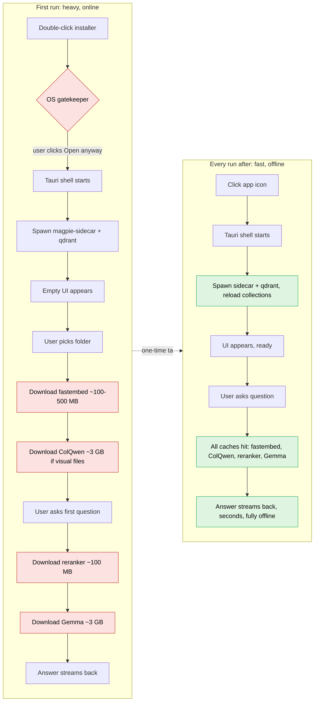

# Magpie First-Launch Walkthrough

This folder documents what a brand-new user experiences the **first time** they install and open Magpie, and what they experience on **every launch after**. It exists so we can stress-test the unboxing story before we ship — every dialog, download, and progress bar that the user will actually see.

The split is deliberate: first run is the friction-heavy path (signing dialogs, model downloads, multi-GB pulls). Every run after is fast, offline, and silent. The gap between those two experiences is the entire reason this folder exists.

## Read in order

1. [01-first-run.md](01-first-run.md) — Phases 1–4. From double-click to first answer. ~3 GB of downloads, ~3 minutes of waiting on a fast connection.
2. [02-subsequent-runs.md](02-subsequent-runs.md) — Phase 5. Cold-start to answer in seconds. No network required.
3. [03-ux-wart-and-mitigations.md](03-ux-wart-and-mitigations.md) — The honest issue: the user asks their first question and waits 3 minutes for the LLM weights to land. Two ways to fix it.
4. [04-disk-and-cache-layout.md](04-disk-and-cache-layout.md) — Where everything lives on each OS so we don't hardcode paths and so the user can find / clean up Magpie's footprint.
5. [05-first-launch-by-os.md](05-first-launch-by-os.md) — **The picture-book version.** Three big icon-heavy Mermaid diagrams, one per OS. If you only look at one file, look at this one for your platform.

## TL;DR

| Phase | First run | Every run after |
|---|---|---|
| 1. OS gatekeeping | Gatekeeper / SmartScreen dialog (one-time) | Skipped |
| 2. App start | 1–3 s (Tauri + sidecar + Qdrant boot) | 1–3 s (same) |
| 3. First indexing | Embedding + vision model download (~100 MB + ~3 GB) | Cached |
| 4. First query | Reranker + LLM weights download (~100 MB + ~3 GB) | Cached |
| 5. Steady state | n/a | Sub-second to seconds, fully offline |

The single biggest first-launch cost is the **3 GB Gemma weights** that download on the first query. This is the thing to mitigate — see [03-ux-wart-and-mitigations.md](03-ux-wart-and-mitigations.md).

## First run vs every run after, side by side

The red nodes are the costs the user pays exactly once. The green nodes are what they get forever after.
