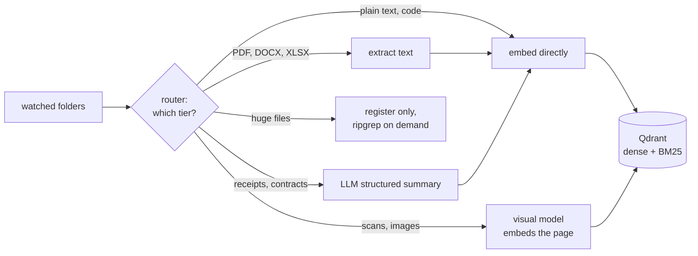
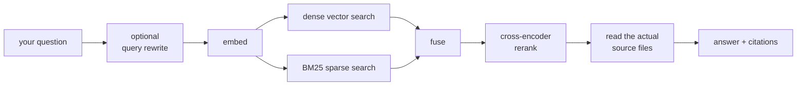

<p align="center">
  <picture>
    <source media="(prefers-color-scheme: dark)" srcset="logo/Magpie_Logo_Transparent_DarkMode.png" />
    
  </picture>
</p>

<h1 align="center">Magpie</h1>

<p align="center">
  <a href="https://github.com/mriddyagrawal/Magpie/releases/latest"></a>
  <a href="LICENSE"></a>
  <a href="https://github.com/mriddyagrawal/Magpie/releases/latest"></a>
  <a href="https://github.com/mriddyagrawal/Magpie/stargazers"></a>
  <a href="#privacy"></a>
</p>

<p align="center">
  <b>Ask questions about your own files. Get answers, with the sources cited.</b>
</p>

<p align="center">
  Hit <code>⌥Space</code>, ask something in plain English, and get an answer grounded in your actual<br />
  documents — receipts, contracts, course catalogs, meeting notes, scanned PDFs — with clickable<br />
  links to the files it used. Your files never leave your machine.
</p>

<p align="center">
  <em>named after the bird that caches thousands of finds across scattered hiding places —<br />and remembers where every one of them is.</em>
</p>

---

<p align="center"><b>macOS (Apple silicon) and Windows 10/11.</b> Linux isn't in this beta (<a href="docs/DEVELOPMENT.md#linux">why</a>).</p>

---

<p align="center">
  <b>📹 Demo video goes here</b><br />
  <sub>a 15-second capture of the real app — recording shortly</sub>
</p>

<!-- When the capture exists, replace the block above with:
     <p align="center"></p>
     Produce it with: uv run python scripts/record_demo.py
     Do NOT use Specs/UI/*.png here — those are design mockups, not the shipped build. -->

---

## the problem

Every desktop search tool works the same way: you type keywords, it matches filenames and maybe some content. That's fine when you remember the exact word. It falls apart the moment you ask a real question.

- *"How much was that flight to Hartford last March?"*
- *"Which course teaches relativity?"*
- *"What's our club's policy on guest voting?"*

Spotlight can find a file whose *name* contains "Hartford," but it can't read the receipt and tell you the total. It can list every course catalog PDF, but it can't scan their contents and return the one covering relativity. The information is on your machine. The search tool just doesn't understand it.

Magpie is the "chat with your documents" experience — but pointed at your own filesystem instead of a curated upload.

---

## why magpie?

| | Magpie | Spotlight / Windows Search | [ripgrep](https://github.com/BurntSushi/ripgrep) | NotebookLM / ChatGPT |
|---|---|---|---|---|
| **what you type** | a question | keywords | a regex | a question |
| **what you get back** | an answer, citing the files it used | a list of files | matching lines | an answer over what you uploaded |
| **understands meaning** | ✅ | ❌ | ❌ | ✅ |
| **works on files where they already are** | ✅ indexed in place, never copied | ✅ | ✅ | ❌ you upload copies |
| **scanned PDFs and photos** | ✅ a visual model embeds the rendered page | partial — OCR on some platforms | ❌ | ✅ if you upload them |
| **exact identifiers** (`PHY-312`, `$143.50`) | ✅ BM25 running alongside the vectors | ✅ | ✅ | ⚠️ depends how it chunked the file |
| **what leaves your machine** | nothing in Local mode; only the retrieved text in Cloud mode | nothing | nothing | everything you upload |
| **price** | free, open source | comes with the OS | free, open source | subscription, at real volume |

The short version: **grep needs the exact word. Spotlight needs the filename. Magpie needs the idea.**

---

## what it does

- **Answers, not hit lists.** Every answer names the files it relied on, as clickable paths you can open or reveal in the file manager.
- **Reads what other tools skip.** Text, PDF, DOCX, XLSX, CSV, code, Markdown — plus scanned pages and photos, through a visual model that embeds the rendered page instead of giving up on it.
- **Two embeddings, because one isn't enough.** A dense vector so "pay the landlord" finds "rent payment," and a sparse BM25 vector so `PHY-312` and `$143.50` stay findable literally. Both are fused at query time.
- **Tables stay row-addressable.** A 3-sentence summary indexes a receipt well; a 1,700-row course catalog is indexed *per row*, so individual courses stay findable.
- **Incremental by default.** A manifest tracks every file. Adding one file to a folder of thousands re-processes exactly one file.
- **The filesystem stays the source of truth.** Nothing is copied into a second store. Delete a file and the next sync drops its summary and index entry.
- **Spotlight-style, out of your way.** Global `⌥Space` to summon, hides the moment it loses focus.

---

## architecture

**Indexing** — every file is routed to the cheapest tier that can actually understand it:



**Search** — retrieval is hybrid, and the answer is written from the real files, not from the summaries:



Four models run inside the app — MiniLM for dense embeddings, BM25 for sparse, ColPali for visual pages, and a cross-encoder for reranking. None of them ever call out.

---

## how it holds up

Magpie is developed against three corpora, each picked to break a different part of the pipeline:

- **ReceiptQA** — receipt images paired with Q&A. Tests image understanding and identifier extraction: amounts, dates, merchant names.
- **A university course catalog** — 1,724 courses across 61 departments, split into CSVs by department and by general-education category. Tests row-level CSV retrieval and whether the router sends the right kind of query at the right kind of file.
- **A student organization directory** — 236 clubs with descriptions and categories, plus each club's uploaded PDFs and Word documents (constitutions, by-laws). Tests mixed-media ingestion at scale.

The answer stage is scored on a hand-written question set with known-correct source files, so a wrong-but-plausible answer still fails:

| setting | value |
|---|---|
| run | 2026-04-12 |
| answer model | kimi-k2.5 via Moonshot |
| questions | 35, hand-written against the internal test corpus |
| top-k from Qdrant | 5 |
| metric | did the answer cite *every* expected source, and no distractors? |

| difficulty | questions | perfect source recall | distractors cited |
|---|---|---|---|
| easy | 12 | 12 / 12 | 0 |
| medium | 12 | 12 / 12 | 0 |
| hard | 11 | 10 / 11 | 1 |
| **total** | **35** | **34 / 35** | **1** |

**Read those numbers honestly.** This is our own question set on our own corpus, not an external benchmark — we wrote the questions, so treat it as a regression test we haven't gamed rather than proof we beat anyone. It ran on kimi-k2.5, which is *not* the model the beta ships with. And 35 questions is a small N. The harness is in [`tests/`](tests/) and the raw per-question output is in [`tests/test results/`](tests/test%20results/) if you want to check our work or run it on your own files.

---

## download

**[Latest release →](https://github.com/mriddyagrawal/Magpie/releases/latest)**

| Platform | File |
|---|---|
| macOS (Apple silicon) | `Magpie_0.1.0_aarch64.dmg` |
| Windows 10/11 (x64) | `Magpie_0.1.0_x64-setup.exe` or `.msi` |
| macOS (Intel) | Not built — GitHub retired the Intel CI runner |
| Linux | Not in this beta ([why](docs/DEVELOPMENT.md#linux)) |

### macOS: the first launch is blocked

The beta is **unsigned and un-notarized**, so macOS quarantines it. This is expected. Either:

```bash
xattr -dr com.apple.quarantine /Applications/Magpie.app
```

…or open **System Settings → Privacy & Security**, scroll down, and click **Open Anyway**.

### Windows

SmartScreen will warn you. Click **More info → Run anyway**.

---

## first run

1. Press **`⌥Space`** to summon the window (`Alt+Space` on Windows).
2. Open **Settings → Data → Add folder** and point it at something real.
3. Wait for the folder to finish indexing — the row shows live progress.
4. Press `⌥Space` again and ask a question.

**The first question needs an internet connection.** Magpie downloads ~90 MB of embedding models on first use, then works from cache. Indexing large folders also downloads a visual model (500 MB–2 GB) the first time it meets a scanned PDF or image.

### shortcuts

| Key | Action |
|---|---|
| `⌥Space` (global) | Summon the window from any app |
| `Enter` | Submit the question |
| `Esc` | Collapse to resting state; again to hide |
| `↑` / `↓` | Move through sources, preview follows |
| `Enter` on a source | Open in the default app |
| `⌘Enter` on a source | Reveal in Finder |

Magpie hides whenever it loses focus, like Spotlight. `⌥Space` brings it back.

---

## what works in this beta

| | Status |
|---|---|
| Indexing folders, live progress, resume | ✅ |
| Asking questions, cited answers, file previews | ✅ |
| Text, PDF, DOCX, XLSX, CSV, code, Markdown | ✅ |
| Scanned PDFs and images (visual search) | ✅ |
| Cloud answers | ✅ ships with a shared key — see [Privacy](#privacy) |
| **Local / offline model** | ❌ not bundled in this build |
| Auto-update | ❌ off; download new versions manually |
| Code signing | ❌ unsigned, hence the launch warnings |
| Linux | ❌ not built |

**About the local model:** Magpie fully supports running inference on-device, but the ~2 GB `llama-server` runtime isn't bundled in the installer yet and there's no in-app downloader. Selecting **Settings → Local** will tell you it isn't set up and point you back to Cloud. If you're running from source, `just install-llama-server` gets you offline inference today.

---

## privacy

What stays local, always:

- **Your files.** Never uploaded, never copied into another store.
- **The index.** Qdrant runs as a local binary on loopback. Magpie *hard-errors* if pointed at a remote cluster — this is enforced in code, not policy.
- **All embedding and ranking.** The four models above run inside the app and never call out.

What leaves the machine, in Cloud mode only:

- **Your question**, if query rewriting is on.
- **The contents of the files retrieved to answer it**, sent to the LLM provider.

That second one is the real boundary — worth knowing before you point Magpie at anything sensitive. In Local mode nothing leaves at all.

> **On the bundled key:** this beta ships with a shared, spend-capped OpenRouter key against a free-tier model so it works out of the box. It's extractable from the binary — assume it's public, and don't rely on it for anything private. Bring-your-own-key and a hosted backend are both planned.

---

## build from source

```bash
git clone https://github.com/mriddyagrawal/Magpie.git
cd Magpie
just sync-environment     # Python deps via uv
just qdrant-install       # local vector database binary
cd frontend && pnpm install
```

Then run the dev loop:

```bash
just qdrant-up                                        # terminal 1
uv run uvicorn src.server:app --port 8765 --reload    # terminal 2
cd frontend && pnpm tauri dev                         # terminal 3
```

## stack

Python (FastAPI) · Tauri 2 (Rust shell) · React/TS · [Qdrant](https://qdrant.tech/) · MiniLM · BM25 · [ColPali](https://huggingface.co/vidore/colpali) · cross-encoder reranking

---

## roadmap

Nearest first — the ❌ rows above are the honest backlog:

- **Bundle the local model.** On-device inference already works from source; it needs the runtime in the installer and an in-app downloader.
- **Sign the builds.** An Apple Developer ID and a Windows cert remove both scary launch dialogs.
- **Bring your own key.** Settings → Advanced → API Keys, so nobody depends on the shared beta key.
- **Ship Linux.** The build exists; it's parked for the beta.
- **Token-by-token answer streaming**, and cancelling in-flight queries when you retype.
- **Auto-update**, currently switched off.

Everything we've considered and deliberately deferred — with the reasoning, so we can tell later whether it still holds — lives in [`Plans/Future Plans.md`](Plans/Future%20Plans.md).

## docs

| doc | what |
|-----|------|
| [docs/DEVELOPMENT.md](docs/DEVELOPMENT.md) | full setup, LLM provider config, local inference, packaging, releases |
| [Plans/Future Plans.md](Plans/Future%20Plans.md) | every deferred idea, numbered, with the reasoning behind the deferral |
| [tests/](tests/) | the retrieval and answer eval harness, plus raw per-question results |

---

## status

Magpie is a **beta**. It has been installed and run by a handful of people; expect rough edges, and please open an issue when you find one.

## contributors

<a href="https://github.com/mriddyagrawal/Magpie/graphs/contributors">
  
</a>

## star history

<a href="https://star-history.com/#mriddyagrawal/Magpie&Date">
  <picture>
    <source media="(prefers-color-scheme: dark)" srcset="https://api.star-history.com/svg?repos=mriddyagrawal/Magpie&type=Date&theme=dark" />
    <source media="(prefers-color-scheme: light)" srcset="https://api.star-history.com/svg?repos=mriddyagrawal/Magpie&type=Date" />
    
  </picture>
</a>

---

## license

Magpie is licensed under the **GNU Affero General Public License, version 3** ([`AGPL-3.0-only`](LICENSE)).

    Copyright (C) 2026 Rahul Ranjan Sah and Mridul Agrawal

    This program is free software: you can redistribute it and/or modify it
    under the terms of the GNU Affero General Public License as published by
    the Free Software Foundation, version 3.

    This program is distributed in the hope that it will be useful, but
    WITHOUT ANY WARRANTY; without even the implied warranty of
    MERCHANTABILITY or FITNESS FOR A PARTICULAR PURPOSE. See the GNU Affero
    General Public License for more details.

    You should have received a copy of the GNU Affero General Public License
    along with this program. If not, see <https://www.gnu.org/licenses/>.

In plain words: anyone may run, read, modify and redistribute Magpie, but a modified version has to carry the same license — and under **section 13** that holds even if the modification is only ever run as a *network service*. Standing up a fork of `server/` for other people counts; its users are entitled to the source.

**Why AGPL and not MIT.** Partly strategy, partly arithmetic: Magpie links [PyMuPDF](https://pymupdf.readthedocs.io/), which Artifex dual-licenses as *AGPL-3.0 or a paid commercial license*. A permissive license for the combined work was never actually on the table without buying that dependency out.

**Commercial use.** The AGPL doesn't stop you selling Magpie or running it inside a business; it requires the source to travel with the software. Copyright is held by the two authors, so the same code can also be offered to a customer under a separate commercial license. Contributors sending non-trivial patches should expect to sign a CLA to keep that option open.
