# `.csv` routing

CSVs are the **only** file type whose ingest path involves both an LLM
summary AND a row-level Qdrant index, AND whose answer-time retrieval is
specially handled (row-window content instead of file-prefix dump).

> **Updated 2026-05-06** to reflect Plan #17 (now shipped). The old "T1 =
> stuff up to 20 MB of raw CSV bytes into the summary markdown" behavior
> is gone. T1 CSVs now produce a real `FileSummary` via the same LLM
> agent T3 uses for PDFs.

The size-based decision still splits three ways:

- **< 20 MB** → **T1 (LLM-summarized)** → walker dispatches to
  `tier1.run_csv_async`. Header + first ~20 rows / ~1000 chars are sent
  to the LLM, which returns a `FileSummary(title, summary, keywords,
  key_entities, identifiers)` — same shape T3 produces. Stage 2 then
  ingests the **CSV rows** into Qdrant as one point per row via
  `csv_ingest.ingest_csv_rows`. The LLM summary markdown is written to
  disk and used as the answer-time supplement (see "Answer-time
  retrieval" below).
- **≥ 20 MB but ≤ 100,000 rows** → T2 → whole CSV text extracted, capped
  at 8 KB. One file-level summary point.
- **> 100,000 rows** → T0 → header + first 100 rows preview + filename.
  Ripgrep at query time for needle-in-haystack lookups.

`.csv` is in `_DATA_EXTS_DEFAULT_OFF` — **filtered out at the walker unless
`--include-data` is passed.** Use `just sync --include-data` or
`just walk-data <path>`.

## Path summary

| Stage | What runs |
|---|---|
| Walker filter | Default-skipped (in `_DATA_EXTS_DEFAULT_OFF`). Re-enabled with `--include-data`. |
| peek function | `_peek_csv` ([src/router.py:262](../src/router.py#L262)) |
| decide branch | CSV_EXTS ([src/router.py:960](../src/router.py#L960)) |
| Thresholds | size ≥ 20 MB and rows ≤ 100k → T2; rows > 100k → T0; else → T1 |
| Tier worker(s) | **T1 CSV: `tier1.run_csv_async` (LLM call)** / T2: `tier2.run` / T0: `tier0.run` |
| Stage 2 downstream | T1 csv → **`csv_ingest.ingest_csv_rows` (one point per row, batched 64, payload includes `row_index`)**.<br/>T0/T2 csv → standard `parse_summary_file` → 1 point per file. |
| Answer-time | T1 csv hits → row-window block (matched row + ±2 neighbors, merged) + LLM summary supplement. NOT `build_content_blocks(text[:max_chars])`. |

## What "T1 CSV" looks like end-to-end

The CSV ends up represented in **two** Qdrant shapes (and a third place on disk):

| Where | What | Shape |
|---|---|---|
| `summaries` collection (Qdrant) | One point per row | `{id, vector.dense, vector.sparse, payload: {source_path, chunk_index}}`. **Path-only payload since 2026-05** — the row's text is NOT stored, just enough metadata to re-locate it. Display snippets are reconstructed by re-reading the CSV at `chunk_index` at query time (already cached by `_load_csv_rows`). Saves ~30% of Qdrant size at scale. `chunk_index` is the generic name for the within-file index — row number for CSVs; future PDF/audio chunks reuse the same field. |
| `<APP_DATA_DIR>/summaries/<hash>_t1.md` (disk) | The LLM-generated `FileSummary` (title / 3-7 sentence summary / keywords / entities / identifiers) | A normal T3-style summary markdown |
| Manifest entry | Tracks `summary_file=<hash>_t1.md`, `routes=["T1"]`, `row_count=N` | Same row used for both row-cleanup and supplement lookup |

> **Known gap (post-Plan-#17 followup):** the LLM summary on disk is
> **not** also embedded as a file-level Qdrant point. So semantic queries
> like *"do we have a course catalog?"* can't yet retrieve a CSV by what
> it *is* — only by what's in its rows. The summary IS used as the
> answer-time supplement once any row hits, but isn't itself searchable.
> Wiring this is a small follow-up: also call `upsert_summaries([parsed])`
> for the CSV's markdown alongside `ingest_csv_rows`.

## Answer-time retrieval (Plan #17 Part B)

When a CSV row is in the top-k retrieval, the answer step does NOT call
`build_content_blocks(path, max_chars=...)` (which would dump the file's
beginning regardless of which row matched). Instead:

1. `pipeline.ask` groups retrieved hits by path, keeping each hit's
   `row_index`. Result: `{path: [row_index, ...]}`.
2. `answer.answer_question` receives `csv_row_hits` and, for any CSV path
   in it, calls `build_csv_row_window_block(path, indexes, window=2)`.
3. The helper:
   - Builds ±2 neighbor windows around each row index.
   - Merges overlapping or adjacent windows (rows 5 and 6 → one window
     covering 3-8; row 47 stays separate as 45-49).
   - Returns formatted text with `(match)` markers on hit rows.
4. The file's LLM summary markdown is prepended via `_summary_supplement`
   (capped at 10 KB). For T1 CSVs this is now a real distilled summary
   thanks to Part A — pre-Plan-#17 it was raw CSV bytes, which caused
   token-blowup incidents.

So a 3-hit query against the directory CSV produces a prompt block like:

```
Content type: llm-summary [...]
Title: Furman Faculty Directory
Summary: ~1700-row directory of Furman University faculty by department, with...
Keywords: directory, faculty, ...

---

Content type: csv-row-windows (the rows that match the question, with ±2 neighbors)

---
[row 3] dept: Physics | name: Dr. Smith | ...
[row 4] dept: Physics | name: Dr. Jones | ...
[row 5 (match)] dept: Physics | name: Dr. Brown | ...
[row 6 (match)] dept: Physics | name: Dr. Green | ...
[row 7] dept: Physics | name: Dr. Lee | ...
[row 8] dept: Physics | name: Dr. Khan | ...
```

versus the pre-Plan-#17 alternative which would have stuffed the first
~25 KB of the directory CSV (≈80 rows starting from row 0, regardless of
which rows actually matched) into the prompt, **twice** (once as raw-byte
"summary supplement", once as `text[:max_chars]`).

## Identical paths

_(none — only `.csv` takes this path)_

## Flowchart

```mermaid
flowchart TD
    A["File: example.csv"] --> A0Q{"--include-data passed?<br/>(.csv default-skipped)"}
    A0Q -- "no" --> Z0["filtered: data file<br/>default-skipped"]
    A0Q -- "yes" --> B{"In .gitignore /<br/>.nasignore?"}
    B -- "yes" --> Z1["filtered by walker"]
    B -- "no" --> C{"Manifest unchanged?"}
    C -- "yes" --> Z2["SKIP: unchanged"]
    C -- "no" --> D["router.peek →<br/>_peek_csv"]
    D --> E["Stream every row, count rows<br/>5 KB peek_text from header<br/>+ first lines"]
    E --> F["scores + criticality"]
    F --> G["router.decide<br/>CSV_EXTS branch"]
    G --> H{"size_bytes < 20 MB?"}
    H -- "yes" --> T1["Route: T1<br/>(LLM-summarized;<br/>row-level Qdrant)"]
    H -- "no" --> I{"row_count ≤ 100,000?"}
    I -- "yes" --> T2["Route: T2<br/>(extract whole CSV)"]
    I -- "no" --> T0["Route: T0<br/>(preview only)"]

    T1 --> W1["tier1.run_csv_async<br/>1) hash file (dedup)<br/>2) sample header + ~20 rows<br/>3) LLM call → FileSummary<br/>4) render_markdown<br/>→ &lt;hash16&gt;_t1.md"]
    T2 --> W2["tier2.run<br/>path.read_text<br/>cap 8000 chars<br/>content_type: csv"]
    T0 --> W0["tier0.run<br/>header + first 100 rows<br/>title: filename + N rows"]

    W2 --> WR2["render_summary_markdown<br/>→ &lt;hash16&gt;_t2.md"]
    W0 --> WR0["render_summary_markdown<br/>→ &lt;hash16&gt;_t0.md"]

    W1 --> N["manifest.mark_summarized<br/>+ mark_routed (T1 in routes)<br/>+ mark_content_hash"]
    WR2 --> N2["manifest.mark_summarized<br/>+ mark_routed (T2 in routes)"]
    WR0 --> N0["manifest.mark_summarized<br/>+ mark_routed (T0 in routes)"]

    N --> O["End of walk → Stage 2 push"]
    N2 --> O
    N0 --> O

    O --> P{"Manifest entry:<br/>.csv extension AND<br/>T1 in routes?"}

    P -- "yes (T1 csv)" --> CR1["csv_ingest.ingest_csv_rows<br/>(reads RAW CSV from disk,<br/>NOT the LLM summary md)"]
    CR1 --> CR2["For each row in csv.DictReader:<br/>'Key: Val | Key: Val | ...'"]
    CR2 --> CR3["Batch 64 rows:<br/>embed_dense (MiniLM)<br/>+ embed_sparse (BM25)"]
    CR3 --> CR4["Qdrant upsert into<br/>'summaries' collection<br/>1 point PER ROW<br/>id = md5(source::row:N)<br/>payload: {source_path,<br/>  chunk_index}<br/>(text reconstructed at query<br/>time from CSV on disk)"]
    CR4 --> CR5["manifest.mark_ingested"]
    CR4 -.- GAP["GAP: LLM summary md is<br/>on disk but NOT also<br/>embedded as a file-level<br/>Qdrant point. Used as<br/>answer-time supplement only."]

    P -- "no (T0 or T2 csv)" --> NR1["parse_summary_file"]
    NR1 --> NR2["embed_dense + embed_sparse"]
    NR2 --> NR3["Qdrant upsert<br/>'summaries' collection<br/>1 point for whole file<br/>id = md5(source_rel)"]
    NR3 --> NR4["manifest.mark_ingested"]

    %% Answer-time path (separate from ingest)
    CR5 -.-> Q["Query time:<br/>row hit returned"]
    Q --> Q1["pipeline.ask groups by path:<br/>csv_row_hits[path] = [row_idxs]"]
    Q1 --> Q2["answer.answer_question:<br/>build_csv_row_window_block<br/>(merged ±2 windows)"]
    Q2 --> Q3["+ _summary_supplement<br/>(reads &lt;hash&gt;_t1.md from disk;<br/>cap 10 KB)"]
    Q3 --> Q4["LLM answer prompt"]

    classDef skip fill:#ffcccc,stroke:#990000,color:#000
    class Z0,Z1,Z2 skip
    classDef rowLevel fill:#fff2a8,stroke:#b38600,color:#000
    class CR1,CR2,CR3,CR4 rowLevel
    classDef llm fill:#cce5ff,stroke:#0050b3,color:#000
    class W1,Q3 llm
    classDef gap fill:#ffe5b4,stroke:#cc6600,color:#000,stroke-dasharray: 5 5
    class GAP gap
    classDef answer fill:#e6ffe6,stroke:#006600,color:#000
    class Q,Q1,Q2,Q3,Q4 answer
```



## Code references

### Ingest path
- Walker default-skip set: [src/ingest/walker.py:137](../src/ingest/walker.py#L137)
- Walker dispatch (T1 CSV branch): [src/ingest/walker.py:86](../src/ingest/walker.py#L86)
- peek: [src/router.py:262](../src/router.py#L262) (`_peek_csv` — full row stream)
- decide branch: [src/router.py:960](../src/router.py#L960)
- **T1 CSV worker (LLM-summarized):** [src/ingest/tier1.py:run_csv_async](../src/ingest/tier1.py)
- T2 worker (whole CSV extract): [src/ingest/tier2.py:70](../src/ingest/tier2.py#L70)
- T0 worker (preview): [src/ingest/tier0.py:45](../src/ingest/tier0.py#L45) (`_csv_preview`)
- Stage 2 row-level switch: [src/stage2/__main__.py:121](../src/stage2/__main__.py#L121)
- Per-row ingest: [src/stage2/csv_ingest.py:28](../src/stage2/csv_ingest.py#L28)

### Answer-time row-window path
- Hit grouping: [src/pipeline.py:ask](../src/pipeline.py)
- Row-window builder: [src/stage2/search.py:build_csv_row_window_block](../src/stage2/search.py)
- Supplement (reads `<hash>_t1.md` from disk): [src/answer.py:_summary_supplement](../src/answer.py)
- CSV-row-hit branch in answer: [src/answer.py:answer_question](../src/answer.py)

### Tests
- Sampling + LLM dispatch: [tests/ingest/test_tier1_csv.py](../tests/ingest/test_tier1_csv.py)
- Row-window merging: [tests/stage2/test_csv_row_windows.py](../tests/stage2/test_csv_row_windows.py)
