# `.csv` routing

CSVs are the **only** file type with a row-level indexing path. The decision
splits three ways by size and row count:

- **< 20 MB** → T1 → Stage 2 detects T1+csv and switches to `csv_ingest.ingest_csv_rows`,
  which embeds **one Qdrant point per row** (`Key: Val | Key: Val | …`). This is
  what makes "find the course about relativity" work across a 1,724-row catalog.
- **≥ 20 MB but ≤ 100,000 rows** → T2 → whole CSV text extracted and capped at
  8 KB. One point for the whole file.
- **> 100,000 rows** → T0 → header + first 100 rows preview + filename.
  Ripgrep at query time for needle-in-haystack lookups.

`.csv` is in `_DATA_EXTS_DEFAULT_OFF` — **filtered out at the walker unless
`--include-data` is passed.** When you do want CSVs indexed, pass
`just walk-data <path>` or `python -m src.ingest <path> --include-data`.

## Path summary

| Stage | What runs |
|---|---|
| Walker filter | Default-skipped (in `_DATA_EXTS_DEFAULT_OFF`). Re-enabled with `--include-data`. |
| peek function | `_peek_csv` ([src/router.py:232](../src/router.py#L232)) |
| decide branch | CSV_EXTS ([src/router.py:930](../src/router.py#L930)) |
| Thresholds | size ≥ 20 MB and rows ≤ 100k → T2; rows > 100k → T0; else → T1 |
| Tier worker(s) | `tier0.run` / `tier1.run` / `tier2.run` |
| Stage 2 downstream | T1 csv → **`csv_ingest.ingest_csv_rows` (one point per row, batched 64)**. T0/T2 csv → standard `parse_summary_file` → 1 point per file. |

## Identical paths

_(none — only `.csv` takes this path)_

## Flowchart

```mermaid
flowchart TD
    A["File: example.csv"] --> A0Q{"--include-data passed?<br/>(.csv default-skipped)"}
    A0Q -- "no" --> Z0["filtered: data file<br/>default-skipped"]
    A0Q -- "yes" --> B{"In .gitignore /<br/>.nasignore?"}
    B -- "yes" --> Z1["filtered by walker"]
    B -- "no" --> C{"Manifest unchanged?"}
    C -- "yes" --> Z2["SKIP: unchanged"]
    C -- "no" --> D["router.peek →<br/>_peek_csv"]
    D --> E["Stream every row, count rows<br/>5 KB peek_text from header<br/>+ first lines"]
    E --> F["scores + criticality"]
    F --> G["router.decide<br/>CSV_EXTS branch"]
    G --> H{"size_bytes < 20 MB?"}
    H -- "yes" --> T1["Route: T1<br/>(row-level path)"]
    H -- "no" --> I{"row_count ≤ 100,000?"}
    I -- "yes" --> T2["Route: T2<br/>(extract whole CSV)"]
    I -- "no" --> T0["Route: T0<br/>(preview only)"]

    T1 --> W1["tier1.run<br/>raw CSV body, 20 MB cap<br/>content_type: csv<br/>title: filename"]
    T2 --> W2["tier2.run<br/>path.read_text<br/>cap 8000 chars<br/>content_type: csv"]
    T0 --> W0["tier0.run<br/>header + first 100 rows<br/>title: filename + N rows<br/>identifiers: filename, N rows, bytes"]

    W1 --> WR1["render_summary_markdown<br/>→ &lt;hash16&gt;_t1.md"]
    W2 --> WR2["render_summary_markdown<br/>→ &lt;hash16&gt;_t2.md"]
    W0 --> WR0["render_summary_markdown<br/>→ &lt;hash16&gt;_t0.md"]

    WR1 --> N["manifest.mark_summarized<br/>+ mark_routed (T1 in routes)"]
    WR2 --> N2["manifest.mark_summarized<br/>+ mark_routed (T2 in routes)"]
    WR0 --> N0["manifest.mark_summarized<br/>+ mark_routed (T0 in routes)"]

    N --> O["End of walk → Stage 2 push"]
    N2 --> O
    N0 --> O

    O --> P{"Manifest entry:<br/>.csv extension AND<br/>T1 in routes?"}

    P -- "yes (T1 csv)" --> CR1["csv_ingest.ingest_csv_rows"]
    CR1 --> CR2["For each row in csv.DictReader:<br/>'Key: Val | Key: Val | ...'"]
    CR2 --> CR3["Batch 64 rows:<br/>embed_dense (transformer)<br/>+ embed_sparse (BM25)"]
    CR3 --> CR4["Qdrant upsert into<br/>'summaries' collection<br/>1 point PER ROW<br/>id = md5(source::row:N)<br/>payload.row_index = N<br/>payload.summary = row text"]
    CR4 --> CR5["manifest.mark_ingested"]

    P -- "no (T0 or T2 csv)" --> NR1["parse_summary_file"]
    NR1 --> NR2["embed_dense + embed_sparse"]
    NR2 --> NR3["Qdrant upsert<br/>'summaries' collection<br/>1 point for whole file<br/>id = md5(source_rel)"]
    NR3 --> NR4["manifest.mark_ingested"]

    classDef skip fill:#ffcccc,stroke:#990000,color:#000
    class Z0,Z1,Z2 skip
    classDef rowLevel fill:#fff2a8,stroke:#b38600,color:#000
    class CR1,CR2,CR3,CR4 rowLevel
```

## Code references

- Walker default-skip set: [src/ingest/walker.py:137](../src/ingest/walker.py#L137)
- peek: [src/router.py:232](../src/router.py#L232) (`_peek_csv` — full row stream)
- decide branch: [src/router.py:930](../src/router.py#L930)
- T1 worker (raw CSV body): [src/ingest/tier1.py:40](../src/ingest/tier1.py#L40) (CSV cap = 20 MB, not 8 KB)
- T2 worker (whole CSV extract): [src/ingest/tier2.py:70](../src/ingest/tier2.py#L70)
- T0 worker (preview): [src/ingest/tier0.py:45](../src/ingest/tier0.py#L45) (`_csv_preview`)
- Stage 2 row-level switch: [src/stage2/__main__.py:90](../src/stage2/__main__.py#L90)
- Per-row ingest: [src/stage2/csv_ingest.py:28](../src/stage2/csv_ingest.py#L28)
