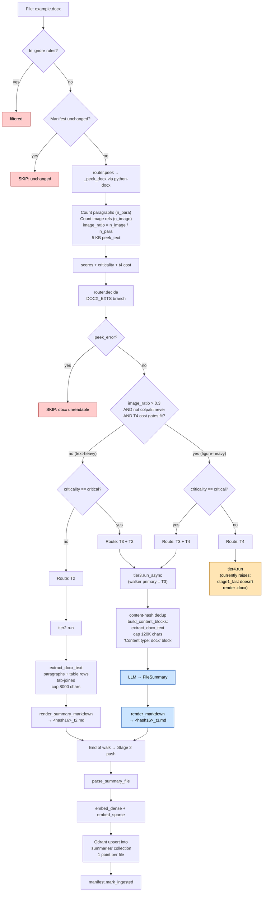

# `.docx` routing

Word document. The decision is **figure-heavy vs text-heavy**: image_ratio
(images / paragraphs) > 0.3 routes to T4 (ColPali) if cost gates fit and
ColPali isn't disabled; otherwise T2 with the standard `python-docx` text
extractor.

> **Note**: the router happily routes figure-heavy DOCX to T4, but
> [src/stage1_fast/index.py:42](../src/stage1_fast/index.py#L42) currently only
> renders **PDF and image** files. A DOCX routed to T4 would raise
> `ValueError("unsupported file for fast tier")` inside the worker. In
> practice DOCX nearly always lands at T2 (or T3+T2 if critical).

## Path summary

| Stage | What runs |
|---|---|
| Walker filter | `_CONSIDERED_EXTS` (allowed). |
| peek function | `_peek_docx` via python-docx ([src/router.py:333](../src/router.py#L333)) |
| decide branch | DOCX_EXTS ([src/router.py:1023](../src/router.py#L1023)) |
| Threshold | `image_ratio > 0.3` → visual path |
| Tier worker(s) | `tier2.run` (default) / `tier3.run_async` (critical adds T3) / `tier4.run` (figure-heavy) |
| Stage 2 downstream | parse → embed → upsert into `summaries` collection (1 point per file). |

## Identical paths

_(none — only `.docx` takes this path)_

## Flowchart

## Code references

- peek: [src/router.py:333](../src/router.py#L333)
- decide branch: [src/router.py:1023](../src/router.py#L1023)
- T2 extractor: [src/content.py:282](../src/content.py#L282) (`extract_docx_text`)
- T3 worker: [src/ingest/tier3.py](../src/ingest/tier3.py)
- T4 worker (incomplete for docx): [src/stage1_fast/index.py:42](../src/stage1_fast/index.py#L42)
- Stage 2 push: [src/stage2/__main__.py:29](../src/stage2/__main__.py#L29)
