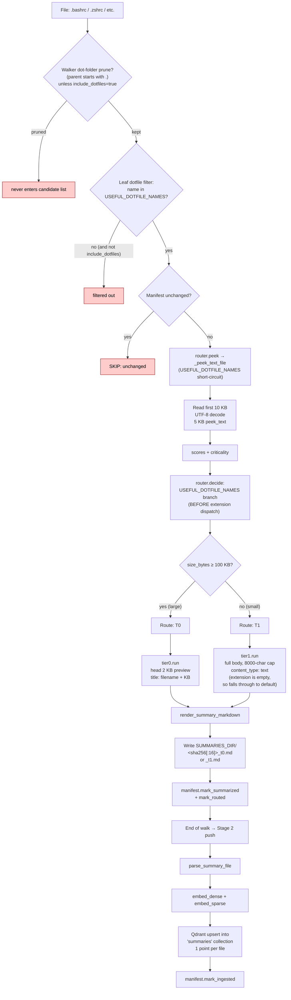

# Dotfiles routing (`.bashrc`, `.zshrc`, `.vimrc`, `.gitconfig`, …)

Useful extensionless dotfiles are routed by **filename**, not extension. The
router has an allowlist (`USEFUL_DOTFILE_NAMES`) of ~25 names — shell rcs,
editor configs, terminal multiplexer configs, tool configs. Files in the
allowlist bypass the considered-extension check and are treated as text.

The walker has a **separate** prune pass: dot-folders (`.config/`, `.cache/`)
are pruned in-place during traversal unless `.nasconfig.yaml` says
`include_dotfiles: true`. Leaf-name dotfiles outside the allowlist are skipped.

Sensitive dotfiles deliberately **NOT** in the allowlist: `.env`, `.npmrc`,
`.netrc`, `.pgpass`, `.git-credentials` (secrets), `.gitignore` (meta-only),
`.DS_Store`, `.ipynb_checkpoints` (cruft).

## Path summary

| Stage | What runs |
|---|---|
| Walker filter | Allowlisted dotfile names bypass the considered-ext check ([src/ingest/walker.py:300](../src/ingest/walker.py#L300)). Dot-folders pruned during traversal. |
| peek function | `_peek_text_file` (extensionless but treated as text) ([src/router.py:213](../src/router.py#L213)) |
| decide branch | `path.name in USEFUL_DOTFILE_NAMES` short-circuit ([src/router.py:867](../src/router.py#L867)) |
| Threshold | `TEXT_SIZE_T0_THRESHOLD = 100 KB` (same as `.txt`) |
| Tier worker(s) | `tier1.run` (small) or `tier0.run` (large) |
| Stage 2 downstream | parse → embed → upsert into `summaries` collection (1 point per file). |

## Allowlisted names

```
Shell / login:    .bashrc .bash_profile .bash_aliases .bash_logout
                  .zshrc .zprofile .zshenv .zlogin .zlogout
                  .profile .kshrc .cshrc .tcshrc
                  .inputrc .dircolors
Editors:          .vimrc .nvimrc .gvimrc
Multiplexers:     .tmux.conf .screenrc
Tool config:      .gitconfig .gitattributes .editorconfig
                  .condarc
```

(See [src/router.py:48](../src/router.py#L48) for the canonical list.)

## Flowchart



## Code references

- Allowlist: [src/router.py:48](../src/router.py#L48) (`USEFUL_DOTFILE_NAMES`)
- Walker leaf-dotfile filter: [src/ingest/walker.py:300](../src/ingest/walker.py#L300)
- Walker dot-folder prune: [src/ingest/walker.py:286](../src/ingest/walker.py#L286)
- peek dispatch: [src/router.py:621](../src/router.py#L621)
- decide short-circuit: [src/router.py:867](../src/router.py#L867)
- T0 worker: [src/ingest/tier0.py](../src/ingest/tier0.py)
- T1 worker: [src/ingest/tier1.py](../src/ingest/tier1.py)
