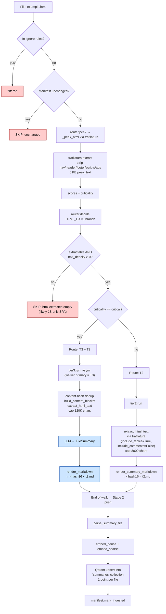

# `.html` routing

HTML page. Trafilatura strips boilerplate (nav, header/footer, scripts, ads)
and yields clean article text. If extraction yields nothing — typical of
JavaScript-only SPAs that render server-side empty — the file is skipped.

## Path summary

| Stage | What runs |
|---|---|
| Walker filter | `_CONSIDERED_EXTS` (allowed). |
| peek function | `_peek_html` via trafilatura ([src/router.py:507](../src/router.py#L507)) |
| decide branch | HTML_EXTS ([src/router.py:1125](../src/router.py#L1125)) |
| Threshold | extractable AND density > 0; else SKIP |
| Tier worker(s) | `tier2.run` (default) / `tier3.run_async` (critical adds T3) |
| Stage 2 downstream | parse → embed → upsert into `summaries` collection (1 point per file). |

## Identical paths

These extensions take the **same** code path: `.htm`.

## Flowchart

## Code references

- peek: [src/router.py:507](../src/router.py#L507)
- decide branch: [src/router.py:1125](../src/router.py#L1125)
- T2 extractor: [src/content.py:332](../src/content.py#L332) (`extract_html_text`)
- T3 worker: [src/ingest/tier3.py](../src/ingest/tier3.py)
- Stage 2 push: [src/stage2/__main__.py:29](../src/stage2/__main__.py#L29)
