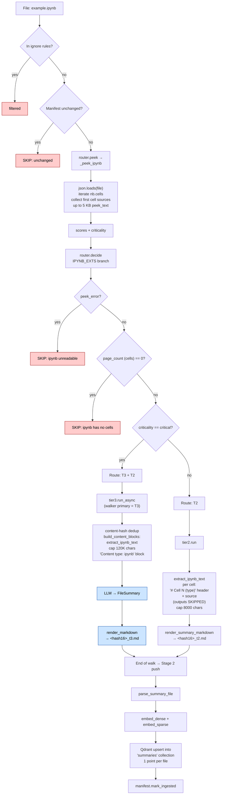

# `.ipynb` routing

Jupyter notebook. The peek parses the JSON, counts cells, and extracts cell
sources (skipping outputs). Once parsed, notebooks behave like text-native
documents — T2 by default, T3+T2 if critical.

## Path summary

| Stage | What runs |
|---|---|
| Walker filter | `_CONSIDERED_EXTS` (allowed). |
| peek function | `_peek_ipynb` (parse JSON + iterate cells) ([src/router.py:541](../src/router.py#L541)) |
| decide branch | IPYNB_EXTS ([src/router.py:1139](../src/router.py#L1139)) |
| Threshold | n_cells > 0; else SKIP |
| Tier worker(s) | `tier2.run` (default) / `tier3.run_async` (critical adds T3) |
| Stage 2 downstream | parse → embed → upsert into `summaries` collection (1 point per file). |

## Identical paths

_(none — only `.ipynb` takes this path)_

## Flowchart

## Code references

- peek: [src/router.py:541](../src/router.py#L541)
- decide branch: [src/router.py:1139](../src/router.py#L1139)
- T2 extractor: [src/content.py:361](../src/content.py#L361) (`extract_ipynb_text`)
- T3 worker: [src/ingest/tier3.py](../src/ingest/tier3.py)
- Stage 2 push: [src/stage2/__main__.py:29](../src/stage2/__main__.py#L29)
