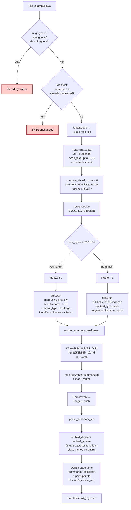

# `.java` routing

Source-code file. Same shape as the text path but with a **larger size threshold**
(500 KB) — code files tend to be longer than prose files of equivalent semantic
density, and the body is what we want to embed verbatim for BM25 to catch
identifier strings (function names, class names, error codes).

## Path summary

| Stage | What runs |
|---|---|
| Walker filter | `_CONSIDERED_EXTS` (allowed). Not in `_DATA_EXTS_DEFAULT_OFF`. |
| peek function | `_peek_text_file` ([src/router.py:213](../src/router.py#L213)) |
| decide branch | CODE_EXTS ([src/router.py:908](../src/router.py#L908)) |
| Threshold | `CODE_SIZE_T0_THRESHOLD = 500 KB` |
| Tier worker(s) | `tier1.run` (small) or `tier0.run` (large) |
| Stage 2 downstream | `parse_summary_file` → dense + sparse embed → upsert into `summaries` collection (1 point per file). |

## Identical paths

These extensions take the **same** code path: `.py`, `.js`, `.ts`, `.tsx`, `.jsx`, `.go`, `.rs`, `.c`, `.cpp`, `.h`, `.hpp`, `.cs`, `.rb`, `.swift`, `.kt`, `.sh`, `.sql`.

## Flowchart

## Code references

- Walker filter list: [src/ingest/walker.py:116](../src/ingest/walker.py#L116)
- peek: [src/router.py:213](../src/router.py#L213)
- decide branch: [src/router.py:908](../src/router.py#L908)
- T0 worker: [src/ingest/tier0.py](../src/ingest/tier0.py)
- T1 worker: [src/ingest/tier1.py](../src/ingest/tier1.py) (writes `content_type: code`)
- Stage 2 push: [src/stage2/__main__.py:29](../src/stage2/__main__.py#L29)
