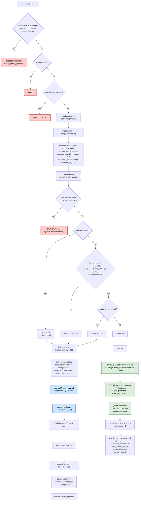

# `.jpeg` routing

Standalone image. Three end states:

1. **Thumbnail skip**: bytes < 50 KB AND both dims < 600 px → skipped (UI assets).
2. **T4 (default)**: ColPali on the single rendered image, with cost gates and
   T4 budget cap. **T3 + T4** if criticality is critical.
3. **T3 fallback**: when ColPali is disabled (`colpali: never`) or the budget /
   per-file cost gate denies T4.

T3 for an image sends the raw bytes to a vision-capable LLM as `BinaryContent`
(no text extract is possible for raw images).

The `_asset_library_folders` rule is a structural pre-filter: a folder
containing **≥ 15 images and 0 documents** is treated as an asset library and
**all** its images are dropped wholesale before reaching the router.

## Path summary

| Stage | What runs |
|---|---|
| Walker filter | `_CONSIDERED_EXTS` (allowed). Asset-library structural filter applied. |
| peek function | `_peek_image` via PIL ([src/router.py:579](../src/router.py#L579)) |
| decide branch | IMAGE_EXTS ([src/router.py:1156](../src/router.py#L1156)) |
| Thresholds | thumbnail: bytes < 50 KB AND dims < 600 × 600. T4 cost gates: ≤ 50 MB/file, ≤ 30s GPU / 10s CPU/file, corpus-budget. |
| Tier worker(s) | `tier4.run` (default) / `tier3.run_async` (when T4 gated off or critical) |
| Stage 2 downstream | T3 → summary upsert. T4 → patches in `fast_tier`. |

## Identical paths

These extensions take the **same** code path: `.png`, `.jpg`, `.webp`, `.gif`.

## Flowchart

## Code references

- Asset-library filter: [src/ingest/walker.py:175](../src/ingest/walker.py#L175)
- peek: [src/router.py:579](../src/router.py#L579)
- decide branch: [src/router.py:1156](../src/router.py#L1156)
- T3 worker: [src/ingest/tier3.py](../src/ingest/tier3.py)
- T3 image content block: [src/content.py:444](../src/content.py#L444)
- T4 worker: [src/ingest/tier4.py](../src/ingest/tier4.py) → [src/stage1_fast/index.py](../src/stage1_fast/index.py)
- Stage 2 push: [src/stage2/__main__.py:29](../src/stage2/__main__.py#L29)
