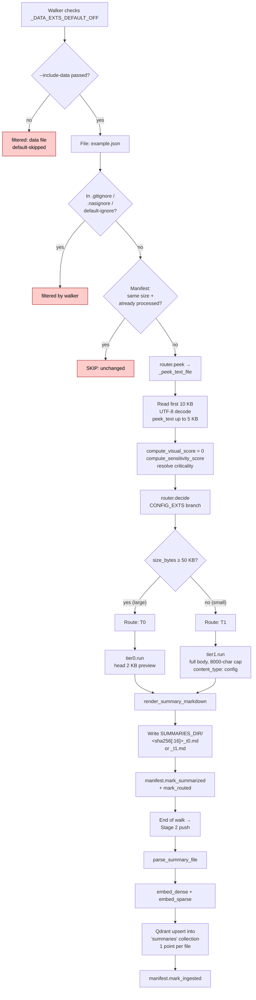

# `.json` routing

Configuration / data file. Routed by size like the text and code paths, but
with the smallest threshold (50 KB → T0) — config files this large are
typically generated dumps, not hand-written.

**`.json` is in `_DATA_EXTS_DEFAULT_OFF` and is filtered out at the walker unless `--include-data` is passed.** Real-world corpora often carry thousands of config dumps and dataset exports that bloat the index without being what users typically query.

## Path summary

| Stage | What runs |
|---|---|
| Walker filter | `_CONSIDERED_EXTS` (allowed). Default-skipped (in `_DATA_EXTS_DEFAULT_OFF`) unless `--include-data`. |
| peek function | `_peek_text_file` ([src/router.py:213](../src/router.py#L213)) |
| decide branch | CONFIG_EXTS ([src/router.py:918](../src/router.py#L918)) |
| Threshold | `CONFIG_SIZE_T0_THRESHOLD = 50 KB` |
| Tier worker(s) | `tier1.run` (small) or `tier0.run` (large) |
| Stage 2 downstream | `parse_summary_file` → dense + sparse embed → upsert into `summaries` collection (1 point per file). |

## Identical paths

These extensions take the **same** code path: `.yaml`, `.yml`, `.toml`.

## Flowchart

## Code references

- Walker filter list: [src/ingest/walker.py:116](../src/ingest/walker.py#L116)
- `_DATA_EXTS_DEFAULT_OFF`: [src/ingest/walker.py:137](../src/ingest/walker.py#L137)
- peek: [src/router.py:213](../src/router.py#L213)
- decide branch: [src/router.py:918](../src/router.py#L918)
- T0 worker: [src/ingest/tier0.py](../src/ingest/tier0.py)
- T1 worker: [src/ingest/tier1.py](../src/ingest/tier1.py) (writes `content_type: config`)
- Stage 2 push: [src/stage2/__main__.py:29](../src/stage2/__main__.py#L29)
