# `.pdf` routing

The most complex routing in the system. PDFs branch on **page count**, **text
density**, **extractability**, **criticality**, **`.nasconfig.yaml` colpali
preference**, and the **running T4 storage budget**. End states span all five
tiers (T0 is not directly reachable for PDF, but the others are).

Three high-level paths:

1. **Short PDF (≤ 5 pages, default)** → T3 (LLM). Receipts, contracts, forms —
   "discriminator-heavy" content where verbatim identifiers matter most.
2. **Text-native PDF** (visual_score < 7, extractable, ≥ 100 chars/page) → T2
   alone, or **T3 + T2** if criticality is "critical".
3. **Visual PDF** (scanned, figure-heavy, sparse text) → T4 (ColPali) if cost
   gates fit, else T3 fallback. **T3 + T4** if critical.

Special: scanned PDFs reach T3 via the LLM-vision path — pages are rendered at
150 DPI as PNG and sent to a vision-capable model.

## Path summary

| Stage | What runs |
|---|---|
| Walker filter | `_CONSIDERED_EXTS` (allowed). |
| peek function | `_peek_pdf` via pymupdf, three-point sample ([src/router.py:265](../src/router.py#L265)) |
| decide branch | PDF_EXTS ([src/router.py:952](../src/router.py#L952)) |
| Thresholds | `PDF_SHORT_PAGE_THRESHOLD = 5`. T4 cost gates: ≤ 50 MB/file, ≤ 30s GPU / 10s CPU/file, corpus-budget cap (default 5 GB). |
| Tier worker(s) | `tier2.run` / `tier3.run_async` / `tier4.run` |
| Stage 2 downstream | T2/T3 → summary upsert. T4 → patches already in `fast_tier` collection (separate from `summaries`). |

## Identical paths

_(none — only `.pdf` takes this path)_

## Flowchart

```mermaid
flowchart TD
    A["File: example.pdf"] --> B{"In ignore rules?"}
    B -- "yes" --> Z1["filtered"]
    B -- "no" --> C{"Manifest unchanged?"}
    C -- "yes" --> Z2["SKIP: unchanged"]
    C -- "no" --> D["router.peek →<br/>_peek_pdf via pymupdf"]
    D --> E["Three-point text sample:<br/>first / middle / last page<br/>density = avg chars/page<br/>page_count, peek_text up to 5 KB"]
    E --> F["compute_visual_score<br/>(low density / not extractable → +)<br/>compute_sensitivity_score<br/>resolve criticality<br/>estimate_t4_cost"]
    F --> G["router.decide<br/>PDF_EXTS branch"]
    G --> H{"page_count == 0?"}
    H -- "yes" --> Z3["SKIP: empty/unreadable"]
    H -- "no" --> I{"page_count ≤ 5<br/>AND not colpali=always?"}
    I -- "yes (short PDF)" --> R1["Route: T3"]
    I -- "no" --> J{"visual_score < 7<br/>AND extractable<br/>AND density ≥ 100?"}

    J -- "yes (text-native)" --> K{"criticality == critical?"}
    K -- "yes" --> R2["Route: T3 + T2"]
    K -- "no" --> R3["Route: T2"]

    J -- "no (visual)" --> L{"colpali = never?"}
    L -- "yes" --> R4["Route: T3 only"]
    L -- "no" --> M{"T4 cost gates fit?<br/>t4_mb ≤ 50<br/>AND t4_s ≤ 30 (GPU) / 10 (CPU)<br/>AND budget_used + t4_mb ≤ cap"}
    M -- "no" --> R5["Route: T3 fallback<br/>(over_per_file_cap or<br/>budget_exhausted)"]
    M -- "yes" --> N{"criticality == critical?"}
    N -- "yes" --> R6["Route: T3 + T4"]
    N -- "no" --> R7["Route: T4"]

    R1 --> W3
    R2 --> W3["tier3.run_async<br/>(walker primary = T3)"]
    R3 --> W2["tier2.run"]
    R4 --> W3
    R5 --> W3
    R6 --> W3
    R7 --> W4["tier4.run"]

    W3 --> D1["content-hash dedup<br/>(1) on-disk &lt;hash&gt;_t3.md exists?<br/>(2) peer worker hashing same file?<br/>(3) claim digest, run"]
    D1 --> D2["build_content_blocks<br/>extract_pdf_text up to 120K chars<br/>(pypdf + pymupdf bookmark TOC)"]
    D2 --> D3{"text empty?<br/>(scanned PDF)"}
    D3 -- "yes" --> D4["render_pdf_pages_as_png<br/>up to 20 pages at 150 DPI<br/>→ BinaryContent blocks"]
    D3 -- "no" --> D5["text block:<br/>'Content type: pdf' header"]
    D4 --> D6["LLM call (vision)<br/>FileSummary schema"]
    D5 --> D6
    D6 --> D7["render_markdown<br/>→ &lt;hash16&gt;_t3.md"]

    W2 --> X1["extract_pdf_text via pypdf<br/>+ bookmark TOC<br/>cap 8000 chars"]
    X1 --> X2["render_summary_markdown<br/>→ &lt;hash16&gt;_t2.md"]

    W4 --> F1["src.stage1_fast.index.index_file<br/>render every page at 150 DPI<br/>via pymupdf"]
    F1 --> F2["ColPali multi-vector encode<br/>~700 patches/page<br/>int8-quantized<br/>(POOL_FACTOR = 1 for PDF)"]
    F2 --> F3["Qdrant upsert into<br/>'fast_tier' collection<br/>multivector point per page"]
    F3 --> F4["manifest.fast_indexed_at<br/>+ fast_pages = N"]

    D7 --> SP["End of walk → Stage 2 push"]
    X2 --> SP
    SP --> SP1["parse_summary_file"]
    SP1 --> SP2["embed_dense + embed_sparse"]
    SP2 --> SP3["Qdrant upsert into<br/>'summaries' collection<br/>1 point per file"]
    SP3 --> SP4["manifest.mark_ingested"]

    F4 --> F5["fast_tier already populated;<br/>Stage 2 sees<br/>summary_file=None +<br/>fast_indexed_at=set<br/>→ marks ingested,<br/>no new upsert"]

    classDef skip fill:#ffcccc,stroke:#990000,color:#000
    class Z1,Z2,Z3 skip
    classDef llm fill:#cce5ff,stroke:#0044aa,color:#000
    class D6,D7 llm
    classDef colpali fill:#ddeedd,stroke:#226633,color:#000
    class F1,F2,F3 colpali
```

## Code references

- peek: [src/router.py:265](../src/router.py#L265)
- decide branch: [src/router.py:952](../src/router.py#L952)
- T2 worker: [src/ingest/tier2.py](../src/ingest/tier2.py) → `extract_pdf_text` ([src/content.py:58](../src/content.py#L58))
- T3 worker: [src/ingest/tier3.py](../src/ingest/tier3.py) (3-level dedup)
- T3 content building: [src/content.py:419](../src/content.py#L419) (`build_content_blocks`)
- Scanned PDF rendering: [src/content.py:260](../src/content.py#L260) (`render_pdf_pages_as_png`)
- T4 worker: [src/ingest/tier4.py](../src/ingest/tier4.py) → [src/stage1_fast/index.py](../src/stage1_fast/index.py)
- Stage 2 push: [src/stage2/__main__.py:29](../src/stage2/__main__.py#L29)
