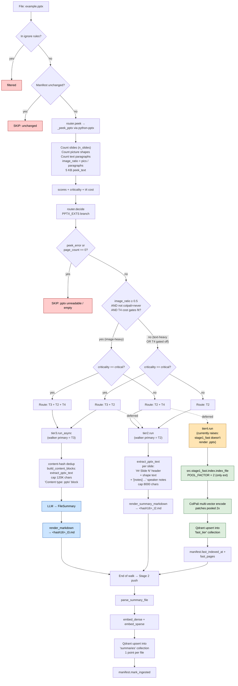

# `.pptx` routing

PowerPoint deck. The decision is **image-heavy vs text-heavy**: image_ratio
(picture shapes / text paragraphs) ≥ 0.5 → routes T2 + T4 (ColPali on rendered
slides); otherwise T2 alone (or T3+T2 if critical). PPTX is the **only**
extension where T4 patch pooling is enabled (`POOL_FACTOR = 2`) — lecture decks
are query-shaped semantically, so half-resolution patches retain ~100% recall.

> **Note**: the router routes image-heavy PPTX to T4, but
> [src/stage1_fast/index.py:42](../src/stage1_fast/index.py#L42) currently only
> renders **PDF and image** files. PPTX routed to T4 would raise
> `ValueError("unsupported file for fast tier")`. In practice PPTX nearly
> always lands at T2 (or T3+T2 if critical).

## Path summary

| Stage | What runs |
|---|---|
| Walker filter | `_CONSIDERED_EXTS` (allowed). |
| peek function | `_peek_pptx` via python-pptx ([src/router.py:452](../src/router.py#L452)) |
| decide branch | PPTX_EXTS ([src/router.py:1082](../src/router.py#L1082)) |
| Threshold | `image_ratio ≥ 0.5` → image-heavy path |
| Tier worker(s) | `tier2.run` (default) / `tier3.run_async` (critical) / `tier4.run` (image-heavy, with POOL_FACTOR=2) |
| Stage 2 downstream | parse → embed → upsert into `summaries`. T4 patches in `fast_tier`. |

## Identical paths

_(none — only `.pptx` takes this path)_

## Flowchart

## Code references

- peek: [src/router.py:452](../src/router.py#L452)
- decide branch: [src/router.py:1082](../src/router.py#L1082)
- T2 extractor: [src/content.py:300](../src/content.py#L300) (`extract_pptx_text`)
- T3 worker: [src/ingest/tier3.py](../src/ingest/tier3.py)
- T4 POOL_FACTOR=2: [src/ingest/tier4.py:43](../src/ingest/tier4.py#L43)
- Stage 2 push: [src/stage2/__main__.py:29](../src/stage2/__main__.py#L29)
