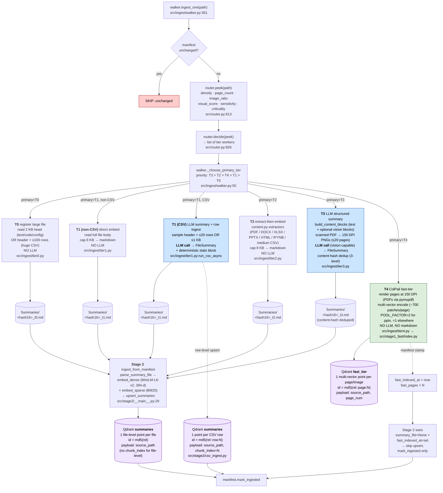
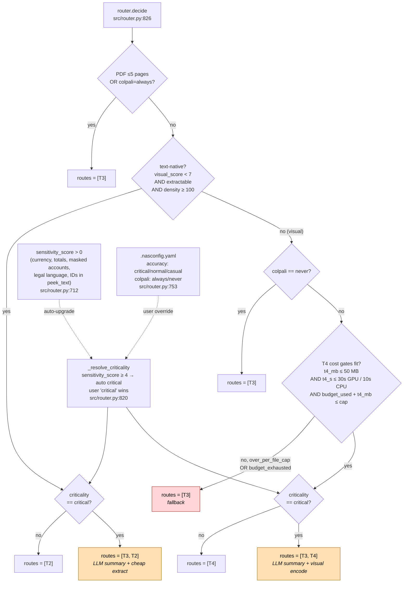

# Tiers — per-extension routing diagrams

Every diagram in this folder describes how one file extension flows through
NotAnotherSpotlight's ingestion pipeline:
**walker → router.peek → router.decide → tier worker → Stage 2 push → Qdrant**.

The pipeline is **policy-driven**. The router (`src/router.py`) is a pure
function of `(peek result + .nasconfig.yaml + GPU availability + T4 budget) →
list of tier workers to run`. The walker picks ONE primary tier (priority
**T3 > T2 > T4 > T1 > T0**) and dispatches.

> Diagrams reflect what's in **code**, not the IO/ docs. Where the code differs
> from the documentation, the diagrams follow code.

---

## The five tiers at a glance

| Tier | What it does | LLM? | Output |
|---|---|---|---|
| **T0** | Register large file with 2 KB head preview (or header + 100 CSV rows). Ripgrep at query time. | No | summary md |
| **T1** | Non-CSV: direct embed of full file body in markdown (8 KB cap). **CSV: LLM-summarized via `tier1.run_csv_async` (header + ~20 sample rows → `FileSummary`).** | **Yes for CSV**, no otherwise | summary md |
| **T2** | Extract-then-embed via [src/content.py](../src/content.py) extractors (PDF/DOCX/XLSX/PPTX/HTML/IPYNB/CSV). 8 KB cap. | No | summary md |
| **T3** | LLM structured summary (vision-capable). Content-hash deduped. | **Yes** | summary md |
| **T4** | ColPali multi-vector visual embedding. Pool factor 2 only for `.pptx`. | No (encoder) | Qdrant patches in `fast_tier` |

T0/T1/T2/T3 all write a summary markdown to `SUMMARIES_DIR/<sha256[:16]>_<tier>.md`,
which Stage 2 then parses, embeds (dense + sparse), and upserts into the
`summaries` Qdrant collection (1 point per file). T4 doesn't produce a
markdown — its output is multi-vector patches in the `fast_tier` collection.

**CSVs (T1) are the exception**: they get **two Qdrant representations** in
the `summaries` collection. (1) The LLM-generated summary markdown is
embedded as one file-level point (so "what is this CSV?" semantic
queries find the file by its identity). (2) `csv_ingest.ingest_csv_rows`
also embeds every CSV row as its own point (so "which row matches the
question?" queries hit the right row). The two have distinct point IDs
(`_point_id(rel)` for the file vs `_row_point_id(rel, i)` for rows) so
they don't collide. See [CSV_routing.md](CSV_routing.md) for the full
end-to-end including answer-time row-window retrieval.

---

## Master tier-IO flowchart

One diagram covering all five tiers' inputs, work, and outputs end-to-end —
walker dispatch through Qdrant. The per-extension diagrams below specialize
this for each file type. Verified against
[src/ingest/walker.py](../src/ingest/walker.py),
[src/ingest/tier{0,1,2,3,4}.py](../src/ingest/),
[src/stage2/__main__.py](../src/stage2/__main__.py),
[src/stage2/csv_ingest.py](../src/stage2/csv_ingest.py), and
[src/stage1_fast/index.py](../src/stage1_fast/index.py).



### What converges where

| Tier  | Disk artifact            | Qdrant collection | Point ID                      | Payload fields              |
|-------|--------------------------|-------------------|-------------------------------|-----------------------------|
| T0    | `<hash16>_t0.md`         | `summaries`       | `md5(rel)`                    | `source_path`               |
| T1 nc | `<hash16>_t1.md`         | `summaries`       | `md5(rel)`                    | `source_path`               |
| T1 csv| `<hash16>_t1.md` + N rows| `summaries` (×N+1)| file: `md5(rel)`<br/>row N: `md5(rel::row:N)` | file: `source_path`<br/>row: `source_path`, `chunk_index=N` |
| T2    | `<hash16>_t2.md`         | `summaries`       | `md5(rel)`                    | `source_path`               |
| T3    | `<hash16>_t3.md`         | `summaries`       | `md5(rel)`                    | `source_path`               |
| T4    | *(none)*                 | `fast_tier`       | `md5(rel::page:N)` per page   | `source_path`, `page_num`   |

`<hash16>` = first 16 hex chars of SHA-256 of file contents
([src/ingest/common.py:33](../src/ingest/common.py#L33)) — content-based, so
byte-identical files across paths share one summary on disk. T1 CSV and T3
both rely on this for dedup.

### Route resolution (when `decide` returns more than one tier)

The master diagram above shows the **primary** tier the walker dispatches.
But `router.decide` can return a *list* of tiers — most often when
criticality fans out (`critical` files get an LLM pass on top of cheap
extraction or visual encoding) or when T4 cost gates miss. The walker
runs every tier in the returned list and `_choose_primary_tier` only
controls which produces the primary `summary_file` on the manifest row.



**Multi-tier execution.** When `routes = ["T3", "T2"]` or `["T3", "T4"]`,
the walker invokes both tier workers. The primary tier (per
`_choose_primary_tier`'s priority `T3 > T2 > T4 > T1 > T0`) sets
`manifest.summary_file`; the secondary tier still produces its artifact
(`<hash16>_t2.md` on disk OR `fast_tier` patches in Qdrant) — that
artifact lands without a manifest summary pointer, so Stage 2 picks up
the primary's markdown for the file-level summary point but the secondary
is still searchable (T4 patches are queryable directly; a T2 markdown
written under a T3 primary effectively becomes orphaned and not re-upserted).

**T4 cost-gate fallback.** When a file *would* take the T4 path but its
estimated patch storage / encode time / corpus budget would blow a gate
([src/router.py:1023-1066](../src/router.py#L1023)), `decide` returns
`["T3"]` instead with `reason ∈ {over_per_file_cap, budget_exhausted}`
(visible via `--verbose`). Same content lands in `summaries` via the
LLM rather than `fast_tier` via ColPali.

---

## Extensions covered (41 individual files)

Each link below is a per-extension diagram. **Extensions in the same group
share the exact same code path** — the only thing that changes is the literal
extension token in the file's name.

### Text path (T0/T1 by size, threshold = 100 KB, no LLM)

| Ext | File |
|---|---|
| `.txt` | [TXT_routing.md](TXT_routing.md) |
| `.md` | [MD_routing.md](MD_routing.md) |
| `.markdown` | [MARKDOWN_routing.md](MARKDOWN_routing.md) |
| `.log` | [LOG_routing.md](LOG_routing.md) |

### Code path (T0/T1 by size, threshold = 500 KB, no LLM)

| Ext | File |
|---|---|
| `.py` | [PY_routing.md](PY_routing.md) |
| `.js` | [JS_routing.md](JS_routing.md) |
| `.ts` | [TS_routing.md](TS_routing.md) |
| `.tsx` | [TSX_routing.md](TSX_routing.md) |
| `.jsx` | [JSX_routing.md](JSX_routing.md) |
| `.go` | [GO_routing.md](GO_routing.md) |
| `.rs` | [RS_routing.md](RS_routing.md) |
| `.java` | [JAVA_routing.md](JAVA_routing.md) |
| `.c` | [C_routing.md](C_routing.md) |
| `.cpp` | [CPP_routing.md](CPP_routing.md) |
| `.h` | [H_routing.md](H_routing.md) |
| `.hpp` | [HPP_routing.md](HPP_routing.md) |
| `.cs` | [CS_routing.md](CS_routing.md) |
| `.rb` | [RB_routing.md](RB_routing.md) |
| `.swift` | [SWIFT_routing.md](SWIFT_routing.md) |
| `.kt` | [KT_routing.md](KT_routing.md) |
| `.sh` | [SH_routing.md](SH_routing.md) |
| `.sql` | [SQL_routing.md](SQL_routing.md) |

### Config path (T0/T1 by size, threshold = 50 KB, no LLM)

| Ext | File | Notes |
|---|---|---|
| `.json` | [JSON_routing.md](JSON_routing.md) | **default-skipped** unless `--include-data` |
| `.yaml` | [YAML_routing.md](YAML_routing.md) | |
| `.yml` | [YML_routing.md](YML_routing.md) | |
| `.toml` | [TOML_routing.md](TOML_routing.md) | |

### CSV (special — LLM summary + row-level Qdrant points + answer-time row windows)

| Ext | File | Notes |
|---|---|---|
| `.csv` | [CSV_routing.md](CSV_routing.md) | **default-skipped** unless `--include-data`. Small csv → T1 → LLM summary md + 1 Qdrant point per row. Answer step substitutes ±2 row windows for the file-prefix dump (Plan #17). |

### Office documents

| Ext | File |
|---|---|
| `.docx` | [DOCX_routing.md](DOCX_routing.md) |
| `.xlsx` | [XLSX_routing.md](XLSX_routing.md) |
| `.xlsm` | [XLSM_routing.md](XLSM_routing.md) |
| `.pptx` | [PPTX_routing.md](PPTX_routing.md) |

### Visual

| Ext | File | Notes |
|---|---|---|
| `.pdf` | [PDF_routing.md](PDF_routing.md) | most complex routing (5 end states) |
| `.png` | [PNG_routing.md](PNG_routing.md) | |
| `.jpg` | [JPG_routing.md](JPG_routing.md) | |
| `.jpeg` | [JPEG_routing.md](JPEG_routing.md) | |
| `.webp` | [WEBP_routing.md](WEBP_routing.md) | |
| `.gif` | [GIF_routing.md](GIF_routing.md) | |

### Web / notebook

| Ext | File |
|---|---|
| `.html` | [HTML_routing.md](HTML_routing.md) |
| `.htm` | [HTM_routing.md](HTM_routing.md) |
| `.ipynb` | [IPYNB_routing.md](IPYNB_routing.md) |

### Dotfiles (extensionless, by name)

[DOTFILES_routing.md](DOTFILES_routing.md) — `.bashrc`, `.zshrc`, `.vimrc`,
`.gitconfig`, etc. routed by name, not extension.

---

## Identical-path matrix

Files in the same group have **byte-identical** code paths. If you change
behavior for one, you change it for all.

| Group | Extensions | Threshold / Special |
|---|---|---|
| TEXT | `.txt`, `.md`, `.markdown`, `.log` | 100 KB → T0 |
| CODE | `.py`, `.js`, `.ts`, `.tsx`, `.jsx`, `.go`, `.rs`, `.java`, `.c`, `.cpp`, `.h`, `.hpp`, `.cs`, `.rb`, `.swift`, `.kt`, `.sh`, `.sql` | 500 KB → T0 |
| CONFIG | `.json`*, `.yaml`, `.yml`, `.toml` | 50 KB → T0; *json default-skipped |
| CSV | `.csv` | row-level indexing, default-skipped |
| PDF | `.pdf` | 5 end states (T2/T3/T4 + cost gates) |
| DOCX | `.docx` | image_ratio > 0.3 → T4 path |
| XLSX | `.xlsx`, `.xlsm` | size > 10 MB → T0; else T2 |
| PPTX | `.pptx` | image_ratio ≥ 0.5 → T2+T4; T4 pool=2 |
| HTML | `.html`, `.htm` | trafilatura extract; SPA → SKIP |
| IPYNB | `.ipynb` | T2 (text-native after parsing) |
| IMAGE | `.png`, `.jpg`, `.jpeg`, `.webp`, `.gif` | T4 (or T3 fallback); thumbnail < 50 KB AND < 600 px → SKIP |
| DOTFILES | `.bashrc`, `.zshrc`, etc. (by-name allowlist) | TEXT path threshold |

---

## Common gates that apply to every diagram

These appear at the top of every flowchart:

- **Walker filters** ([src/ingest/walker.py:230](../src/ingest/walker.py#L230)):
  - cascading `.gitignore` / `.nasignore` rules
  - default ignores (`node_modules/`, `__pycache__/`, `.git/`, etc.)
  - dot-folder prune during traversal
  - leaf-dotfile allowlist filter
  - asset-library rule (≥15 images + 0 docs in a folder → drop images)
  - `_DATA_EXTS_DEFAULT_OFF = {.json, .csv, .dat}` skip without `--include-data`
- **Manifest skip**: same byte size + already processed → SKIP "unchanged"
- **Sensitivity auto-upgrade** ([src/router.py:712](../src/router.py#L712)): regex
  hits in `peek_text` (currency, totals, masked accounts, legal language, IDs)
  → criticality auto-upgrades to "critical" → adds T3 alongside T2/T4
- **`.nasconfig.yaml`** ([src/router.py:753](../src/router.py#L753)):
  `accuracy: critical|normal|casual`, `colpali: always|never`,
  `t4_budget_gb_override: N`

## T4 cost gates (apply to PDF / DOCX / PPTX / IMAGE only)

```
t4_mb        ≤ T4_MAX_STORAGE_MB_PER_FILE        = 50 MB
t4_seconds   ≤ T4_MAX_SECONDS_PER_FILE_GPU       = 30s   (or _CPU = 10s)
budget_used  + t4_mb  ≤  DEFAULT_T4_BUDGET_MB    = 5 GB  (overridable)
```

If any gate fails → fallback to T3 (LLM summary).

---

## Stage 2 downstream — what every diagram converges to

Two end states for the Stage 2 push ([src/stage2/__main__.py:29](../src/stage2/__main__.py#L29)):

1. **Standard path** — most files. `parse_summary_file` reads the markdown,
   `embed_dense` + `embed_sparse` produce vectors, `upsert_summaries` writes
   one point per file into the `summaries` Qdrant collection.
   `id = md5(source_rel)`.
2. **CSV dual path** — `.csv` extension AND `T1` in routes. **Two upserts
   into the same `summaries` collection:**
   (a) `csv_ingest.ingest_csv_rows` produces **one row-level point per
   row**. `id = md5("source_rel::row:N")`, payload carries
   `chunk_index: N` so the answer step can recover the row's neighbors
   at query time.
   (b) The standard summary-markdown path also runs — the CSV's
   LLM-generated `<hash16>_t1.md` is embedded and upserted as a
   **file-level point** with `id = md5(source_rel)` (no `chunk_index`).
   Together a CSV with N rows produces N+1 points. This is the post-Plan-#17
   shape ([src/stage2/__main__.py:145](../src/stage2/__main__.py#L145)).

T4 files (PDFs / images via ColPali) don't go through Stage 2's summary upsert
— their patches are already in the `fast_tier` collection. Stage 2 sees
`summary_file=None` + `fast_indexed_at=set` and just calls `mark_ingested`
without writing new vectors.

## Qdrant collection schemas

| Collection | Qdrant-managed | Payload fields | Notes |
|---|---|---|---|
| `summaries` | `id`, `vector.dense` (384-d MiniLM-L6-v2), `vector.sparse` (BM25 indices+values) | `source_path`, `chunk_index` | **Path-only payload since 2026-05.** No summary text in payload — search-snippet text is reconstructed at query time by re-reading the CSV at `chunk_index` (row hits) or the summary markdown via the manifest (file-level hits). Saves ~30% of Qdrant size at 1M+ scale. `chunk_index` is the generic within-file index (RAG industry convention) — row number for CSVs; future PDF/audio chunks reuse the same field. File-level summary points omit it. |
| `fast_tier` | `id`, `vector` (multi-vector ColPali patch embeddings) | `source_path`, `page_num` | One point per page (PDFs) or per image. |

## Answer-time post-processing (CSV-only, since Plan #17)

For non-CSV hits the answer step still calls
`build_content_blocks(path, max_chars=...)` — file prefix or
keyword-anchored chunk for PDFs.

For CSV row hits ([src/answer.py:answer_question](../src/answer.py)):

1. `pipeline.ask` groups hits by path, keeping `chunk_index` from the
   payload: `csv_row_hits[path] = [chunk_indexes]`. (CSV-specific dict
   name; the field itself is generic — `SearchResult.chunk_index`.)
2. For each CSV path, `build_csv_row_window_block(path, indexes, window=2)`
   produces a multi-window text block (matched rows + ±2 neighbors,
   overlapping windows merged).
3. The CSV's LLM summary markdown is prepended via `_summary_supplement`
   (cap 10 KB).
4. `build_content_blocks` is **skipped** for the CSV path — no
   file-prefix dump.

## Reading the diagrams

Each per-extension file contains a Mermaid `flowchart TD` (top-down). To view:

- **GitHub**: native rendering in any `.md` preview.
- **VS Code**: Markdown Preview Enhanced or any Mermaid extension.
- **Standalone**: paste the ` ```mermaid ... ``` ` block into <https://mermaid.live>.

Diamonds = decisions, rectangles = work, **red** = skip terminations,
**blue** = LLM call, **green** = ColPali / fast_tier path,
**yellow** = row-level CSV ingest, **orange** = currently-incomplete worker
path (T4 for DOCX/PPTX).

---

## Key code anchors

- Walker entrypoint: [src/ingest/walker.py:805](../src/ingest/walker.py#L805) (`main`)
- Per-file dispatch: [src/ingest/walker.py:361](../src/ingest/walker.py#L361) (`ingest_one`)
- Tier-priority pick: [src/ingest/walker.py:50](../src/ingest/walker.py#L50) (`_choose_primary_tier`)
- Router peek dispatch: [src/router.py:613](../src/router.py#L613) (`peek`)
- Router decide: [src/router.py:826](../src/router.py#L826) (`decide`)
- Stage 2 push: [src/stage2/__main__.py:29](../src/stage2/__main__.py#L29) (`ingest_from_manifest`)
- CSV row ingest: [src/stage2/csv_ingest.py:28](../src/stage2/csv_ingest.py#L28) (`ingest_csv_rows`)
- ColPali fast-tier: [src/stage1_fast/index.py](../src/stage1_fast/index.py)
