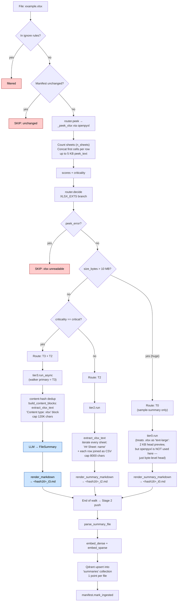

# `.xlsx` routing

Excel spreadsheet. The decision splits on **size**: spreadsheets > 10 MB go to
T0 (preview only), the rest go to T2 (extract every sheet's cells via
openpyxl). Critical-tagged files add a T3 sibling.

`.xlsx` and `.xlsm` share this path identically — XLSM is just XLSX with
macros, irrelevant to extraction.

## Path summary

| Stage | What runs |
|---|---|
| Walker filter | `_CONSIDERED_EXTS` (allowed). |
| peek function | `_peek_xlsx` via openpyxl ([src/router.py:392](../src/router.py#L392)) |
| decide branch | XLSX_EXTS ([src/router.py:1059](../src/router.py#L1059)) |
| Threshold | size > 10 MB → T0; else T2 (or T3+T2 if critical) |
| Tier worker(s) | `tier0.run` / `tier2.run` / `tier3.run_async` |
| Stage 2 downstream | parse → embed → upsert into `summaries` collection (1 point per file). |

## Identical paths

These extensions take the **same** code path: `.xlsm`.

## Flowchart

## Code references

- peek: [src/router.py:392](../src/router.py#L392)
- decide branch: [src/router.py:1059](../src/router.py#L1059)
- T2 extractor: [src/content.py:395](../src/content.py#L395) (`extract_xlsx_text`)
- T3 worker: [src/ingest/tier3.py](../src/ingest/tier3.py)
- Stage 2 push: [src/stage2/__main__.py:29](../src/stage2/__main__.py#L29)
