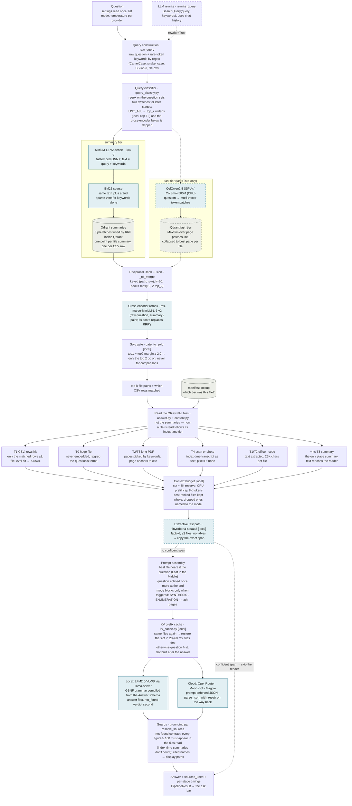
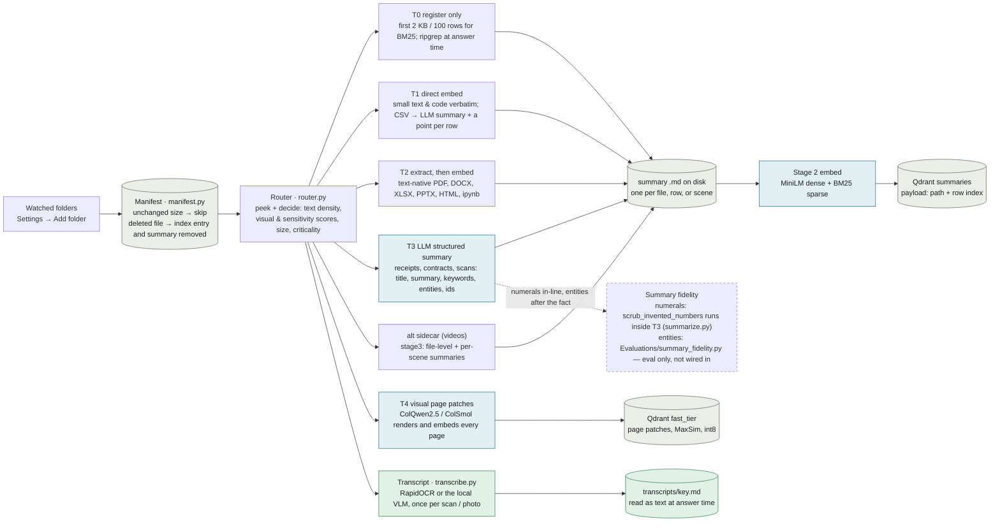

# Magpie pipeline map

The whole system on one page: how a question moves through Magpie, how a
file gets indexed, what every stage defaults to, and which evaluation each
stage shipped on. This file moves with the code — see the rule at the
bottom. Per-extension routing detail lives in [`Tiers/`](../Tiers/README.md);
eval provenance per arm lives in [`Evaluations/RUNLOG.jsonl`](../Evaluations/RUNLOG.jsonl)
(`uv run python Evaluations/runlog_table.py --last 12` prints it).

Legend for the figures: **solid** node = on by default · **dashed** = opt-in,
off by default · `[local]` = only runs on the local provider (the 3B model
needs it; cloud skips it) · blue = a model runs here · grey = a store on disk.

## Query path — one question, start to finish

Entry point [`src/pipeline.py`](../src/pipeline.py) `ask()` →
[`src/stage2/search.py`](../src/stage2/search.py) `run_search()` →
[`src/answer.py`](../src/answer.py) `answer_question()`.

<b>Mermaid source (edit here, then re-render)</b>

What the sketch words map to:

| You say | What runs | Where |
|---|---|---|
| rewrites here | Rewrite is **off by default** (the 3B rewriter replaced questions rather than cleaning them). A regex pulls identifier-shaped tokens (`GetIndentation`, `CSC223`, `config.yaml`) into `keywords` so BM25 gets a separate vote for them. The LLM rewrite still exists for cloud / multi-turn. | `search.raw_query`, `extract_rare_tokens`, `rewrite_query` |
| MiniLM (vectors) | all-MiniLM-L6-v2 dense 384-d **and** a BM25 sparse vector, both via fastembed (ONNX). Three prefetches (dense, sparse, keywords-only sparse) fused by RRF inside Qdrant. | `_search_summary_tier`, `stage2/embeddings.py` |
| ColQwen (vectors) | ColQwen2.5 on GPU, ColSmol-500M on CPU. The question becomes token-level multi-vectors; Qdrant scores MaxSim against every page's patches. Opt-in (`fast=True`) — ~25 s model load on the first query. | `_search_fast_tier`, `stage1_fast/model.py`, `stage2/fast_db.py` |
| compare these in the summaries that are indexed | The summary index holds one point per file *and* one per CSV row, so a course catalog is row-addressable. Payload is path + row only; the snippet is rebuilt from the summary markdown on disk. | `_summary_for_result`, `stage2/csv_ingest.py` |
| get a score / compares scores | Reciprocal Rank Fusion of the two arms, keyed on (path, row) so five matching rows of one CSV survive as five hits. | `_rrf_merge`, `RRF_K=60` |
| ranks them | A cross-encoder rescores (raw question, summary) pairs and its score replaces RRF's; then the **solo gate** (local only) hands the reader just the top 2 when #1 beats #2 by ≥ 2.0, because the 3B collapses in a 5-file distractor pile. | `stage2/rerank.py`, `gate_to_solo` |
| retrieves the files (real documents) | Also before this: the query classifier. A "list all my receipts" question widens top_k and *suppresses* the reranker, which was measured to bury receipts under prose. | `stage2/query_classify.py` |
| reads the original / extracted document file | Retrieval found the file by its summary; the reader opens the **original** and the tier it got at index time decides how: CSV row windows, ripgrep for T0, keyword-picked pages for long PDFs, the index-time transcript for scans and photos, plain extraction for Office/code, and the T3 summary prepended as a labelled supplement. | `content.build_content_blocks`, `transcript_for`, `extract_pdf_relevant_pages` |
| then answers | Context budget → optional extractive span → prompt assembly → KV prefix restore or build → local LFM2.5-VL-3B under a GBNF grammar, or a cloud model with JSON repair → not-found contract → numeral grounding guard → source path resolution. | `answer.answer_question`, `kv_cache.py`, `inference/gbnf.py`, `grounding.py` |

## Index path — what "the summaries that are indexed" means

Entry point [`src/ingest/walker.py`](../src/ingest/walker.py) →
[`src/router.py`](../src/router.py) → `src/ingest/tier0-4.py` →
[`src/stage2`](../src/stage2/) ingest. A file is fast-tier *or* summary-tier,
never both (image-heavy PPTX dual-routes T2 + T4). Per-extension diagrams:
[`Tiers/`](../Tiers/README.md).

<b>Mermaid source (edit here, then re-render)</b>

## Every model that runs, and where

| Model | Role | Module |
|---|---|---|
| all-MiniLM-L6-v2 | dense 384-d embeddings, index and query (fastembed ONNX, ~1.5 s load) | `stage2/embeddings.py` |
| Qdrant/bm25 | sparse vectors so `PHY-312` and `$143.50` stay literally findable | `stage2/embeddings.py` |
| ColQwen2.5 / ColSmol-500M | visual page patches for scans and images; GPU picks ColQwen, CPU picks ColSmol | `stage1_fast/device.py`, `model.py` |
| ms-marco-MiniLM-L-6-v2 | cross-encoder rerank of the fused pool (~80 MB; `RERANK_MODEL` overrides) | `stage2/rerank.py` |
| LFM2.5-VL-3B | the shipped local model: reader, rewriter, T3 summariser, VLM transcriber — one llama-server process | `inference/profiles.py` |
| RapidOCR | PaddleOCR det + rec on ONNX, CPU; tenths of a second per page | `transcribe.py` |
| tinyroberta-squad2 | span extractor for the factoid fast path (off by default) | `extractive.py` |
| cloud LLM | OpenRouter (bundled key), Moonshot Kimi, or magpie-cloud; only retrieved text leaves the machine | `llm.py`, `cloud_provider.py` |

## Stages and their defaults

| Stage | Default | Knob | Module |
|---|---|---|---|
| LLM query rewrite | off (`rewrite=False`) | `ask(rewrite=True)` | `stage2/search.py` |
| Rare-token keywords | on | `MAGPIE_RARE_TOKENS=1` | `stage2/search.py` |
| Query classifier (LIST_ALL widening, rerank suppression) | on | `LOCAL_MAX_TOP_K=12`; Settings → enumerate lists | `stage2/query_classify.py` |
| Fast (visual) tier at query time | off (`fast=False`) | `ask(fast=True)` | `stage2/search.py` |
| Cross-encoder rerank | on (pipeline passes `rerank=True`) | `RERANK_MODEL` | `stage2/rerank.py` |
| Solo gate | on, local only | `LOCAL_SOLO_MARGIN=2.0`, `LOCAL_SOLO_KEEP=2` (0 disables) | `stage2/search.py` |
| doc2query "hype" tier | off (experiment) | `MAGPIE_HYPE_WEIGHT=0` | `stage2/search.py` |
| Index-time transcripts | on — the walker writes one per pixels-only file as it indexes | `MAGPIE_TRANSCRIBE_BACKEND=auto` (ocr when RapidOCR is installed, else the local VLM; `off` writes nothing), `MAGPIE_TRANSCRIBE_MAX_PAGES=8`, `MAGPIE_TRANSCRIPTS_DIR` | `transcribe.py`, `content.py` |
| Summary supplement | always attached | `MAGPIE_SUMMARY_WHEN_THIN=0` (1 = drop it when raw text is plentiful; did not ship) | `answer.py` |
| Context budget | on, local only | `LOCAL_PREFILL_BUDGET_TOKENS` (8000 on CPU; unset on GPU = full window) | `answer.py` |
| Extractive fast path | off | `MAGPIE_EXTRACTIVE=1`, `MAGPIE_EXTRACTIVE_MIN_SCORE=0.5` | `extractive.py` |
| Prompt order | auto (files first only when the KV slot exists) | `MAGPIE_PROMPT_ORDER=files\|question` | `answer.py` |
| Multipart block | off | `MAGPIE_MULTIPART=1` | `answer.py` |
| KV prefix cache | on, local only | `MAGPIE_KV_CACHE=1`, `MAGPIE_KV_CACHE_MB=2048` | `kv_cache.py` |
| GBNF grammar | on, local only | falls back to prompt + repair if the schema is unsupported | `inference/gbnf.py` |
| Grounding guard — mode | `numerals` | `MAGPIE_GROUNDING=numerals\|evidence\|off` · `MAGPIE_GROUNDING_ACTION=refuse\|warn` (warn = log only, for measuring) · `MAGPIE_STRICT_GROUNDING=1` (summaries never count as support) | `grounding.py` |
| Grounding — numerals mode | floor 100 for bare integers; decimals always; sums of ≤5 | `MAGPIE_GROUNDING_MIN_NUMERAL=100` · `MAGPIE_GROUNDING_DECIMALS=1` · `MAGPIE_GROUNDING_SUM_TERMS=5` | `grounding.py` |
| Grounding — evidence mode | implemented, **unmeasured** | model quotes spans first (`Answer.evidence`, grammar-enforced locally, prompt-enforced on cloud; not on magpie-cloud) · `MAGPIE_EVIDENCE_MIN_NUMERAL=0` · `MAGPIE_EVIDENCE_MIN_OVERLAP=0.8` · `MAGPIE_EVIDENCE_REQUIRED=1` · `MAGPIE_EVIDENCE_NUMERALS=1` · `MAGPIE_EVIDENCE_ARITHMETIC=1` | `grounding.py`, `answer.py` |

## Change log

One line per change that shipped on a positive eval, newest first, plus
one-liners for experiments that missed their gate so they are not re-run
blindly. Numbers before 2026-08-29 are transcribed from the comments in
the code that record them; from here on they come from `RUNLOG.jsonl`.

| Date | Change | Dataset | Evidence | Commit |
|---|---|---|---|---|
| 2026-08-30 | Transcript writing wired into the walker: every pixels-only file (photo, scanned PDF) gets its OCR / VLM transcript as it is indexed, not only when `Evaluations/transcribe_index.py` is run by hand. Read side unchanged; `MAGPIE_TRANSCRIBE_BACKEND=off` restores the pixel path | sroie / sem6 | same transcript path already measured: receipts read as OCR text 3/4 vs pixels 1/4 (eyes_vs_brain, 08-29); no new arm — this only makes the app do what the eval sweep did | rahul/transcribe-at-index |
| 2026-08-29 | *Implemented, not yet evaluated:* evidence grounding mode — the model quotes the span(s) it read before answering; each quote must be in the files and every answer figure must sit inside a quote or derive from quoted figures. Replaces the numerals check's magnitude floor (29% of numeric ground truths sit entirely below 100) and its sum-only arithmetic. Default stays `numerals` until a sem6 arm (`MAGPIE_GROUNDING=evidence`, then `MAGPIE_GROUNDING_ACTION=warn` to measure without refusing) clears the gate | sem6 (pending) | analysis: absence probe q25 had rerank top-1 −7.7 vs median 0.02 — the retrieval signal existed and was discarded; guard fired on 3/22 arms | uncommitted |
| 2026-08-29 | Images (photographed receipts) read their index-time transcript like scanned PDFs do | sem6 / sroie | transcript path measured far more accurate than answer-time pixels (see 08-25) | uncommitted |
| 2026-08-29 | Prompt order chosen per question: files-first only when the KV slot already exists, else question-first | sem6 | files-first blind cost 5/40 questions | uncommitted |
| 2026-08-28 | KV prefix cache for the file part of the prompt | phyll | restore 20–60 ms vs ~1 s re-read on GPU | uncommitted |
| 2026-08-28 | Grounding guard: figures absent from the files read → honest not-found; summaries excluded from support | sem6 | score-neutral 31/40 → 31/40; two invented figures (a €2,500 salary, a postcode) became refusals | 6c1c2c5 |
| 2026-08-28 | *Tried, did not ship:* drop the summary supplement when raw text ≥ 1.5K chars | sem_4 | gate ≥ 12/25; landed 8/25 vs 7/25 baseline — kept behind `MAGPIE_SUMMARY_WHEN_THIN=1` | 6c1c2c5 |
| 2026-08-28 | *Kept opt-in:* extractive span fast path | phyll | numbers in `Evaluations/phyll/REPORT.md`; off until it clears a gate | uncommitted |
| 2026-08-27 | GBNF grammar sent as `grammar` (llama-server ignored `response_format`); Answer field order answer-first | sem6 | correct answers were being deleted by a `not_found: true` opening token | 6c1c2c5 |
| 2026-08-26 | *Tried, did not ship:* doc2query question points in the main RRF pool | sem6 | recall@5 33 → 29; moved to a nominating tier behind `MAGPIE_HYPE_WEIGHT` | 6c1c2c5 |
| 2026-08-25 | Index-time transcripts for scanned PDFs (OCR / VLM), read as text at answer time | sem6 vision set | answer-time pixels 1/12 → transcript 7/12 (cloud) | 6c1c2c5 |
| 2026-08-24 | Solo gate: confident retrieval hands the reader fewer files (keep=2 after sem_4) | college_data, sem_4 | top hit right 93% when margin ≥ 2.0 on college_data; sem_4 showed the right file at rank 2–4 in every miss → keep 2 | 6c1c2c5 |
| 2026-08-24 | Rewrite off on local; rare-token regex keywords | sem5 (C# corpus) | `GetIndentation` alone ranks all 3 copies top-4; the full question returned none | 6c1c2c5 |
| 2026-08-24 | SYNTHESIS MODE injected per comparative question, not in the system prompt | college_data | system-prompt version regressed the q01 sentinel on both providers | 6c1c2c5 |
| 2026-08-23 | Context budget for local (window − reserve, CPU prefill cap) | sem6 | every multi-source local answer had been rejected at 24–52K tokens vs a 16K window | 6c1c2c5 |
| 2026-05-08 | Reversed file order (best nearest the question) + reranker on by default | — | Lost-in-the-Middle argument; see commit | add819f |
| 2026-05-06 | RRF keyed by (path, chunk_index) so multiple CSV row hits survive fusion | — | correctness audit | db937e8 |
| 2026-04-25 | Rerank suppressed for LIST_ALL queries | receipts | rerank on: 0 receipts in top-20; off: 11 | — |
| 2026-04-21 | ColPali visual fast tier | — | first visual retrieval | 29ac496 |

## How this file is kept true

Whenever a change to `src/` ships on the strength of a positive eval — the
arm's strict score met its pre-registered gate or beat the baseline arm on
the same dataset and criteria, and the change stays on by default — update
this file in the same change: redraw the figure if a stage was added,
removed, moved or changed default; update the stage's row and knob; add a
change-log line with date, change, dataset, strict score before → after,
the winning arm's RUNLOG `note`, and the commit. Misses get a one-line
"tried, did not ship" entry. After editing a figure, re-render the SVGs:
`bash ~/.claude/skills/render-mermaid/render.sh docs/PIPELINE.md`
(GitHub renders the Mermaid source natively; the SVGs are for local preview).
The rule is in the repo `CLAUDE.md` and is Step 4 of the `run-evaluation` skill.
